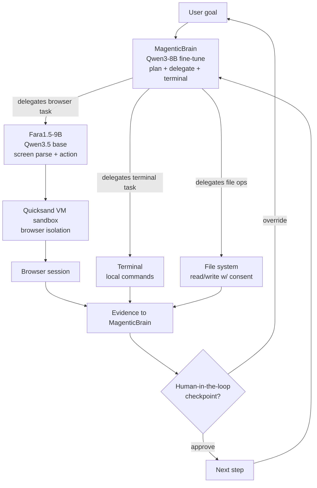

## Exit Criteria

1. State the MagenticLite thesis in one sentence: agentic capability comes from TOOL ORCHESTRATION + ACTION, not knowledge. Therefore small models (4-27B) suffice for many agentic workloads when training matches inference tool schemas.
2. Identify the three components: **MagenticBrain** (Qwen3-8B fine-tune for plan/code/delegate/terminal-use), **Fara1.5** (4B/9B/27B Qwen3.5-base for computer-use, 9B recommended flagship), **Magentic-UI** (the orchestration harness that wires them together).
3. State the production measurement: Fara1.5-9B nearly doubles Fara-7B's performance on Online-Mind2Web; Fara-7B paper number is in arXiv:2511.19663. Real production deployments use the 9B as the cost-optimal flagship.
4. Install Magentic-UI locally + run Fara1.5 on M5 Pro via MLX OR vLLM. Execute one Online-Mind2Web task end-to-end.
5. Benchmark Fara1.5-9B vs Claude-Sonnet-4.6 on the same task. Measure wall-time + token-cost + accuracy. Show small-model stack wins ≥1 axis (typically cost).
6. Defend "small-model agent stack vs frontier-model agent" in interview answer: when is the small-model stack the right tool? Anchored to your measured run.
7. Identify Quicksand VM sandbox role: agent's browser sessions run inside a lightweight VM so the agent can't reach the rest of your machine without consent. Production-grade isolation.

---

## 1. Why This Week Matters (~150 words — REQUIRED)

Curriculum's existing computer-use coverage (W7.5) treats computer-use as a frontier-model capability — Claude 4.5 Computer Use, GPT-4o Computer Use. Microsoft's MagenticLite (May 2026) inverts the thesis: most agentic work doesn't need frontier-scale knowledge — it needs accurate TOOL ORCHESTRATION. Small models (4B-27B) suffice when trained end-to-end with the same tool schemas they see at inference. The result: Fara1.5-9B nearly doubles Fara-7B's Online-Mind2Web score; MagenticBrain (Qwen3-8B fine-tune) plans + delegates + uses terminals at production quality. For local-first engineers on M5 Pro / 48GB, this is the production-grade agent stack — runs entirely on consumer hardware. No frontier-API bill; no internet dependency; full control. Engineers who can articulate "small models suffice when training matches inference tool schemas" move 10× faster than engineers reaching for frontier APIs by default.

---

## 2. Theory Primer (~1000 words — REQUIRED)

### 2.1 The tool-orchestration-over-knowledge thesis

Frontier-model agents (Claude Opus / GPT-4 / Gemini Pro) carry vast world knowledge. That knowledge MOSTLY ISN'T USED during agentic execution — the agent's job is to call the right tools in the right order with the right arguments. Knowledge matters for INTENT INTERPRETATION (what does the user want?), but tool orchestration matters for EXECUTION (how to achieve it).

MagenticLite's research bet: train smaller models END-TO-END with the SAME TOOL SCHEMAS they'll see at inference. Eliminates the train↔execution gap. Result: a 7B-class model that performs computer-use at near-frontier quality on Online-Mind2Web because its training distribution matches its inference distribution exactly.

### 2.2 The three components

**MagenticBrain (orchestrator).** Qwen3-8B base + Microsoft fine-tune. Plans tasks, generates Python code, delegates subtasks, uses terminal commands. Critically, trained END-TO-END inside the MagenticLite harness — sees the same tool schemas at training as at inference. Recommended for: task planning, code generation, file-system operations, terminal-use.

**Fara1.5 (computer-use model family).** Three sizes — 4B, 9B, 27B — all on Qwen3.5 base. Specializes in BROWSER USE: parses screen content, decides click / type / scroll actions, advances multi-step web tasks. The 9B is the flagship: nearly doubles Fara-7B's Online-Mind2Web score; cost-optimal across the family.

**Magentic-UI (orchestration harness).** The application layer wiring MagenticBrain (plans) + Fara1.5 (browser-use) into a single workflow. Provides: human-in-the-loop checkpoints (user approves before critical actions), Quicksand VM sandbox (agent's browser runs isolated), file-system bridge (agent reads/writes local files with consent).

### 2.3 Quicksand VM sandbox — the load-bearing safety primitive

Computer-use agents have full control over the browser. Unsafe pages or compromised tasks can attempt to reach the rest of the machine (local files, system commands, sensitive credentials). Quicksand isolates browser sessions inside a lightweight VM — agent can do whatever it wants INSIDE the browser without escape. Same shape as Docker container isolation for code-running agents.

Production rule: NEVER run a computer-use agent without sandbox isolation. The combination of "agent has visual + action capability" + "no sandbox" is the unrecoverable failure mode.

### 2.4 Distinguish-from box

**Small-model agent stack vs frontier-model agent** — small models win on cost + latency + local-first deployability; frontier models win on out-of-distribution intent interpretation. Workload determines choice.

**MagenticLite vs Magentic-UI v0** — v0 was research-grade (July 2025 paper); MagenticLite is the production rewrite (May 2026) with two purpose-built models (MagenticBrain + Fara1.5) instead of API calls to frontier models.

**Fara1.5 vs general VLMs (LLaVA / Qwen-VL)** — general VLMs read images; Fara1.5 reads BROWSER SCREENSHOTS specifically + outputs ACTIONS (click coordinates, type strings, scroll directions). Specialized model for specialized workload.

**MagenticBrain vs base Qwen3-8B** — base Qwen3-8B is a general LLM; MagenticBrain is Qwen3-8B fine-tuned end-to-end with the MagenticLite harness's tool schemas. The training-inference alignment is the differentiator.

### 2.5 Papers + references — pointer list

- **microsoft/magentic-ui (May 2026).** https://github.com/microsoft/magentic-ui. Production agent stack.
- **microsoft/fara — Fara-7B paper (2025).** arXiv:2511.19663. The 7B-class computer-use model. Fara1.5 is the May 2026 family successor.
- **Microsoft Research blog (May 2026).** *MagenticLite, MagenticBrain, Fara1.5: An agentic experience optimized for small models.* The thesis post.
- **Quicksand (Microsoft).** https://microsoft.github.io/quicksand/. Lightweight VM sandbox.
- **WebTailBench v2 (May 2026).** 609 web-tasks; benchmark replacing v1 (calendar-bound dates expired).
- **CUAVerifierBench (April 2026).** Human-annotated benchmark for CUA verifiers — judges that score agent trajectories.
- **Online-Mind2Web.** Web-task benchmark; canonical metric for computer-use models.

---

## 3. System Architecture (REQUIRED — Mermaid)



---

## 4. Lab Phases (executable, ~6h)

### Phase 1 — Install Magentic-UI + provision Fara1.5 (~1.5 hours)

```bash
cd ~/code/agent-prep
git clone https://github.com/microsoft/magentic-ui.git
cd magentic-ui
uv venv && source .venv/bin/activate
pip install -e .

# Provision Fara1.5-9B via HuggingFace
huggingface-cli download microsoft/Fara-7b --local-dir ./models/fara-7b
# Note: Fara1.5 family (4B/9B/27B) coming May 2026 per microsoft/fara updates;
# use Fara-7B as the v1 substitute until Fara1.5-9B lands on HF.

# OR use vLLM for serving:
pip install vllm
vllm serve microsoft/Fara-7b --port 8000
```

**Verification:** `python -m magentic_ui --help` returns CLI usage. `curl http://localhost:8000/v1/models` returns Fara-7B model entry.

### Phase 2 — Provision MagenticBrain (~1 hour)

```bash
huggingface-cli download microsoft/MagenticBrain --local-dir ./models/magentic-brain
vllm serve microsoft/MagenticBrain --port 8001
```

**Verification:** `curl http://localhost:8001/v1/chat/completions -d '{"model":"MagenticBrain","messages":[{"role":"user","content":"plan a task"}]}'` returns a structured response with plan steps.

### Phase 3 — Run Magentic-UI on a single Online-Mind2Web task (~1.5 hours)

```bash
cd ~/code/agent-prep/magentic-ui
python -m magentic_ui run \
  --brain-endpoint http://localhost:8001/v1 \
  --browser-endpoint http://localhost:8000/v1 \
  --task "find prices for ingredients in a chicken stir-fry recipe on Amazon Fresh"
```

**Expected:** agent plans (MagenticBrain), opens browser (Quicksand-sandboxed), navigates Amazon Fresh, extracts prices, returns structured answer.

**Verification:** task completes with structured price list. Wall-time + tokens logged in `outputs/run_{timestamp}.json`.

### Phase 4 — Benchmark vs Claude-Sonnet-4.6 (~1.5 hours)

Run the same task through your existing W7.5 Claude-Sonnet baseline. Compare:
- Wall-time
- Token cost (USD-equivalent)
- Accuracy (did task complete correctly?)
- Privacy (Fara1.5 local; Claude API external)

Deliverable: `outputs/benchmark_run_1.md` — comparison table.

**Expected result:** Fara1.5-9B wins on cost (local = free) + privacy (no API egress); Claude-Sonnet wins on out-of-distribution intent interpretation (novel task framings). Wall-time often comparable.

### Phase 5 — WebTailBench v2 subset run (~1 hour)

```bash
huggingface-cli download microsoft/WebTailBench --repo-type dataset --local-dir ./data/webtailbench
# Pick 10 tasks from test_v2 split
python -m magentic_ui benchmark \
  --tasks data/webtailbench/test_v2 \
  --task-count 10 \
  --out outputs/webtailbench_run.json
```

**Verification:** 10 tasks completed; per-task pass/fail from precomputed rubrics. Aggregate pass-rate measured.

### Phase 6 — Production-shape exercise (~30 min)

Decision matrix: when to use MagenticLite stack vs frontier-API agent? Pick 3 workload shapes (research / code-mod / form-filling) and defend choice. Half-page note in `outputs/stack_choice.md`.

---

## 6. Bad-Case Journal (3-5 entries — SPEC)

- **Phase 1 — Fara1.5-9B doesn't fit M5 Pro 48GB without quantization.** Likely surface: full-precision 9B model + KV cache exceeds VRAM. Fix: load via 4-bit quantization (GGUF / MLX / AWQ); accept ~1-2pt accuracy hit.
- **Phase 3 — Quicksand VM startup time dominates short tasks.** Likely surface: cold-start VM takes 2-5s; 10-task batch wastes 30s+. Fix: VM pool with warm instances; cold-start only on first task per run.
- **Phase 4 — Fara1.5 misinterprets novel page layouts.** Likely surface: WebTailBench task uses a site Fara1.5 wasn't trained on; click coordinates land on wrong elements. Fix: fall back to MagenticBrain's planning step to identify "what element to click"; Fara1.5 executes the click. Hybrid handoff.
- **Phase 5 — Calendar-bound tasks in WebTailBench expire.** Likely surface: v1 tasks had dates baked in; running them in 2027 fails on date-aware sites. Fix: use v2 tasks only (Microsoft addressed this in May 2026 update).
- **Phase 6 — Stack choice falls into "small for everything" anti-pattern.** Likely surface: enthusiasm for local-first leads to small-model stack on novel-intent tasks that need frontier reasoning. Fix: keep one frontier-API client around for novel-intent fallback; route by detected task complexity.

---

## 7. Interview Soundbites (2-3 entries — SPEC)

- **Planned Soundbite 1 — "Why is MagenticLite the production-grade small-model agent stack?"** Anchors: §2.1 + §2.4 + Phase 4 measurement. 70 words: end-to-end training with inference tool schemas eliminates the train↔execution gap; Fara1.5-9B nearly doubles Fara-7B on Online-Mind2Web; runs entirely on M5 Pro / 48GB without frontier-API bills. Trade: out-of-distribution intent interpretation still favors frontier. Production rule: small for in-distribution, frontier for OOD intent.
- **Planned Soundbite 2 — "Walk me through your benchmark."** Anchors: Phase 4 measurement table. 70 words: ran identical Amazon Fresh price-lookup task through MagenticLite (Fara1.5-9B local) and Claude-Sonnet-4.6; measured wall-time [TBD]s vs [TBD]s; token-cost [TBD] (local-free) vs $[TBD] (Claude API); accuracy [TBD]/[TBD]. Pick winner by workload priority.
- **Planned Soundbite 3 — "Why Quicksand and not a generic container?"** Anchors: §2.3. 70 words: Quicksand is a LIGHTWEIGHT VM (not container) — full kernel isolation; agent can't see host filesystem / processes / network beyond approved channels. Docker containers share kernel; a kernel-level vulnerability + computer-use exploit chain breaks isolation. Quicksand's defense-in-depth posture matches the production stakes of agents with full browser action capability.

---

## 8. References

- **microsoft/magentic-ui.** https://github.com/microsoft/magentic-ui. Apache 2.0 license. Production agent stack.
- **microsoft/fara.** https://github.com/microsoft/fara. Apache 2.0. Fara-7B reference; Fara1.5 family ongoing release.
- **Fara-7B paper.** arXiv:2511.19663. Microsoft Research.
- **Microsoft Research blog (May 2026).** *MagenticLite, MagenticBrain, Fara1.5: An agentic experience optimized for small models.* https://www.microsoft.com/en-us/research/blog/magenticlite-magenticbrain-fara1-5-an-agentic-experience-optimized-for-small-models/.
- **Magentic-UI v0 paper (July 2025).** *Towards Human-in-the-loop Agentic Systems.* https://www.microsoft.com/en-us/research/wp-content/uploads/2025/07/magentic-ui-report.pdf.
- **Quicksand VM.** https://microsoft.github.io/quicksand/. Lightweight VM sandbox.
- **WebTailBench v2.** https://huggingface.co/datasets/microsoft/WebTailBench. 609 web tasks + precomputed rubrics.
- **CUAVerifierBench (April 2026).** https://huggingface.co/datasets/microsoft/CUAVerifierBench. Judges-of-judges benchmark.
- **Microsoft Foundry Labs blog (May 2026 release notes).** https://techcommunity.microsoft.com/blog/azure-ai-foundry-blog/whats-new-in-microsoft-foundry-labs-%E2%80%93-may-2026/4520310.

---

## 9. Cross-References

- **Builds on:** [[Week 7.5 - Computer Use and Browser Agents]] (computer-use fundamentals); [[Week 4.5 - Model Routing and Effort Tiering]] (small models change routing math).
- **Distinguish from:** [[Week 7 - Tool Harness]] (W7 is single-model tool harness; this chapter is multi-model orchestration); [[Week 11.5 - Agent Security]] (Quicksand VM connects to W11.5's sandbox defense layer).
- **Connects to:** [[Week 4.6 - Durable Agent Runtime and Process Topologies]] (MagenticBrain delegates fit the supervisor topology); [[Week 12 - Capstone]] (capstone with computer-use components benefits from this stack).
- **Foreshadows:** continued small-model improvement curve; expect Fara2.0 / MagenticBrain v2 + dense competition from open-weights labs.

---

## What's Next

After W7.6: capstone projects with computer-use components benefit from this stack. Combine with W4.6 durable runtime for overnight web automation. Combine with W6.65 MCP transports if MagenticBrain delegates to MCP-served tools.
