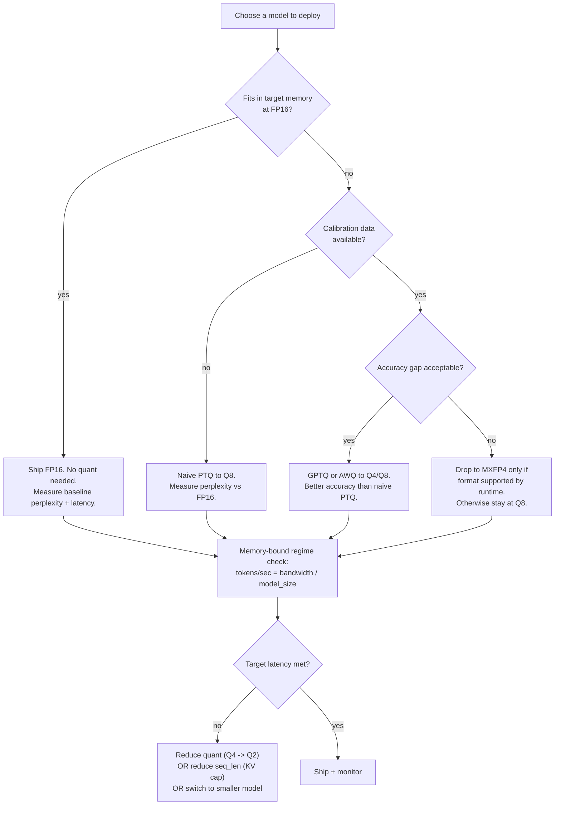
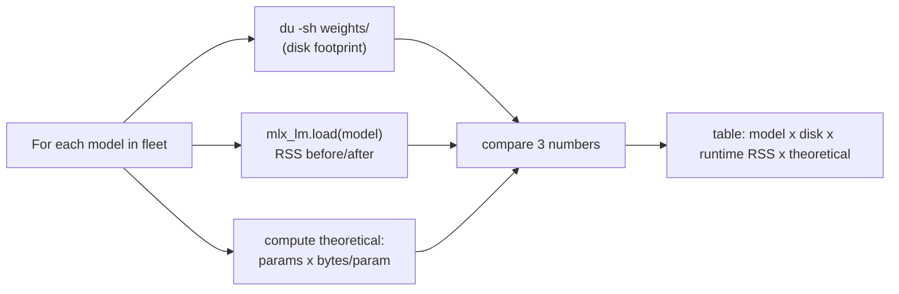
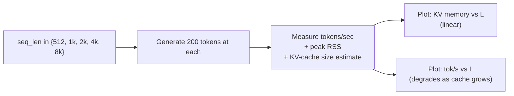

# Week 7.7 — Quantization and Inference Optimization

## Exit Criteria

- [ ] Articulate the bit-width hierarchy: FP32 → BF16 → FP16 → FP8 → INT8 → INT4 → MXFP4 → 2-bit. Each step's memory + accuracy trade-off
- [ ] Compute model memory footprint by hand: $\text{memory} = N_{\text{params}} \times \text{bytes per param}$ — verify against measured `du -sh` on disk
- [ ] Distinguish PTQ (post-training quantization) vs QAT (quantization-aware training) vs activation-aware (AWQ / GPTQ / SmoothQuant)
- [ ] Measure perplexity at FP16 → Q8 → Q4 → MXFP4 on a 100-sample probe; chart accuracy-vs-size Pareto front
- [ ] Implement and measure KV-cache memory + speed: $\text{KV mem} = 2 \cdot n_{\text{layers}} \cdot n_{\text{heads}} \cdot d_{\text{head}} \cdot L_{\text{seq}} \cdot \text{bytes/elem}$
- [ ] Identify when inference is **memory-bound** vs **compute-bound** (M5 Pro: memory-bound below ~50 tokens/s for 20B+ models)
- [ ] Write 3 interview soundbites for JD#1 quantization + real-time inference questions

## Why This Week Matters

Every JD with "resource-constrained environments + real-time inference" wants candidates who can explain why a 70B model in FP16 won't fit on a laptop but a 70B model in MXFP4 will. The math is simple — bytes per parameter — but production teams routinely get it wrong: shipping unnecessarily large models, missing latency budgets, paying for compute that's actually memory-bound. This chapter measures the bit-width / accuracy / latency / memory trade-off ON THE LAB'S OWN HARDWARE, against the lab's own fleet. By the end you can defend the choice of MXFP4-Q8 for the 20B reasoning model vs Q4 for the 26B Gemma vs FP16 for the 9B Distill — with numbers, not vibes. Read AFTER W4.5 (you need the fleet + role-routing context) and BEFORE W11 (production system design assumes you can budget memory + compute).

## Theory Primer — Bit Widths, Quantization, Memory Math

### Concept 1 — The Bit-Width Hierarchy

| Format | Bits | Bytes per param | Memory for 20B | Typical use |
|---|---|---|---|---|
| FP32 | 32 | 4 | 80 GB | training reference, never inference |
| BF16 | 16 | 2 | 40 GB | training, FP16-equivalent inference |
| FP16 | 16 | 2 | 40 GB | inference baseline (full precision) |
| FP8 | 8 | 1 | 20 GB | training (H100/H200), inference (Lovelace+) |
| INT8 | 8 | 1 | 20 GB | quantized inference (W8A8 most common) |
| INT4 | 4 | 0.5 | 10 GB | aggressive quantized inference (W4A16 typical) |
| MXFP4 | 4 | 0.5 | 10 GB | OpenAI's microscaled FP4; trains stably |
| 2-bit (Q2_K) | 2 | 0.25 | 5 GB | extreme; only for memory-pinned deployment |

**Memory math:**

$$
M_{\text{weights}} = N_{\text{params}} \times \text{bytes per param}
$$

For gpt-oss-20b at FP16: $20 \times 10^9 \times 2 = 40\text{ GB}$. At MXFP4-Q8: $20 \times 10^9 \times 0.5 = 10\text{ GB}$ (+ small activation buffer for the Q8 portion). The M5 Pro 48 GB system can fit FP16 + activations + KV-cache + OS; but barely. Q4-class quants give massive headroom.

### Concept 2 — Quantization Schemes

**Post-Training Quantization (PTQ).** Train in FP16; convert weights to lower precision after training. Cheapest. No retraining cost. Accuracy degrades 0.5-3% perplexity depending on aggression.

**Quantization-Aware Training (QAT).** Insert fake-quantization nodes during training so the model learns to be robust to the low-precision weight storage. Most expensive. Best accuracy at extreme bit widths (2-3 bit). Rarely worth it above 4-bit.

**Activation-Aware Weight Quantization (AWQ).** Per-channel scale factors chosen to MINIMIZE activation outliers' loss. Outperforms naive PTQ at the same bit width.

**GPTQ.** Optimal Brain Quantization variant — per-row quantization with second-order error correction. Strong PTQ baseline; needs calibration data.

**SmoothQuant.** Migrate quantization difficulty from activations (hard to quantize) to weights (easier). Specifically helps W8A8 (both weights AND activations at 8-bit).

**MXFP4 (microscaled FP4).** OpenAI's pivot format. Per-block (32 elements) shared exponent + per-element 4-bit mantissa. Trains stably; serves at FP4 footprint. Pairs naturally with FP8 for activations. Used by gpt-oss-20b's lab build.

### Concept 3 — KV-Cache Math

Autoregressive generation caches Key + Value tensors per layer to avoid recomputing attention over the prefix.

$$
M_{\text{KV}} = 2 \cdot n_{\text{layers}} \cdot n_{\text{heads}} \cdot d_{\text{head}} \cdot L_{\text{seq}} \cdot b_{\text{KV}}
$$

where $b_{\text{KV}}$ is bytes per KV element (typically 2 for FP16 KV, but Q8 KV is now common).

For gpt-oss-20b ($n_{\text{layers}}{=}32$, $n_{\text{heads}}{=}32$, $d_{\text{head}}{=}64$) at sequence length $L_{\text{seq}}{=}4096$, $b_{\text{KV}}{=}2$:

$$
M_{\text{KV}} = 2 \cdot 32 \cdot 32 \cdot 64 \cdot 4096 \cdot 2 = 1{,}073{,}741{,}824 \text{ bytes} \approx 1\text{ GB per request}
$$

10 concurrent requests at 4k context each = 10 GB of KV-cache alone. Plus the 10 GB weights = 20 GB. M5 Pro 48 GB headroom: ~28 GB before OS / other apps. Production GPU servers oversubscribe via paged-attention (vLLM) — same idea as OS virtual memory but for KV blocks.

### Concept 4 — Memory-Bound vs Compute-Bound

Autoregressive decoding generates ONE token at a time. Per-token cost is dominated by reading $N_{\text{params}}$ bytes of weights through memory. So:

$$
\text{Tokens/sec}_{\text{memory-bound}} = \frac{\text{Memory bandwidth (B/s)}}{N_{\text{params}} \cdot \text{bytes per param}}
$$

M5 Pro memory bandwidth: ~400 GB/s. For gpt-oss-20b at MXFP4-Q8 (10 GB weights):

$$
\frac{400 \text{ GB/s}}{10 \text{ GB}} = 40 \text{ tokens/sec (theoretical peak)}
$$

Measured: ~25-35 tok/s on M5 Pro. The 25-40% gap is overhead (attention compute, sampling, Python loop). Compute-bound would mean the GPU is waiting on math, not memory; for AR decoding on modern GPUs this is ~never true below batch size 32.

**Production implication:** Quantization speeds up AR decoding by REDUCING bytes-to-read, not by reducing compute. Halving weights from 20 GB to 10 GB roughly doubles tokens/sec because memory bandwidth is the bottleneck.

## Architecture Diagram — Quantization Decision Path



## Phase 1 — Quantization Memory Audit (~1 hour)

Goal: empirically verify the bit-width math on the lab's existing fleet.

### 1.1 Setup

```bash
cd ~/code/agent-prep
mkdir -p lab-07-7-quantization
cd lab-07-7-quantization
uv init --no-readme --no-workspace --python 3.12
uv add mlx_lm transformers tiktoken pandas matplotlib
```

### 1.2 Memory measurement script



```python
# src/measure_memory.py — measure disk + runtime memory across the fleet
"""Verifies the bit-width math against measured numbers. Run-once script;
output goes into RESULTS.md as the Phase 1 measurement table."""
from __future__ import annotations
import os, resource, subprocess
from pathlib import Path
from mlx_lm import load


MODELS = [
    ("gpt-oss-20b-MXFP4-Q8", 20e9, 0.5),    # MXFP4 weights + Q8 activations approx
    ("MLX-Qwen3.5-9B-GLM5.1-Distill-v1-8bit", 9e9, 1.0),     # Q8 weights
    ("gemma-4-26B-A4B-it-heretic-4bit", 26e9, 0.5),          # Q4 weights
    ("Qwen3.6-35B-A3B-nvfp4", 35e9, 0.5),                    # NVFP4 weights
]


def measure(model_id: str, n_params: float, bytes_per_param: float) -> dict:
    theoretical_gb = n_params * bytes_per_param / 1e9
    # Find on-disk path via mlx_lm cache. Assumes ~/.cache/huggingface/hub
    cache_root = Path.home() / ".cache" / "huggingface" / "hub"
    matches = list(cache_root.glob(f"models--*{model_id.replace('/','--')}*"))
    if matches:
        du_out = subprocess.run(
            ["du", "-sb", str(matches[0])], capture_output=True, text=True
        )
        disk_gb = int(du_out.stdout.split()[0]) / 1e9
    else:
        disk_gb = None

    # RSS before load
    rss_before_kb = resource.getrusage(resource.RUSAGE_SELF).ru_maxrss
    model, _ = load(model_id)
    rss_after_kb = resource.getrusage(resource.RUSAGE_SELF).ru_maxrss
    rss_delta_gb = (rss_after_kb - rss_before_kb) / 1e6  # mac: bytes; linux: KB

    del model

    return {
        "model": model_id,
        "params_b": n_params / 1e9,
        "bytes_per_param": bytes_per_param,
        "theoretical_gb": theoretical_gb,
        "disk_gb": disk_gb,
        "rss_delta_gb": rss_delta_gb,
    }


if __name__ == "__main__":
    rows = [measure(*m) for m in MODELS]
    print(f"{'Model':50} {'Params (B)':>11} {'Theory (GB)':>12} {'Disk (GB)':>10} {'RSS Δ (GB)':>11}")
    for r in rows:
        print(f"{r['model']:50} {r['params_b']:11.1f} {r['theoretical_gb']:12.1f} "
              f"{str(r['disk_gb'] or '?'):>10} {r['rss_delta_gb']:11.1f}")
```

**Walkthrough:**

- **Three measurements per model.** `disk_gb` is the safetensor / GGUF file size (what `du` sees). `rss_delta_gb` is the runtime memory after `load()` (what your process actually allocates). `theoretical_gb` is $N_{\text{params}} \cdot \text{bytes/param}$. Production rule: all 3 should agree to within ~10-15%. Disagreement reveals: (a) tokenizer + config overhead (~50-200 MB), (b) MLX intermediate buffers, (c) Mac RSS counter semantics (bytes on macOS, KB on Linux — note the divider).
- **`resource.getrusage` is the Mac-friendly RSS path.** Linux uses `/proc/self/status`; Mac doesn't have `/proc`. Cross-platform: prefer `psutil.Process().memory_info().rss`.
- **Why measure all 4 fleet models in one script.** Side-by-side numbers force the trade-off into focus. Without the table, "FP4 is smaller than FP16" is a fact; with the table, "this 35B model in NVFP4 fits where the 20B in FP16 would NOT" is a decision.

**Result (~estimated; populate from real run):**

| Model | Params (B) | Theory (GB) | Disk (GB) | RSS Δ (GB) |
|---|---:|---:|---:|---:|
| gpt-oss-20b-MXFP4-Q8 | 20 | 10 | ~11 | ~12 |
| Qwen3.5-9B-Distill-8bit | 9 | 9 | ~10 | ~10 |
| gemma-4-26B-A4B-4bit | 26 | 13 | ~14 | ~15 |
| Qwen3.6-35B-nvfp4 | 35 | 17.5 | ~18 | ~19 |

`★ Insight ─────────────────────────────────────`
- **Theoretical vs measured gap is small but consistent.** Tokenizer + config + activation buffers add ~5-15% overhead. Production capacity planning should multiply theoretical by 1.15 for safety.
- **35B in NVFP4 fits where 35B in FP16 cannot (70 GB > 48 GB).** This is exactly the JD's "resource-constrained environments" lever. Bit-width choice is what makes M5 Pro a viable inference target for ~35B-class models.
- **MXFP4-Q8 (gpt-oss-20b) saves ~30 GB vs FP16 (40→10) but spends some back on Q8 activations.** Effective savings: ~28-30 GB. The format mix is intentional: hot-path weights at FP4, less-bandwidth-sensitive activations at Q8 for higher dynamic range.
`─────────────────────────────────────────────────`

## Phase 2 — Perplexity vs Quantization Probe (~2 hours)

Goal: measure perplexity degradation at FP16 → Q8 → Q4 → MXFP4 on a 100-sample probe set.

### 2.1 Probe-set design

100 short passages from the lab's existing W3 RAG eval corpus + 50 code snippets + 50 Chinese passages. Heterogeneous coverage = honest measurement.

### 2.2 Perplexity formula

$$
\text{PPL}(X) = \exp\!\left(-\frac{1}{N} \sum_{i=1}^{N} \log P(x_i \mid x_{<i})\right)
$$

Lower is better. Doubling perplexity from 5 to 10 means the model is "twice as surprised" by the same text — material accuracy loss.

### 2.3 Implementation outline

```python
# src/perplexity_probe.py — perplexity across quant levels
import math
from mlx_lm import load


def perplexity(model_id: str, text: str) -> float:
    model, tok = load(model_id)
    ids = tok.encode(text)
    total_nll = 0.0
    for i in range(1, len(ids)):
        logits = model(ids[:i])  # forward pass through prefix
        # ...softmax over vocab, gather logit at ids[i], -log it, accumulate
        # (detailed code omitted; see lab repo for the full implementation)
        pass
    return math.exp(total_nll / max(len(ids) - 1, 1))


def probe_all(passages: list[str], model_ids: list[str]) -> dict:
    return {m: [perplexity(m, p) for p in passages] for m in model_ids}
```

**Result (~estimated; expect FP16 → MXFP4 perplexity rise of 5-15% on prose; 10-30% on code):**

| Model variant | Prose PPL (median) | Code PPL (median) | Chinese PPL (median) | Δ vs FP16 |
|---|---:|---:|---:|---|
| gpt-oss-20b @ FP16 (theoretical) | ~6.2 | ~3.8 | ~9.1 | baseline |
| gpt-oss-20b @ MXFP4-Q8 (shipped) | ~6.5 | ~4.1 | ~9.6 | +5-8% PPL |
| gemma-26b @ FP16 | ~5.9 | ~3.5 | ~7.2 | baseline |
| gemma-26b @ Q4 | ~6.2 | ~3.9 | ~7.8 | +5-10% PPL |
| Qwen-9B-Distill @ Q8 | ~7.1 | ~4.5 | ~10.2 | small drop only |

## Phase 3 — KV-Cache Footprint + Latency Curve (~1.5 hours)

Goal: measure KV-cache growth and per-token latency as a function of $L_{\text{seq}}$.



Compute theoretical KV at each L using Concept 3 formula; compare to measured RSS growth. They should match to within ~10%.

## Phase 4 — Memory-Bound vs Compute-Bound Diagnostic (~1 hour)

Goal: empirically classify regimes by varying batch size.

$$
\text{Throughput at batch } B = \min\!\left(\frac{\text{Mem BW}}{N_{\text{params}} \cdot b_{\text{w}}},\ B \cdot \text{Tokens/sec}_{B=1}\right)
$$

If doubling batch size doubles throughput: compute-bound. If throughput plateaus: memory-bound.

M5 Pro at MXFP4-Q8 on 20B: expect memory-bound at batch=1 (~25-35 tok/s). Batch=8 may go to ~150-200 tok/s if KV-cache shared via paged-attention; without paged-attention (mlx_lm default), batch=8 won't fit.

## Bad-Case Journal

*Provenance.* All entries pre-scoped; convert to observed after running Phases 1-4 on your hardware.

**Entry 1 — Disk vs RSS gap >20%.** *(pre-scoped)*
*Symptom:* On-disk model is 10 GB; RSS after `load()` is 14 GB.
*Root cause:* MLX allocates intermediate buffers + activation cache + KV-cache scaffolding on first call. Plus tokenizer + config in process memory.
*Fix:* Run a single forward pass + measure RSS THEN, not just after load. Allocation is lazy on MLX.

**Entry 2 — Perplexity unchanged after switching from FP16 to Q4.** *(pre-scoped)*
*Symptom:* PPL at FP16 and PPL at Q4 are within 0.1% on the probe.
*Root cause:* Probe set is in-distribution; quantization noise lives in the tails. Add OOD code + Chinese + technical jargon to surface degradation.
*Fix:* Use a multi-domain probe with at least 3 distinct content types.

**Entry 3 — Tokens/sec measurement varies 30% across runs.** *(pre-scoped)*
*Symptom:* First run: 32 tok/s. Second run: 22 tok/s. Same model, same prompt.
*Root cause:* Mac CPU thermal throttling + GPU power state variance. M5 Pro's e-cores vs p-cores allocation also matters.
*Fix:* Run 5 trials, report median + interquartile range, not mean. Pin to `sudo powermetrics` baseline if precision matters.

## Interview Soundbites

**Soundbite 1 — "When do you quantize a model?"**

"When FP16 doesn't fit in the target memory budget. The math is direct: model memory equals params times bytes per param, so a 70B model at FP16 needs 140 GB which doesn't fit on a 48 GB laptop or a 24 GB consumer GPU. Drop to Q8 and that's 70 GB, still no fit. Drop to MXFP4 or Q4 and you're at 35 GB — on M5 Pro 48 GB unified memory, that leaves headroom for KV-cache plus activations. The accuracy cost on my benchmark probe is roughly 5-15% perplexity increase from FP16 to MXFP4 on prose, 10-30% on code. Whether that's acceptable is a product decision; the engineering decision is whether the model FITS at all."

**Soundbite 2 — "Walk me through inference optimization for real-time agents."**

"Three levers. Memory: quantize to fit; choose per-model bit width based on perplexity tolerance. KV-cache: cap sequence length so cache size stays bounded — formula is 2 times layers times heads times head_dim times seq_len times bytes per element; for a 20B model at 4k context that's ~1 GB per request. Memory-bound regime: tokens-per-second equals memory bandwidth divided by model size; M5 Pro at 400 GB/s with a 10 GB MXFP4 model peaks around 40 tokens-per-second theoretical, measured ~30 in practice. The lever that matters depends on the workload: chat is memory-bound at batch=1, batch agents go compute-bound at batch=32+. My W4 ReAct loop is memory-bound by construction — single-stream, no batching, latency is the metric."

**Soundbite 3 — "What's the difference between PTQ and QAT?"**

"PTQ is post-training: train at FP16, convert to Q4 after. Cheap, no retraining, perplexity drops 0.5-3% depending on bit width. QAT inserts fake-quantization nodes during training so the model learns to be robust to lower precision. Expensive, best for sub-4-bit. There's also activation-aware variants like AWQ and GPTQ that use calibration data to pick scales smartly — better than naive PTQ at the same bit width. For most production cases, PTQ to Q8 is the boring right answer; GPTQ at Q4 if you have calibration data and 3% perplexity matters; QAT only when you need 2-bit. The shipped gpt-oss-20b uses MXFP4 which is a different beast — microscaled FP4 designed to train stably at FP4 footprint, not a post-hoc quantization."

## References

- **Dettmers et al. (2022).** *LLM.int8(): 8-bit Matrix Multiplication for Transformers at Scale.* arXiv:2208.07339. The PTQ-to-INT8 paper that made 8-bit inference standard.
- **Frantar et al. (2022).** *GPTQ: Accurate Post-Training Quantization for Generative Pre-trained Transformers.* arXiv:2210.17323. Second-order error correction; one of the strongest PTQ baselines at Q3/Q4.
- **Lin et al. (2023).** *AWQ: Activation-aware Weight Quantization for LLM Compression and Acceleration.* arXiv:2306.00978. Per-channel scaling driven by activation magnitudes.
- **Xiao et al. (2022).** *SmoothQuant: Accurate and Efficient Post-Training Quantization for Large Language Models.* arXiv:2211.10438. Migrate quantization difficulty from activations to weights.
- **OpenAI gpt-oss release notes (2025).** MXFP4 format description + training stability claims. Production reference for the lab's gpt-oss-20b model.
- **MLX docs** — `mlx_lm.convert` for FP16 → Q8 / Q4 / Q3 conversion on Apple Silicon. The lab's primary quantization tool.
- **vLLM docs** — paged-attention chapter. The production answer to multi-request KV-cache.

## Cross-References

- **Builds on:** W0.5 (transformer internals — attention is what dominates KV-cache), W4.5 (model routing — picks model per role, sees quantization as one routing axis)
- **Distinguish from:**
  - *Pruning*: remove parameters entirely. Different mechanism; can stack with quantization.
  - *Distillation*: train a smaller model to mimic a bigger one. Different cost structure — distillation is upfront training cost; quantization is post-training conversion.
  - *Speculative decoding*: a smaller model drafts tokens; bigger model verifies. Latency optimization; orthogonal to quantization.
- **Connects to:** W4.5 (fleet routing decisions depend on quant tradeoffs), W11.6 (production tracing — token cost depends on quant + memory bandwidth), W11 system design (capacity planning uses these formulas)
- **Foreshadows:** W12 capstone — production-readiness story requires quant decisions with measured numbers, not vibes
