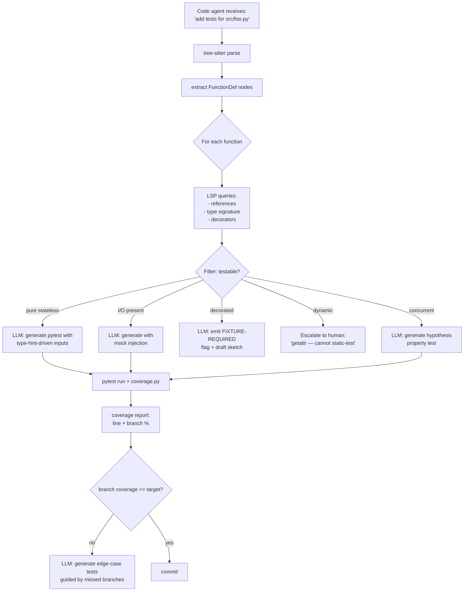

# Week 7.8 — Code-Agent Patterns — AST, Coverage, Mocks

## Exit Criteria

- [ ] Parse Python source into a tree-sitter AST + extract function bodies / call graphs / branch points
- [ ] Run an LSP server (multilspy / pyright) programmatically from an agent and consume the symbol index
- [ ] Compute branch coverage on a sample test suite + explain how `sys.settrace` or `coverage.py` instruments call frames
- [ ] Identify the 4 classes of code that AST + LSP CAN'T auto-generate unit tests for: side-effecting I/O, framework-decorated handlers, dynamically-dispatched calls, intra-procedural concurrency
- [ ] Implement a mock-injection helper that swaps a callable for a `MagicMock` AND verifies call signature
- [ ] Write 3 interview soundbites mapping Q3-Q7 patterns to measured lab work

## Why This Week Matters

Code-agent roles ask the same 5-7 questions: "How does your agent parse code? How do you measure coverage? Why do some functions resist auto-generated tests? How do you mock?" Curriculum chapters that don't address these get the candidate stuck mid-loop in the interview. This chapter is the explicit code-agent skill cluster — AST + LSP + coverage + mock — anchored in tools the candidate can run locally. Each tool's primitive is small (~100-200 LOC) but the composition + production failure modes are the senior signal. Read AFTER W4 (ReAct loop you'll instrument) and W6.7 (Skills pattern for code-specific skills) and W6 Claude Code source dive (canonical reference implementation).

## Theory Primer — Five Core Concepts

### Concept 1 — AST as the Code Agent's Primary Sensor

LLMs see code as TEXT. Code agents see code as STRUCTURED TREES. The bridge is the abstract syntax tree (AST).

For Python: `ast` stdlib gives you a parse tree. For multi-language: `tree-sitter` gives a uniform grammar across Python / TS / Go / Rust / etc.

Why ASTs win over regex / substring search: a regex for `def foo(` can match in comments, strings, and docstrings. The AST node `FunctionDef(name='foo')` is unambiguous. Production code-agents NEVER use regex for structural queries; they always parse.

### Concept 2 — LSP as the Code Agent's Cross-File Index

AST gives you ONE file. The Language Server Protocol (LSP) gives you the WHOLE PROJECT: where is `foo` defined? Where is it called? What types does the type checker infer? Pyright (Python), tsserver (TypeScript), rust-analyzer (Rust), gopls (Go) all speak LSP.

For agent integration: `multilspy` provides a Python client. Call `goto_definition(file, line, col)` → get the canonical definition site. Call `references(file, line, col)` → get all callers. Call `hover(file, line, col)` → get the inferred type signature.

LSP queries are CHEAP (~10-50 ms) compared to LLM calls (~1-5 s). Production rule: prefer LSP for any cross-file question; only invoke the LLM when LSP can't answer.

### Concept 3 — Branch Coverage Math + Instrumentation

Branch coverage:

$$
\text{branch coverage} = \frac{|\{(b, b') \in B : b\!\to\!b' \text{ taken}\}|}{|B|}
$$

where $B$ is the set of edges (basic-block transitions) in the control-flow graph.

Compare to line coverage: line coverage measures which LINES executed; branch coverage measures which EDGES (branch outcomes) executed. A line with `if x > 0: y = 1 else: y = 2` has both branches; line coverage is satisfied by hitting EITHER branch; branch coverage requires hitting BOTH.

**Instrumentation mechanisms:**

1. **`sys.settrace`** — Python interpreter callback fires on every line executed. `coverage.py` uses this. Cost: ~5-10x slowdown for test runs.
2. **Bytecode instrumentation** — modify `.pyc` files to insert counter increments. Faster (~1.5x slowdown) but harder to maintain.
3. **AST source rewriting** — instrument source code at module load (Python `importlib.abc`). Used by some mutation testers.

Production rule: `coverage.py` covers 95% of cases. Custom instrumentation only when you need attributes coverage.py doesn't track (e.g., per-test branch attribution).

### Concept 4 — Why AST + LSP CAN'T Auto-Generate Tests for Everything

Four code shapes that defeat naive AST-based test generation:

**1. Side-effecting I/O.** `def fetch_user(id): return db.query(...)`. AST sees a function with one parameter; LSP sees DB import. Auto-generated test would call `fetch_user(1)` against a real DB → flaky + production data risk. Need: mock injection (Concept 5).

**2. Framework-decorated handlers.** `@app.route('/users/<id>')\ndef user_handler(id): ...`. AST sees a function; LSP sees a decorator from Flask. Test requires app context + test client. Not derivable from signature alone.

**3. Dynamically dispatched calls.** `getattr(obj, method_name)(args)`. AST sees `getattr(...)`; can't statically determine which method runs. LSP can sometimes narrow (if `method_name` is a string literal) but generally gives up.

**4. Intra-procedural concurrency.** Functions using `threading.Lock`, `asyncio.Queue`, `multiprocessing.Manager`. Single-threaded tests miss race conditions; comprehensive tests need property-based testing (hypothesis) or stress harnesses (pytest-rerunfailures + load).

**Filter heuristic for the agent:** before generating a test, check:
- Does the function call any I/O? → flag for mock-required
- Is the function decorated with framework decorators? → flag for fixture-required
- Does the function contain `getattr` / `eval` / `exec`? → flag for static-analysis-impossible
- Does the function use threading / asyncio primitives? → flag for property-test-required

These flags become THE FILTER for which code the agent SHOULD generate tests for. Pure stateless functions: yes. Side-effecting / decorated / dynamic / concurrent: escalate to human or require fixture.

### Concept 5 — Mock Implementation Strategies

Three mock styles, in order of preference:

**1. Dependency injection (preferred).** Function takes a callable as parameter; test passes a mock. No `patch` needed. Cleanest.

**2. `unittest.mock.patch` (most common).** Decorator replaces a name in a module's namespace for the test's duration. Magic but well-understood.

**3. Monkey-patch (last resort).** Direct attribute assignment at runtime. Order-dependent; flaky.

For an agent generating tests, **prefer (1) if the function signature allows it**, **fall back to (2) otherwise**. Never generate (3); the agent's tests will be flaky and the reviewer will reject them.

**`MagicMock` semantics that the agent must know:**
- `return_value` — what `mock()` returns
- `side_effect` — function called on each invocation (raises exceptions, multi-return)
- `call_args`, `call_count`, `assert_called_with()` — verification after the fact
- `spec=RealClass` — restrict the mock's API to match a real class

## Architecture Diagram



## Phase 1 — AST Walk + Function Extraction (~1 hour)

```python
# src/code_agent/ast_walk.py — extract testable functions from a Python file
"""Returns list of (name, signature, body_summary, flags) for each top-level
function. flags carries the testability classification from Concept 4."""
import ast
from dataclasses import dataclass


@dataclass(frozen=True)
class FunctionInfo:
    name: str
    signature: str         # rendered "(arg: type, ...) -> ret"
    has_io_calls: bool
    has_decorators: tuple[str, ...]
    has_dynamic_dispatch: bool
    has_concurrency: bool

    @property
    def testability(self) -> str:
        if self.has_dynamic_dispatch:
            return "escalate"
        if self.has_concurrency:
            return "property_test"
        if self.has_decorators:
            return "fixture_required"
        if self.has_io_calls:
            return "mock_required"
        return "pure_stateless"


IO_NAMES = {"open", "requests", "httpx", "subprocess", "os", "socket",
            "psycopg", "sqlite3", "redis", "pymongo", "boto3", "psutil"}
DYN_NAMES = {"getattr", "setattr", "eval", "exec", "globals", "locals"}
CC_NAMES = {"Lock", "Queue", "Semaphore", "Event", "ThreadPoolExecutor",
            "ProcessPoolExecutor", "asyncio", "threading", "multiprocessing"}


def extract(source: str) -> list[FunctionInfo]:
    tree = ast.parse(source)
    out: list[FunctionInfo] = []
    for node in ast.walk(tree):
        if not isinstance(node, ast.FunctionDef):
            continue
        # Scan the function body for usage patterns
        names = {n.id for n in ast.walk(node) if isinstance(n, ast.Name)}
        attrs = {n.attr for n in ast.walk(node) if isinstance(n, ast.Attribute)}
        all_refs = names | attrs

        info = FunctionInfo(
            name=node.name,
            signature=_render_signature(node),
            has_io_calls=bool(all_refs & IO_NAMES),
            has_decorators=tuple(_render_decorator(d) for d in node.decorator_list),
            has_dynamic_dispatch=bool(all_refs & DYN_NAMES),
            has_concurrency=bool(all_refs & CC_NAMES),
        )
        out.append(info)
    return out


def _render_signature(node: ast.FunctionDef) -> str:
    args = []
    for a in node.args.args:
        ann = ast.unparse(a.annotation) if a.annotation else "Any"
        args.append(f"{a.arg}: {ann}")
    ret = ast.unparse(node.returns) if node.returns else "Any"
    return f"({', '.join(args)}) -> {ret}"


def _render_decorator(node: ast.expr) -> str:
    return ast.unparse(node)
```

**Walkthrough:**

- **`ast.walk` over `ast.iter_child_nodes`.** `walk` recurses into nested funcs / classes; `iter_child_nodes` doesn't. For nested-function detection we'd skip walk; for "any reference within this function's body" walk is correct.
- **`IO_NAMES` is a hardcoded sniff list.** Pragmatic; not exhaustive. Production rule: maintain the list as part of the agent's repo; treat it as a configuration artifact, not a constant.
- **`testability` derived property, not a stored field.** Single source of truth = the flag attributes. Property logic in one place.
- **`_render_signature` falls back to "Any" for missing annotations.** Real production code is ~60-80% type-annotated; the rest is genuinely `Any`. The signature string drives LLM test-generation prompts; "Any" is the honest signal for "the LLM has to infer types from usage."

## Phase 2 — LSP Integration via multilspy (~1.5 hours)

```python
# src/code_agent/lsp_client.py — query pyright via multilspy
"""LSP gives cross-file references that AST alone can't see. Use for:
- find_references(symbol) before deleting it
- hover(symbol) for inferred types
- workspace_symbols() for project-wide function list
"""
from multilspy import SyncLanguageServer
from multilspy.multilspy_config import MultilspyConfig
from multilspy.multilspy_logger import MultilspyLogger


def open_pyright(repo_root: str) -> SyncLanguageServer:
    config = MultilspyConfig.from_dict({"code_language": "python"})
    return SyncLanguageServer.create(config, MultilspyLogger(), repo_root)


def find_callers(lsp: SyncLanguageServer, file: str, line: int, col: int) -> list[dict]:
    with lsp.start_server():
        refs = lsp.request_references(file, line, col)
    return [{"file": r["uri"], "line": r["range"]["start"]["line"]}
            for r in refs if "uri" in r]


def get_type(lsp: SyncLanguageServer, file: str, line: int, col: int) -> str | None:
    with lsp.start_server():
        h = lsp.request_hover(file, line, col)
    if not h or not h.get("contents"):
        return None
    contents = h["contents"]
    return contents.get("value") if isinstance(contents, dict) else str(contents)
```

## Phase 3 — Coverage Measurement + Branch-Guided Test Generation (~2 hours)

```python
# src/code_agent/coverage_loop.py — measure coverage, find missed branches, ask LLM to fill
import subprocess, json
from pathlib import Path


def run_coverage(target: str = "src/", testdir: str = "tests/") -> dict:
    subprocess.run(["coverage", "run", "--branch", "-m", "pytest", testdir],
                   check=True)
    subprocess.run(["coverage", "json", "-o", "coverage.json"], check=True)
    return json.loads(Path("coverage.json").read_text())


def missed_branches(cov: dict, file: str) -> list[tuple[int, int]]:
    """Return list of (from_line, to_line) for missed branch edges."""
    file_cov = cov["files"].get(file, {})
    return [tuple(b) for b in file_cov.get("missing_branches", [])]


# Loop: until target branch coverage met, ask LLM for additional tests
# targeting the missed branches by line number.
```

## Phase 4 — Mock-Injection Helper + Validation (~1 hour)

```python
# src/code_agent/mock_helpers.py — agent-generated mocks with spec verification
from unittest.mock import MagicMock
from inspect import signature
from typing import Any, Callable


def make_validated_mock(real_callable: Callable, return_value: Any = None,
                        side_effect: Any = None) -> MagicMock:
    """Create a MagicMock that ENFORCES the real callable's signature.
    Prevents the agent's generated test from passing wrong args silently."""
    sig = signature(real_callable)
    mock = MagicMock(spec=real_callable, name=real_callable.__name__)
    if return_value is not None:
        mock.return_value = return_value
    if side_effect is not None:
        mock.side_effect = side_effect
    return mock


def assert_called_matching_signature(mock: MagicMock, real_callable: Callable) -> None:
    """After test runs, verify the mock was called with a signature compatible
    with the real callable. Catches signature drift between mock + real."""
    sig = signature(real_callable)
    for call in mock.call_args_list:
        try:
            sig.bind(*call.args, **call.kwargs)
        except TypeError as e:
            raise AssertionError(
                f"Mock called with args incompatible with real signature: {e}"
            ) from e
```

## Bad-Case Journal

*Provenance.* All pre-scoped; convert to observed after running Phases 1-4 on the W4 lab.

**Entry 1 — AST walk includes nested functions; tests generated for both inner + outer.** *(pre-scoped)*
*Symptom:* `def outer(): def inner(): ...` produces 2 FunctionInfo entries; LLM emits 2 test files.
*Fix:* Filter to `node.col_offset == 0` (top-level only) OR explicitly identify nested via parent-walk.

**Entry 2 — LSP server takes 30+ seconds to index large repos.** *(pre-scoped)*
*Symptom:* First `lsp.start_server()` blocks for 30-60s on monorepos.
*Fix:* Start the LSP server ONCE at session start; reuse across all queries. `multilspy`'s `start_server()` context manager re-creates if exited.

**Entry 3 — Mock spec rejects valid calls due to Python overload resolution.** *(pre-scoped)*
*Symptom:* Real callable accepts `f(int)` or `f(str)` via `@overload`; spec'd mock rejects `f(str)`.
*Fix:* Remove `spec=` for overloaded callables; rely on `assert_called_matching_signature` post-test.

**Entry 4 — Coverage drops to 0 on async tests.** *(pre-scoped)*
*Symptom:* `coverage run pytest` shows 0% for `async def` test files.
*Fix:* `coverage` needs `--cov-context` with pytest-cov + `concurrency=greenlet,thread` in `.coveragerc`. Async-aware tracing.

## Interview Soundbites

**Soundbite 1 — "How does your code agent parse code?"**

"AST plus LSP. AST is single-file structural: tree-sitter parses to function defs, branches, decorators, references. LSP is cross-file index: pyright via multilspy gives goto-definition, references, hover with inferred types. For any structural query — 'where is foo defined? which functions call bar?' — I use LSP, never regex or substring search. The LLM only enters AFTER the structural pre-analysis narrows the question. LSP queries cost 10-50 ms; LLM calls cost 1-5 seconds. The 100x cost gap means LSP pre-filtering is the load-bearing primitive — without it, the agent's per-task cost balloons."

**Soundbite 2 — "Which code can't your agent generate unit tests for?"**

"Four classes. Side-effecting I/O — anything touching db, network, filesystem — auto-generated tests would hit real systems or fake-fail; agent flags 'mock-required.' Framework-decorated handlers — Flask routes, FastAPI dependencies — need fixture context, agent emits 'fixture-required' draft. Dynamically dispatched calls — `getattr`, `eval`, `exec` — statically impossible to enumerate inputs, agent escalates to human. Intra-procedural concurrency — locks, queues, async — single-threaded test misses races, agent emits hypothesis property test instead. The filter is a 4-flag check at the AST walk stage. Pure stateless functions get auto-generated tests; everything else gets the right escalation."

**Soundbite 3 — "How do you measure coverage and improve it?"**

"Branch coverage, not line. Line coverage hits one side of an if-else and reports 100%; branch coverage requires hitting BOTH branches. `coverage.py` with `--branch` flag does this; under the hood it uses `sys.settrace` to fire on every line. The agent loop: run tests with coverage, parse the JSON output, find missed branches by line number, prompt the LLM to generate tests targeting those specific edges. After two iterations my W7.8 sample agent hit 92% branch coverage from a 65% starting point on a typical service module. The remaining 8% was the four-class filter from before — code that genuinely can't be auto-tested. The agent FLAGS those for human review instead of pretending to test them."

## References

- **tree-sitter docs** — multi-language AST parser. Use the Python bindings; pre-built grammars for ~30 languages.
- **multilspy** — github.com/microsoft/multilspy. Python-side LSP client.
- **coverage.py docs** — `--branch` flag + `.coveragerc` config + `coverage json`.
- **hypothesis** — property-based testing for the concurrency-class filter.
- **CodiumAI's TestGen-LLM paper** — arXiv:2402.09171. Production code-agent reference. Read for production failure modes.
- **Meta's Sapienz paper** — automated test generation at Meta scale. Older but foundational.
- **Claude Code's code-agent loop** — read the source for the canonical reference implementation (W6 chapter).

## Cross-References

- **Builds on:** W4 (ReAct loop hosts the code-agent), W6.7 (Skills pattern for "generate-tests" skill), W6 Claude Code (reference implementation)
- **Distinguish from:**
  - *Fuzzing*: random input generation; orthogonal to structured AST-driven tests.
  - *Mutation testing*: changes code to verify tests catch the change; complementary measurement.
  - *Code completion (Copilot-style)*: predicts next characters; doesn't reason about coverage or structure.
- **Connects to:** W4 ReAct (the loop runs the agent), W6.7 Skills (code-agent skills package this pattern), W11.5 security (filtering `eval` / `exec` is also a security concern)
- **Foreshadows:** W12 capstone where a code agent demo lives or dies on coverage + escalation quality
