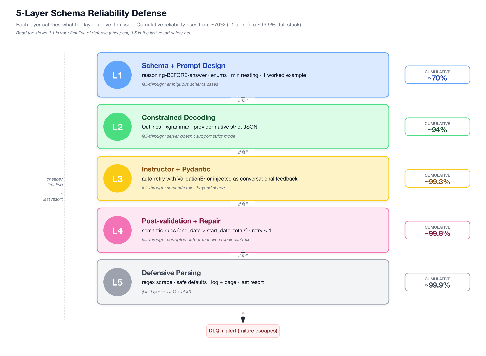
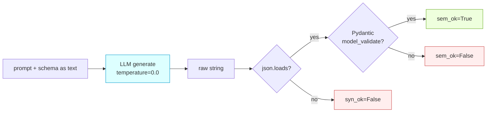
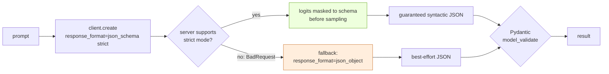
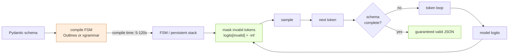
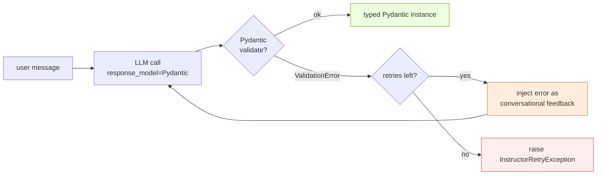
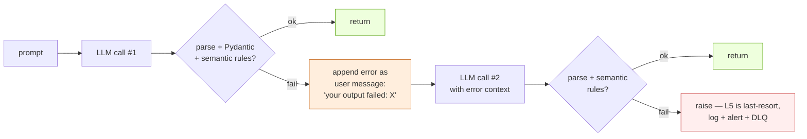
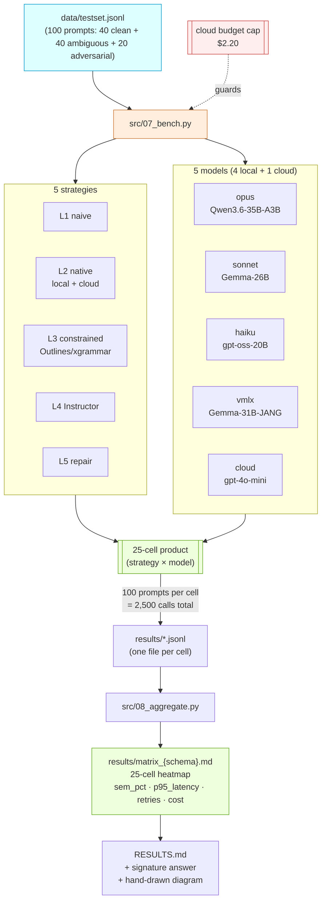

# Week 8 — Schema Reliability Bench (The Signature Week)

> This is **the** week. Not the hardest. Not the prettiest. **The most leveraged.**
>
> Every other week gives you competence. This week gives you a 5-minute answer that can move you up a level in hiring. You will finish it with benchmark numbers, a hand-drawn diagram, and a recorded script you've rehearsed out loud until it's muscle memory.

---

## Why This Week Is Worth More Than Any Other

I want to be blunt with you up front. If you only had four weeks to prepare for agent interviews, this would be one of the four. Here is why.

**The signature interview question.** The phrasing varies a little across companies, but the shape is almost always this:

> "How do you guarantee that an agent stably outputs content matching a fixed schema?"

This question is asked at Anthropic, OpenAI, Google, Scale, Cohere, Hugging Face, every YC AI startup with a structured output step (i.e. nearly all of them), and every enterprise hiring an LLM engineer to sit next to their data platform. It shows up in phone screens, technical rounds, and system-design rounds. It is also the question where candidates stratify the hardest.

- **Junior answer (≤ 30 sec):** "Use JSON mode and Pydantic." Acceptable. Moves you to the next question.
- **Mid answer (~1 min):** "Use JSON mode, wrap with Instructor + Pydantic, retry on validation error." Fine. Might pass.
- **Senior answer (5 min, unprompted, with numbers):** Restates the question, walks all **five layers** of defense, drops the reasoning-before-answer detail as their "I have actually shipped this" tell, cites a benchmark number from their own lab, closes with a sharp tradeoff statement about when each layer is worth its cost. That candidate just moved up a level.

> **Why this matters:** The signature question is a **compression test**. The interviewer is checking whether you can hold the full design space in your head, choose between options with real tradeoff awareness, and speak about it without notes. Candidates who have memorized a single pattern fail the compression test. Candidates who have *built the bench and measured it* pass without effort.

**Recap the 5-Layer Defense (Appendix B, in one glance).** You have already read the appendix. The diagram is etched here so you never lose the thread. Same diagram twice — once as ASCII (portable), once as Mermaid (for your Obsidian preview and any PR you open):

```
                    ╔═════════════════════════════════════════════════════════╗
         ▲          ║ L5  Defensive parsing + field-level fallbacks           ║
         │          ║     (last resort: salvage what you can, log + page)     ║
    more cost       ╠═════════════════════════════════════════════════════════╣
    less freq       ║ L4  Post-validation + repair prompt                     ║
         │          ║     (parse → if invalid, send error back, retry ≤ 1)    ║
         │          ╠═════════════════════════════════════════════════════════╣
         │          ║ L3  Validation wrapper (Instructor + Pydantic)          ║
         │          ║     (auto-retry with schema-aware error injection)      ║
         │          ╠═════════════════════════════════════════════════════════╣
    more freq       ║ L2  Constrained decoding (Outlines / xgrammar / native) ║
    less cost       ║     (token-level guarantee; logits filtered to schema)  ║
         │          ╠═════════════════════════════════════════════════════════╣
         ▼          ║ L1  Schema design + prompt design                       ║
                    ║     (clear field names, examples, reasoning-BEFORE-     ║
                    ║      answer ordering, minimal nesting, 1 worked example)║
                    ╚═════════════════════════════════════════════════════════╝
                          ▲ each layer catches what the one below missed ▲
```



> *Diagram source: [`diagrams/week-8/gen_5layer_reliability.py`](https://github.com/shaneliuyx/agent-prep/blob/main/diagrams/week-8/gen_5layer_reliability.py) — regenerable Python script. Edit and re-run to update.*

> **What this means:** The five layers are not alternatives. They are **stacked defenses**. Each layer catches what the previous one missed. L1 reduces the failure rate from ~30% to ~10%. L2 pushes ~10% down to ~2%. L3 wrings out another ~1%. L4 and L5 handle the long tail. The curve is not smooth — each layer has a different cost profile, and stacking them naively is wasteful. The point of this week is to learn **which layers to stack for which workload**, with numbers in hand.

> **Analogy (Infra):** This is data-quality engineering applied to LLM output.
> - **Pydantic** is your `OPA / Checkov`.
> - **Constrained decoding** is your schema enforcement at write-time (think: Parquet schema with column-level type guarantees).
> - **Instructor's auto-retry** is your `on_failure: retry` policy.
> - **Post-validation repair** is a late-binding Terraform test.
> - **Defensive parsing** is a DLQ (dead-letter queue) with a reducer that salvages partial rows.
> - **The 5 layers** are data-quality SLA tiers: raw → bronze → silver → gold → audited. Each tier has its own cost, and you spend at each tier only as much as the downstream consumer demands.
>
> You already build systems like this at your day job. You just do not have the vocabulary from the LLM side. This week installs that vocabulary.

**What changes this week from "knowing the answer" to "owning the answer":** You will build a **5 × 5 = 25-cell benchmark** across five strategies and five models, run it against **100 prompts**, and produce a matrix with concrete percent-valid, latency, retry count, and cost numbers per cell. When you walk into an interview and say "In my benchmark on Qwen3.6-35B-A3B, L1 alone gave 71% valid, L1+L2 gave 94%, and L1+L2+L3 pushed that to 99.3% with p95 latency up only 9%" — you have left "I read the docs" territory forever.

> **Interview delivery:** When you cite a number, keep it specific and short. "71% on L1, 99.3% on L1+L2+L3" is better than "about 70 to almost 100." Specific numbers are the fastest credibility signal in a technical interview.

---

## Goal + Exit Criteria

**Goal.** Finish the week able to deliver the signature answer in 5 minutes, unprompted, with benchmark numbers from your own lab.

**Exit criteria.** Tick every box. Do not move to Week 9 with any of these open.

- [ ] Three Pydantic test schemas committed: `SimpleTicket`, `NestedInvoice`, `CoTClassification` (with `reasoning` field **before** `answer` — the famous detail).
- [ ] 100-prompt test set in `data/testset.jsonl`: 40 clean, 40 ambiguous, 20 adversarial, each tagged.
- [ ] L1 through L5 strategies each implemented as standalone scripts that accept `--model` and `--schema` flags and emit a JSONL result file.
- [ ] `src/07_bench.py` runs the full **5 × 5 = 25-cell** matrix (5 strategies × 5 models: 4 local + 1 cloud `gpt-4o-mini`). Total spend on OpenAI: ~$2 (budget-capped).
- [ ] `results/matrix.md` rendered with the 25-cell heatmap.
- [ ] `RESULTS.md` completed using the template in this runbook; includes the "winning cell is X because Y" claim and the MoE-vs-dense observation.
- [ ] Hand-drawn 5-layer defense diagram, photographed or scanned, committed at `results/diagram.jpg`.
- [ ] **5-minute signature answer recorded** (`results/mock_answers/signature.m4a`). You have listened back at least once and written one "what to tighten" note.
- [ ] 10 Anki cards added (this week is double the normal dose).
- [ ] 5 spoken-answer Qs recorded.

**Estimated time budget.**

| Phase | Time | Notes |
|---|---|---|
| 1 — Design schemas | 1 h | |
| 2 — Build test set | 2 h | ~1 h auto-draft, ~1 h curation |
| 3 — L1 naive baseline | 1 h | |
| 4 — L2 provider-native | 2 h | Two sub-impls: local + cloud |
| 5 — L3 constrained decoding | 2.5 h | Watch for Outlines compile timeout |
| 6 — L4 Instructor | 1.5 h | |
| 7 — L5 repair prompt | 1 h | |
| 8 — Bench runner (25 cells × 100 prompts) | 3 h | ~1.5 h run + 1.5 h debugging |
| 9 — Aggregation + analysis | 2 h | |
| 10 — Diagram + signature answer recording | 2 h | Do not skimp. Rehearse 5+ takes. |
| **Total** | **~18 h** | Heavier than normal weeks. Budget accordingly. |

---

## Theory Primer — Five Ideas You Must Own Before Touching Code

> Read this primer once before Phase 1, then again after Phase 8 with your numbers in hand. The second pass is when ideas fuse with measurements and become yours. This is the **signature week** — the primer is written so that after one careful read plus a Phase-8 re-read, you can deliver the 5-minute senior answer from memory, with tradeoff awareness, without notes.

### Concept 1 — The Five-Layer Defense Stack (L1 → L5)

The senior answer to "how do you guarantee schema-conformant output?" is not a single tool. It is a **stack of five defenses**, each catching what the previous one missed, each with a distinct cost profile.

- **L1 — Schema + prompt design.** Clear field names, closed-set `Literal` enums instead of open strings, minimal nesting, one worked example in the prompt, and — critically — **`reasoning` field placed before `answer` in any CoT schema** (see Concept 2). L1 alone typically takes naive validity from ~50% to ~70% and costs nothing at runtime.
- **L2 — Constrained decoding.** Token-level guarantee via FSM logit masking (Outlines, xgrammar, llguidance, or provider-native strict-JSON mode). L2 raises validity to ~94% and is the single biggest lift per dollar of engineering time.
- **L3 — Instructor + Pydantic validation wrapper.** Auto-retry with the `ValidationError` injected back into the prompt as feedback. Catches semantic rules the FSM cannot express (regexes, cross-field invariants). Pushes validity toward ~99%.
- **L4 — Post-validation + repair.** A second LLM call given the bad output and the error, asked to repair. Capped at one retry. Handles the long tail L3 misses (e.g., `total ≠ subtotal × (1 + tax_rate)`).
- **L5 — Defensive parsing + field-level fallbacks.** Last-resort salvage: regex-scrape what you can, fill in safe defaults, log to a DLQ, page a human for the rest.

**Interview soundbite:** *"I stack five layers. L1 schema design and reasoning-before-answer takes me to ~70%. L2 constrained decoding to ~94%. L3 Instructor auto-retry to ~99%. L4 is a one-shot repair call for semantic violations the FSM cannot express. L5 is defensive parsing with a DLQ. Each layer catches what the previous missed, and I choose how many to stack based on downstream cost of a bad row."*

> **Optional deep dive:** The Harness Engineering books and Gerred's control-flow series are adjacent but **not core** to this week — they target agent control-flow reliability, not output-schema reliability. Mention them only if an interviewer asks about the orthogonal axis.

### Concept 2 — Reasoning Before Answer (The Famous Detail)

In any Chain-of-Thought schema, put the `reasoning` field **before** the `answer` field. Not after. This single detail separates senior candidates from mid-level ones on this question.

Why it matters: autoregressive models commit **greedily, left-to-right**. If `answer` is emitted first, the model picks an answer and then generates a rationale that **post-hoc justifies** whatever token fell out. You have not done CoT — you have done rationalization. When `reasoning` comes first, the tokens the model conditions on when producing `answer` include the reasoning trace, and the answer is actually caused by the thinking.

The effect is measurable: on hard classification tasks, swapping field order alone moves accuracy by 3–8 points on most models, with zero change to the prompt or the model. Constrained decoding makes this **worse if you get the order wrong**, because the FSM will now force the model to commit to an answer before any reasoning tokens exist.

**Interview soundbite:** *"In CoT schemas, ordering is semantics, not cosmetics. Models commit greedily left-to-right, so if answer comes before reasoning, the reasoning is post-hoc rationalization. I always put `reasoning` before `answer` — it's a free accuracy lift and it's the fastest tell that a candidate has actually shipped structured CoT."*

> **Optional deep dive:** This ordering rule compounds with temperature. At `T=0` with the wrong ordering, you will see the model lock onto a confident wrong answer and then emit perfectly fluent wrong reasoning. Log the first-token probabilities on both orderings and the mechanism becomes visible.

### Concept 3 — Constrained Decoding: Token-Level Guarantee via FSM Masking

Constrained decoding is not a prompt trick. It is a **sampling-time intervention**. At each decode step, the engine computes the set of tokens that would keep the partial output valid under the target grammar, **masks the logits of all other tokens to −∞**, and then samples. Invalid output is not rejected after the fact — it is structurally unreachable.

- **Outlines** (Willard & Louf, 2023 — *Efficient Guided Generation for LLMs*) compiles a JSON Schema or regex into a finite-state machine and walks the FSM in lockstep with decoding. This made grammar-constrained generation tractable on commodity GPUs.
- **XGrammar** (MLC-AI, 2024) claims up to **100× faster** than naive FSM approaches using a persistent parsing stack plus context-independent pre-checks that precompute which tokens can never be valid, regardless of state.
- **llguidance** (guidance-ai) takes a similar grammar-first approach and is what powers Microsoft's guidance stack.
- The **SLOT** paper (arXiv 2505.04016) pushes further, showing near-zero overhead for structured-output constraints on common schemas.

**The counterintuitive point:** constrained decoding is often **faster**, not slower, than unconstrained generation. Fewer retries. Fewer tokens per valid output. No wasted prose. The "it must be slower because it's doing more work" intuition is wrong at the system level.

**Key failure mode:** FSM compile timeout on deeply nested or recursive schemas. If your schema has a `List[List[Union[A, B, C]]]` somewhere, expect compile pauses of 30s+ on cold start. Flatten where you can; cache FSMs where you cannot.

**Interview soundbite:** *"Constrained decoding masks invalid-token logits to negative infinity before sampling, so schema violations are structurally unreachable. Outlines compiles the schema to an FSM; xgrammar claims 100× speedups via a persistent parsing stack. And counterintuitively it's often faster than unconstrained — fewer retries, fewer wasted tokens. The failure mode I watch for is FSM compile timeout on deeply nested schemas."*

### Concept 4 — Provider-Native JSON Mode: When to Trust, When to Wrap

The frontier providers all ship their own flavor of constrained decoding, and under the hood they are doing the same logit-masking trick.

- **OpenAI** (Aug 2024 structured-outputs release): `response_format={"type":"json_schema", "strict": true}` is constrained decoding with 100% schema-conformance guarantee — provided your schema fits their (non-trivial) subset.
- **Anthropic:** tool-use **is** the schema-enforcement pattern. Define a tool whose input schema is your target schema; force `tool_choice` to that tool; the model's call arguments are your structured output.
- **Gemini:** `response_schema` with `response_mime_type="application/json"` achieves the same.

**Failure mode:** these APIs **disagree** on which subset of JSON Schema they support. OpenAI rejects `oneOf` without a discriminator; Gemini is finicky about `$ref`. If your code needs to work across providers, you cannot depend on native mode alone — you need a **wrapper layer (Instructor)** that normalizes the request and falls back to post-validation when the provider choked on your schema.

**Interview soundbite:** *"I use provider-native strict-JSON when I'm single-vendor — OpenAI's `response_format` with `strict:true` is constrained decoding behind the API. But for multi-provider code I wrap with Instructor because each vendor supports a different subset of JSON Schema, and portability costs more than the wrapper."*

### Concept 5 — Validation Wrapper Patterns: Instructor + Pydantic

Constrained decoding guarantees **syntactic** validity. It cannot express "end_date must be after start_date" or "total_cents equals subtotal × (1 + tax_rate)." Those are **semantic** rules, and semantic rules need a validation loop.

Instructor (Jason Liu) is the canonical wrapper. The pattern:

1. User declares a Pydantic model with `@field_validator` or `@model_validator` for semantic rules.
2. Instructor sends the request with constrained decoding enabled.
3. On `ValidationError`, Instructor **injects the error message back into the conversation as a user turn** — "your previous output failed validation with: …; please correct" — and retries.
4. `max_retries=3` by default. Each retry uses the error as context, so this is a **feedback loop**, not a blind resample.

Three properties worth naming:

- **Error-as-context retry** is more robust for semantic rules than single-shot constrained decoding, because the model learns from the specific failure.
- **Cross-provider abstraction.** The same Instructor code works against OpenAI, Anthropic, Gemini, Together, local vLLM, and MLX. You change the client, not your schema.
- **Streaming Pydantic objects.** Instructor can yield partial objects as tokens stream — perfect for UX where you render a form field as soon as it's valid, rather than waiting for the full JSON.

**Interview soundbite:** *"Instructor plus Pydantic is my validation wrapper. On `ValidationError` it injects the error back as context and retries — that's field-level repair through a feedback loop, and it handles semantic rules like `end_date > start_date` that constrained decoding cannot express. Same code works across OpenAI, Anthropic, Gemini, and local MLX, which is why I reach for it before any provider-native mode in production."*

> **Optional deep dive:** Brenndoerfer's "Grammar-Guided Generation" explainer is the clearest walk-through of why FSM masking is correct by construction. For production patterns, Jason Liu's Instructor talks are the shortest path from theory to shipping code.

---

### Companion Texts — Gulli Cross-References

- **[Gulli *Agentic Design Patterns* Appendix A — Advanced Prompting Techniques]** — structured-output prompting patterns as a complement to constrained-decoding depth. ~15 min

## Phases

Each phase is self-contained. Each ends with a verification step. If verification fails, stop and fix before moving forward — carrying bugs across phases in a benchmarking lab is how you end up with a meaningless matrix.

---

### Phase 1 — Design the Test Pydantic Schemas (~1 hour)

You need three schemas that stress different axes of schema reliability. A single schema benchmark tells you nothing. Three tell you where each strategy's strengths and weaknesses actually live.

**Axis 1 — flat-and-simple:** How well does each strategy do when there is no ambiguity, no nesting, no reasoning pressure? This is the floor.

**Axis 2 — nested + constrained:** How well does each strategy handle a realistic business object — nested objects, enums, numeric constraints, optional fields? This is where naive prompting collapses.

**Axis 3 — chain-of-thought with reasoning-before-answer:** How well does each strategy handle the case where the **ordering of fields inside the schema changes the quality of the answer**? This is the famous detail.

#### 1.1 Lab scaffold

```bash
cd ~/code/agent-prep
source .venv/bin/activate
set -a; source .env; set +a

mkdir -p lab-08-schema-bench/{src,data,results,results/traces,results/mock_answers}
cd lab-08-schema-bench

cat > src/__init__.py <<'EOF'
# lab-08-schema-bench
EOF
```

Extra deps for this lab:

```bash
uv pip install instructor outlines xgrammar tiktoken rich tabulate
```

#### 1.2 The three schemas

Save as `src/schemas.py`:

```python
"""Three test schemas, ranked by difficulty."""
from typing import Literal, Optional, List
from pydantic import BaseModel, Field, conint, confloat


# ---------- Schema 1: SimpleTicket (flat, closed-set enums) ----------
class SimpleTicket(BaseModel):
    """A single customer-support ticket classification. Flat schema; low difficulty."""
    category: Literal["billing", "tech", "account", "other"]
    urgency: Literal["low", "medium", "high"]
    language: Literal["en", "zh", "es", "other"]


# ---------- Schema 2: NestedInvoice (nested, numeric constraints) ----------
class LineItem(BaseModel):
    sku: str = Field(min_length=1, max_length=32)
    quantity: conint(ge=1, le=10_000)   # must be 1..10000
    unit_price_cents: conint(ge=0)
    line_total_cents: conint(ge=0)       # semantic rule: = quantity * unit_price_cents

class NestedInvoice(BaseModel):
    """A small invoice. Nested list + numeric constraints + a semantic rule L2 can't express."""
    invoice_id: str = Field(pattern=r"^INV-\d{6}$")
    customer_email: str = Field(pattern=r"^[^@\s]+@[^@\s]+\.[^@\s]+$")
    currency: Literal["USD", "EUR", "GBP", "CNY"]
    line_items: List[LineItem] = Field(min_length=1, max_length=20)
    subtotal_cents: conint(ge=0)         # semantic rule: = sum(li.line_total_cents)
    tax_rate: confloat(ge=0, le=1)
    total_cents: conint(ge=0)            # semantic rule: = round(subtotal * (1 + tax_rate))


# ---------- Schema 3: CoTClassification (reasoning BEFORE answer) ----------
class CoTClassification(BaseModel):
    """Chain-of-thought classification. The field ORDER matters — reasoning MUST come first."""
    reasoning: str = Field(min_length=20, description="Step-by-step analysis BEFORE committing to a label.")
    evidence_spans: List[str] = Field(min_length=1, max_length=5, description="Short quotes from the input that support the label.")
    label: Literal["positive", "negative", "neutral", "mixed"]
    confidence: confloat(ge=0.0, le=1.0)
```

> **The famous detail:** Look at `CoTClassification`. The order is `reasoning → evidence_spans → label → confidence`. **This is the single most important ordering decision in the entire runbook.**
>
> LLMs decode **greedily left-to-right**. When the `label` field appears before `reasoning`, the model commits to a label **before** it has produced any reasoning. The subsequent reasoning is then post-hoc rationalization of a greedily-chosen label, not a deliberation that led to the label. This produces output that is syntactically valid, passes every validator, and is silently wrong a measurable fraction of the time.
>
> **Put `reasoning` first.** Every time. Even if it hurts your streaming UX (workaround: stream the whole response, display `label` last in the UI). This is the detail that separates junior from senior on the signature question.

> **Interview delivery:** When you drop this detail, say it flat: "In a CoT schema, the reasoning field always goes before the answer field, because the model commits greedily and you want it to commit to reasoning first." No hedging, no "I think." That's your tell that you have shipped this in production.

#### 1.3 Verify each schema round-trips

```python
# src/00_verify_schemas.py
from src.schemas import SimpleTicket, NestedInvoice, CoTClassification, LineItem

t = SimpleTicket(category="billing", urgency="medium", language="en")
print(t.model_dump_json())

inv = NestedInvoice(
    invoice_id="INV-000042",
    customer_email="a@b.co",
    currency="USD",
    line_items=[LineItem(sku="A1", quantity=2, unit_price_cents=500, line_total_cents=1000)],
    subtotal_cents=1000, tax_rate=0.08, total_cents=1080,
)
print(inv.model_dump_json())

cot = CoTClassification(
    reasoning="The review uses 'love', 'great service', no negative terms.",
    evidence_spans=["love the product", "great service"],
    label="positive", confidence=0.92,
)
print(cot.model_dump_json())
print("schemas OK")
```

```bash
python -m src.00_verify_schemas
```

**Verification:** three JSON objects print without error. Move on only after this is clean.

---

### Phase 2 — Build the 100-Prompt Test Set (~2 hours)

You need prompts that actually stress the strategies. A test set of 100 "please classify this sentence" prompts tells you nothing interesting. You need three tiers.

- **40 clean** — unambiguous, single-schema, prompts any competent model should get right. The floor. A strategy that fails on clean prompts is broken.
- **40 ambiguous** — prompts where the right label is defensible but arguable. The meat of the benchmark. This is where L1 collapses and L2/L3/L4 differentiate.
- **20 adversarial** — prompts engineered to break the schema: injection attempts, conflicting signals, fields that don't map to your enums, malformed user input inside the message. This exposes whether your guards hold.

> **Why this matters:** Real production traffic is ~70% clean, ~25% ambiguous, ~5% adversarial. Your 40/40/20 split over-weights the hard tail on purpose, because the signal lives there.

#### 2.1 Auto-draft ambiguous + adversarial prompts with sonnet

Save as `src/01_build_testset.py`:

```python
"""Draft candidate prompts across three difficulty tiers. Human curates after."""
import json, os, random
from pathlib import Path
from openai import OpenAI

random.seed(17)
omlx = OpenAI(base_url=os.getenv("OMLX_BASE_URL"), api_key=os.getenv("OMLX_API_KEY"))
SONNET = os.getenv("MODEL_SONNET")

TIERS = {
    "clean": (40, """Write ONE short customer-support message (≤40 words) that unambiguously belongs to ONE of these categories: billing, tech, account, other. Make the category obvious. Return JSON: {{"text": "...", "expected_category": "...", "tier": "clean"}}. Example {i} of 40."""),
    "ambiguous": (40, """Write ONE short customer-support message (≤40 words) that plausibly belongs to TWO of: billing, tech, account, other. The right answer should be defensible but arguable. Return JSON: {{"text": "...", "expected_category": "<your best guess>", "tier": "ambiguous"}}. Example {i} of 40."""),
    "adversarial": (20, """Write ONE short customer-support message (≤50 words) engineered to trip a schema-constrained classifier. Use ONE of: prompt injection ("ignore prior instructions"), category not in the enum (e.g. "refund request is NOT billing"), conflicting signals, empty/whitespace content, JSON fragments inside the message. Return JSON: {{"text": "...", "expected_category": "<best label or null>", "tier": "adversarial", "attack_type": "..."}}. Example {i} of 20."""),
}

out = []
for tier, (n, prompt_tpl) in TIERS.items():
    print(f"drafting {n} {tier}…")
    for i in range(n):
        r = omlx.chat.completions.create(
            model=SONNET,
            messages=[{"role": "user", "content": prompt_tpl.format(i=i+1)}],
            temperature=0.9,               # diversity matters here
            max_tokens=200,
            response_format={"type": "json_object"},
        )
        try:
            obj = json.loads(r.choices[0].message.content)
            obj["prompt_id"] = f"{tier}_{i:03d}"
            out.append(obj)
        except Exception as e:
            print(f"  skip {tier}_{i}: {e}")

Path("data").mkdir(exist_ok=True)
Path("data/testset_candidates.jsonl").write_text("\n".join(json.dumps(o) for o in out))
print(f"wrote {len(out)} candidates")
```

```bash
python -m src.01_build_testset
```

#### 2.2 Human curation (do NOT skip)

Open `data/testset_candidates.jsonl` in your editor. For each entry, take one of three actions:

1. **Keep** — the prompt matches its tier label and the `expected_category` is correct.
2. **Fix** — the prompt is almost right but the label is wrong; edit the JSON line in place.
3. **Drop** — the prompt is duplicative, confused, or useless; delete the line.

Target: keep exactly 40 / 40 / 20. Drop more aggressively if you are unsure; a smaller clean test set is better than a noisy large one.

> **Gotcha:** The sonnet-tier Gemma will sometimes refuse adversarial drafts (the heretic variant is more permissive, but not infinite). If you get fewer than 20 adversarial candidates, either crank temperature to 1.1 and re-run, or hand-write the last few. Do not pad with clean prompts to hit 100 — that corrupts your matrix.

Save the curated set to `data/testset.jsonl`:

```bash
python - <<'PY'
import json
src = "data/testset_candidates.jsonl"
keep = []
for line in open(src):
    o = json.loads(line)
    # (manually mark objects for skip by adding "skip": true before this step)
    if o.get("skip"): continue
    keep.append(o)
assert sum(1 for o in keep if o["tier"] == "clean") == 40, "need exactly 40 clean"
assert sum(1 for o in keep if o["tier"] == "ambiguous") == 40, "need exactly 40 ambiguous"
assert sum(1 for o in keep if o["tier"] == "adversarial") == 20, "need exactly 20 adversarial"
with open("data/testset.jsonl", "w") as f:
    for o in keep: f.write(json.dumps(o) + "\n")
print(f"wrote data/testset.jsonl: {len(keep)}")
PY
```

**Verification.** `wc -l data/testset.jsonl` → `100`. The three asserts above all pass.

> **Production tip:** Save the raw `testset_candidates.jsonl` too. When you rerun the bench six weeks from now against a new model, you will want to know which prompts you curated out and why. Curation decisions are data.

---

### Phase 3 — L1: Naive Prompt Baseline (~1 hour)

The floor. One-shot prompt: "respond in JSON matching this schema." No constrained decoding. No validation wrapper. No retries. This is what most teams ship first, and it is why "our agent keeps returning malformed JSON" is a top-three agent production ticket.

**Control flow (L1 mini-diagram).**



> **What this means:** L1 is a **single-shot** pipeline. No feedback loop. No masking. The only thing between the model and a hard failure is the prompt itself.

Save as `src/02_l1_naive.py`:

```python
"""L1 — Naive prompt baseline. Just asks for JSON in the prompt."""
import argparse, json, os, time
from pathlib import Path
from openai import OpenAI
from pydantic import ValidationError
from src.schemas import SimpleTicket, NestedInvoice, CoTClassification

SCHEMAS = {"simple": SimpleTicket, "nested": NestedInvoice, "cot": CoTClassification}

# The prompt is the ONLY schema signal at L1. Three design choices baked in:
#   1. "ONLY a JSON object" — even LLMs trained on markdown ignore this ~5% of the time.
#   2. "no prose, no markdown, no backticks" — explicit because ```json fences are the #1 L1 parse failure.
#   3. Schema as raw JSON Schema (not natural language) — models trained on OpenAPI docs parse this well.
PROMPT_TPL = """Classify the following customer message. Respond with ONLY a JSON object matching this schema (no prose, no markdown, no backticks):

{schema}

Message: {text}

JSON:"""


def call(client, model, text, schema_cls):
    schema_str = json.dumps(schema_cls.model_json_schema(), indent=2)
    t0 = time.perf_counter()
    r = client.chat.completions.create(
        model=model,
        temperature=0.0,        # deterministic: we want the bench to be reproducible across runs
        max_tokens=800,         # generous: nested/CoT schemas can easily hit 300+ tokens
        messages=[{"role": "user", "content": PROMPT_TPL.format(schema=schema_str, text=text)}],
    )
    dt = time.perf_counter() - t0
    raw = r.choices[0].message.content
    syn_ok = False     # "did it parse as JSON at all" — true for "{}" too
    sem_ok = False     # "did it pass Pydantic" — the metric that actually matters
    err = None
    obj = None
    # Two-stage validation so we know WHICH stage failed (syn vs sem).
    # The bench aggregator uses both fields — syn_pct - sem_pct tells us how many calls returned
    # syntactically-valid JSON that was semantically wrong. That's a tell about prompt quality.
    try:
        obj = json.loads(raw)
        syn_ok = True
    except Exception as e:
        err = f"json: {e}"
    if syn_ok:
        try:
            schema_cls.model_validate(obj)
            sem_ok = True
        except ValidationError as e:
            err = f"pydantic: {e.errors()[0]['msg'][:80]}"
    return {
        "layer": "L1_naive",
        "raw": raw, "syn_ok": syn_ok, "sem_ok": sem_ok,
        "error": err, "latency_s": dt,
        "retries": 0,                                          # L1 has no retries by definition
        "prompt_tokens": r.usage.prompt_tokens if r.usage else None,
        "completion_tokens": r.usage.completion_tokens if r.usage else None,
    }


if __name__ == "__main__":
    ap = argparse.ArgumentParser()
    ap.add_argument("--model", required=True)
    ap.add_argument("--schema", choices=list(SCHEMAS), default="simple")
    ap.add_argument("--base-url", default=os.getenv("OMLX_BASE_URL"))
    ap.add_argument("--api-key", default=os.getenv("OMLX_API_KEY"))
    ap.add_argument("--out", default="results/l1.jsonl")
    args = ap.parse_args()

    cli = OpenAI(base_url=args.base_url, api_key=args.api_key)
    schema_cls = SCHEMAS[args.schema]
    prompts = [json.loads(l) for l in open("data/testset.jsonl")]
    rows = []
    for i, p in enumerate(prompts):
        # Outer try/except so one bad cell (e.g. network blip to oMLX) doesn't kill the whole run
        try:
            r = call(cli, args.model, p["text"], schema_cls)
        except Exception as e:
            r = {"layer": "L1_naive", "syn_ok": False, "sem_ok": False, "error": str(e), "latency_s": None, "retries": 0}
        r.update(prompt_id=p["prompt_id"], tier=p["tier"], model=args.model, schema=args.schema)
        rows.append(r)
        if i % 20 == 0: print(f"  {i+1}/{len(prompts)} sem_ok={r['sem_ok']}")
    Path(args.out).parent.mkdir(parents=True, exist_ok=True)
    Path(args.out).write_text("\n".join(json.dumps(r) for r in rows))
    sem_rate = sum(1 for r in rows if r["sem_ok"]) / len(rows)
    print(f"done. semantic valid = {sem_rate:.1%}  → {args.out}")
```

#### Code walkthrough — L1 naive

1. **`PROMPT_TPL`** — The entire L1 defense is in this string. Three explicit negations (no prose, no markdown, no backticks) because each of them is a real 2026-era L1 failure mode.
   > **Why:** You are fighting the model's training distribution. It has seen JSON inside markdown fences ten million times. You have to override that with an explicit instruction.
2. **`temperature=0.0, max_tokens=800`** — Determinism for reproducible bench numbers, plus headroom for long outputs.
   > **Why:** If you bench at `temperature=0.7` your numbers wobble by ±3% between runs and you can't tell signal from noise.
3. **Two-stage validation (`syn_ok` then `sem_ok`)** — You split "did it parse as JSON" from "did it pass the schema." The gap between the two is diagnostic.
   > **Why:** `syn_pct - sem_pct` on your matrix tells you how much of your L1 failure is "returned garbage" vs "returned JSON shaped wrong." Different fixes for each.
4. **Outer `try/except` in the loop** — One cell must not kill the whole benchmark.
   > **Why:** A 2,500-call bench will hit at least one transient network/server blip. Crashing 2,000 calls in means restarting the whole run; isolating failures means restarting one cell.

**Common modifications:** swap `model_json_schema(indent=2)` for the built-in compact form to save input tokens; add `response_format={"type":"json_object"}` if your server supports it (this nudges toward L2).

```bash
python -m src.02_l1_naive --model "$MODEL_SONNET" --schema simple --out results/l1_sonnet_simple.jsonl
```

Expected: ~60–75% semantic valid on sonnet + `simple`. Much lower on `nested` and `cot`.

> **Gotcha:** L1 will sometimes return a JSON object wrapped in triple backticks despite the explicit "no backticks" instruction. This is a `json.loads` failure, which is a real bug, not a technicality — it is exactly why we cannot stop at L1.

> **Interview delivery:** "L1 is the floor. In my bench, naive prompting on a 26B local Gemma landed around 70% on flat schemas and under 40% on nested. That is the gap every other layer is closing."

---

### Phase 4 — L2: Provider-Native JSON Mode (~2 hours)

The cheapest real defense. Most modern providers ship some form of schema-constrained decoding under the hood; you just have to ask for it.

Two sub-implementations:

- **4a — Local (oMLX):** send `response_format={"type": "json_schema", "json_schema": {...}}`. **Not all oMLX models support strict mode.** Test it; document it. Part of the interview value of this lab is knowing exactly what your local stack does and does not do.
- **4b — Cloud (gpt-4o-mini):** send `response_format={"type": "json_schema", "strict": True, ...}`. This is **actual constrained decoding on OpenAI's side**, token-level guaranteed.

**Control flow (L2 mini-diagram — provider-native).**



> **What this means:** The try/fallback is how you *discover* whether your local server truly supports strict mode — without needing to read undocumented oMLX source. If the `json_schema` call `BadRequest`s, you know the server is degrading; you record that in the output, and your matrix shows a quiet truth.

#### 4a — Local provider-native

Save as `src/03a_l2_native_local.py`:

```python
"""L2a — Provider-native JSON mode on oMLX. Discover whether the server enforces the schema."""
import argparse, json, os, time
from pathlib import Path
from openai import OpenAI, BadRequestError
from pydantic import ValidationError
from src.schemas import SimpleTicket, NestedInvoice, CoTClassification

SCHEMAS = {"simple": SimpleTicket, "nested": NestedInvoice, "cot": CoTClassification}


def call(client, model, text, schema_cls):
    schema = schema_cls.model_json_schema()
    # Some oMLX builds accept "json_schema"; others only "json_object".
    # Try strict first, fall back.
    err = None; raw = None; t0 = time.perf_counter()
    for mode in [
        {"type": "json_schema", "json_schema": {"name": schema_cls.__name__, "schema": schema, "strict": True}},
        {"type": "json_object"},   # fallback
    ]:
        try:
            r = client.chat.completions.create(
                model=model, temperature=0.0, max_tokens=800,
                messages=[{"role": "user", "content": f"Classify this message and return only a JSON object matching the schema.\n\nMessage: {text}"}],
                response_format=mode,
            )
            raw = r.choices[0].message.content
            used_mode = mode["type"]
            break
        except BadRequestError as e:
            err = str(e)
            continue
    else:
        return {"layer": "L2_native_local", "syn_ok": False, "sem_ok": False, "error": err, "latency_s": None, "retries": 0}
    dt = time.perf_counter() - t0
    syn_ok = sem_ok = False; verr = None
    try:
        obj = json.loads(raw); syn_ok = True
        schema_cls.model_validate(obj); sem_ok = True
    except ValidationError as e: verr = f"pydantic: {e.errors()[0]['msg'][:80]}"
    except Exception as e:       verr = f"json: {e}"
    return {
        "layer": "L2_native_local", "used_mode": used_mode, "raw": raw,
        "syn_ok": syn_ok, "sem_ok": sem_ok, "error": verr,
        "latency_s": dt, "retries": 0,
        "prompt_tokens": r.usage.prompt_tokens if r.usage else None,
        "completion_tokens": r.usage.completion_tokens if r.usage else None,
    }


if __name__ == "__main__":
    ap = argparse.ArgumentParser()
    ap.add_argument("--model", required=True)
    ap.add_argument("--schema", choices=list(SCHEMAS), default="simple")
    ap.add_argument("--base-url", default=os.getenv("OMLX_BASE_URL"))
    ap.add_argument("--api-key", default=os.getenv("OMLX_API_KEY"))
    ap.add_argument("--out", default="results/l2_local.jsonl")
    args = ap.parse_args()
    cli = OpenAI(base_url=args.base_url, api_key=args.api_key)
    rows = []
    for i, p in enumerate(json.loads(l) for l in open("data/testset.jsonl")):
        r = call(cli, args.model, p["text"], SCHEMAS[args.schema])
        r.update(prompt_id=p["prompt_id"], tier=p["tier"], model=args.model, schema=args.schema)
        rows.append(r)
    Path(args.out).parent.mkdir(parents=True, exist_ok=True)
    Path(args.out).write_text("\n".join(json.dumps(r) for r in rows))
    used = {r.get("used_mode") for r in rows}
    sem_rate = sum(1 for r in rows if r["sem_ok"]) / len(rows)
    print(f"used modes: {used}  | semantic valid = {sem_rate:.1%}")
```

#### Code walkthrough — L2 native (local)

1. **The two-mode try ladder** — `json_schema` strict first, `json_object` fallback, `else` fail.
   > **Why:** Servers lie. Some oMLX builds accept `json_schema` but silently never enforce it; some reject it with a `BadRequestError`. The ladder turns both cases into observable facts.
2. **`used_mode` in the output row** — recorded per-call, not per-run.
   > **Why:** If the server's support is flaky (works on small schemas, fails on nested), you want to see the mode distribution per cell, not a single summary boolean.
3. **Identical Pydantic validation path as L1** — even though the server "guarantees" the output, you verify.
   > **Why:** Trust-but-verify is non-negotiable at a bench. A provider that drops one field silently is a bug you want to catch.

**Common modifications:** add a third mode that forces `json_object` only (to measure the floor of "JSON mode without schema awareness"); add a fourth mode that uses `tool_use` enforcement (Anthropic's trick where the schema is a tool spec).

> **Production tip:** Record in your `RESULTS.md` whether `used_mode == "json_schema"` (strict mode worked) or `used_mode == "json_object"` (server degraded to plain-JSON mode). That boolean **alone** is something 80% of candidates don't know about their own stack, and hiring managers love finding out you know it.

#### 4b — Cloud provider-native

Save as `src/03b_l2_native_cloud.py` (structurally identical; just points at `api.openai.com`):

```python
"""L2b — OpenAI gpt-4o-mini with response_format strict=True. Real constrained decoding."""
import argparse, json, os, time
from pathlib import Path
from openai import OpenAI
from pydantic import ValidationError
from src.schemas import SimpleTicket, NestedInvoice, CoTClassification

SCHEMAS = {"simple": SimpleTicket, "nested": NestedInvoice, "cot": CoTClassification}

# Pricing (USD/M tokens, 2026 Q2):
# gpt-4o-mini: in=$0.15, out=$0.60
IN_PRICE  = 0.15 / 1_000_000
OUT_PRICE = 0.60 / 1_000_000


def call(client, model, text, schema_cls):
    schema = schema_cls.model_json_schema()
    schema["additionalProperties"] = False   # OpenAI strict mode requires this
    t0 = time.perf_counter()
    r = client.chat.completions.create(
        model=model, temperature=0.0, max_tokens=800,
        messages=[{"role": "user", "content": f"Classify this message.\n\nMessage: {text}"}],
        response_format={
            "type": "json_schema",
            "json_schema": {"name": schema_cls.__name__, "schema": schema, "strict": True},
        },
    )
    dt = time.perf_counter() - t0
    raw = r.choices[0].message.content
    syn_ok = sem_ok = False; err = None
    try:
        obj = json.loads(raw); syn_ok = True
        schema_cls.model_validate(obj); sem_ok = True
    except ValidationError as e: err = f"pydantic: {e.errors()[0]['msg'][:80]}"
    except Exception as e:       err = f"json: {e}"
    cost = (r.usage.prompt_tokens * IN_PRICE) + (r.usage.completion_tokens * OUT_PRICE)
    return {
        "layer": "L2_native_cloud", "raw": raw,
        "syn_ok": syn_ok, "sem_ok": sem_ok, "error": err,
        "latency_s": dt, "retries": 0, "cost_usd": cost,
        "prompt_tokens": r.usage.prompt_tokens, "completion_tokens": r.usage.completion_tokens,
    }


if __name__ == "__main__":
    ap = argparse.ArgumentParser()
    ap.add_argument("--model", default="gpt-4o-mini")
    ap.add_argument("--schema", choices=list(SCHEMAS), default="simple")
    ap.add_argument("--out", default="results/l2_cloud.jsonl")
    args = ap.parse_args()
    assert os.getenv("OPENAI_API_KEY"), "set OPENAI_API_KEY before running cloud"
    cli = OpenAI()
    rows = []; total = 0.0
    for p in (json.loads(l) for l in open("data/testset.jsonl")):
        r = call(cli, args.model, p["text"], SCHEMAS[args.schema])
        r.update(prompt_id=p["prompt_id"], tier=p["tier"], model=args.model, schema=args.schema)
        total += r.get("cost_usd", 0)
        rows.append(r)
    Path(args.out).parent.mkdir(parents=True, exist_ok=True)
    Path(args.out).write_text("\n".join(json.dumps(r) for r in rows))
    sem_rate = sum(1 for r in rows if r["sem_ok"]) / len(rows)
    print(f"semantic valid = {sem_rate:.1%}  cost={total:.3f} USD")
```

> **Gotcha:** OpenAI strict mode **requires** `additionalProperties: false` at every object level of the schema. Pydantic's default `model_json_schema()` does not set this. If you forget, you'll get a 400 with a cryptic "schema invalid" message. I added `schema["additionalProperties"] = False` at the top level; for `NestedInvoice` you need to walk the schema and set it on `LineItem` too. Easier: use `pydantic.TypeAdapter` + a small recursive walker, or just patch it:
>
> ```python
> def strict(s):
>     if s.get("type") == "object": s["additionalProperties"] = False
>     for v in (s.get("properties") or {}).values(): strict(v)
>     for v in s.get("$defs", {}).values(): strict(v)
>     if "items" in s: strict(s["items"])
> strict(schema)
> ```

> **Interview delivery:** "Provider-native JSON mode is constrained decoding in a trench coat. OpenAI's strict mode is actually token-level logit masking under the hood. The failure mode is that your Pydantic-generated JSON Schema has to be normalized — additionalProperties set, no unsupported keywords — before the API will accept it. That's a small-but-real foot-gun."

---

### Phase 5 — L3: Constrained Decoding with Outlines + xgrammar (~2.5 hours)

When your model does not have provider-native JSON mode, or when you want **local token-level guarantees**, this is the layer. Outlines compiles your Pydantic schema into a finite-state machine; xgrammar adds a persistent parsing stack that can be ~100× faster on complex schemas than naive FSM walking.

> **Why this matters:** This is the layer that turns a 20B open-source model from "unreliable JSON emitter" to "99%+ schema-valid emitter" without any cloud API. If you can demonstrate L3 working on your local Qwen, you have a very strong story about local inference reliability for enterprises that cannot ship PII to a hosted API.

**Control flow (L3 mini-diagram — constrained decoding).**



> **What this means:** The FSM is compiled **once per schema**, not per call. Compilation cost amortizes over every call you make with that schema. That's why a 30-second compile is fine in production — you pay it at startup, not per request.

Save as `src/04_l3_constrained.py`:

```python
"""L3 — Outlines + xgrammar constrained decoding via mlx-lm.
We do NOT go through the OpenAI-compatible server here; Outlines needs direct model access.
"""
import argparse, json, os, time
from pathlib import Path
from pydantic import ValidationError
from src.schemas import SimpleTicket, NestedInvoice, CoTClassification

SCHEMAS = {"simple": SimpleTicket, "nested": NestedInvoice, "cot": CoTClassification}


def load_mlx(model_path):
    """Load an MLX-LM model. Note: Outlines integrates with mlx-lm via models.mlxlm."""
    import outlines
    from outlines import models
    m = models.mlxlm(model_path)   # compiles + loads; may take 10–30 s first time
    return m


def build_generator(model, schema_cls, compile_timeout_s=120):
    """Compile the schema into a constrained generator.
    xgrammar is used as the backend for complex schemas — much faster compile than naive FSM."""
    import outlines
    import signal
    schema_json = json.dumps(schema_cls.model_json_schema())

    def _alarm(signum, frame):
        raise TimeoutError(f"Outlines compile timeout > {compile_timeout_s}s")

    signal.signal(signal.SIGALRM, _alarm)
    signal.alarm(compile_timeout_s)
    try:
        t0 = time.perf_counter()
        gen = outlines.generate.json(model, schema_cls)   # Outlines 0.1+ accepts Pydantic directly
        compile_s = time.perf_counter() - t0
    finally:
        signal.alarm(0)
    return gen, compile_s


def call(gen, schema_cls, text):
    t0 = time.perf_counter()
    try:
        obj = gen(f"Classify this message and return only valid JSON.\n\nMessage: {text}",
                  max_tokens=800, temperature=0.0)
    except Exception as e:
        return {"layer": "L3_constrained", "syn_ok": False, "sem_ok": False,
                "error": str(e)[:120], "latency_s": time.perf_counter() - t0, "retries": 0}
    dt = time.perf_counter() - t0
    # Outlines may return a Pydantic instance directly
    if isinstance(obj, schema_cls):
        return {"layer": "L3_constrained", "syn_ok": True, "sem_ok": True, "raw": obj.model_dump_json(),
                "error": None, "latency_s": dt, "retries": 0}
    # Otherwise it's a dict/str
    try:
        if isinstance(obj, str): obj = json.loads(obj)
        schema_cls.model_validate(obj)
        return {"layer": "L3_constrained", "syn_ok": True, "sem_ok": True, "raw": json.dumps(obj),
                "error": None, "latency_s": dt, "retries": 0}
    except (ValidationError, Exception) as e:
        return {"layer": "L3_constrained", "syn_ok": True, "sem_ok": False, "raw": str(obj)[:200],
                "error": str(e)[:120], "latency_s": dt, "retries": 0}


if __name__ == "__main__":
    ap = argparse.ArgumentParser()
    ap.add_argument("--model-path", required=True,
        help="Path on disk, e.g. ~/.omlx/models/gpt-oss-20b-MXFP4-Q8")
    ap.add_argument("--schema", choices=list(SCHEMAS), default="simple")
    ap.add_argument("--out", default="results/l3.jsonl")
    args = ap.parse_args()

    model = load_mlx(os.path.expanduser(args.model_path))
    schema_cls = SCHEMAS[args.schema]
    gen, compile_s = build_generator(model, schema_cls)
    print(f"compiled FSM in {compile_s:.1f}s")

    rows = []
    for p in (json.loads(l) for l in open("data/testset.jsonl")):
        r = call(gen, schema_cls, p["text"])
        r.update(prompt_id=p["prompt_id"], tier=p["tier"],
                 model=os.path.basename(args.model_path), schema=args.schema,
                 compile_s=compile_s)
        rows.append(r)
    Path(args.out).parent.mkdir(parents=True, exist_ok=True)
    Path(args.out).write_text("\n".join(json.dumps(r) for r in rows))
    sem_rate = sum(1 for r in rows if r["sem_ok"]) / len(rows)
    print(f"semantic valid = {sem_rate:.1%}")
```

Run it:

```bash
python -m src.04_l3_constrained \
  --model-path ~/.omlx/models/gpt-oss-20b-MXFP4-Q8 \
  --schema simple --out results/l3_gptoss_simple.jsonl
```

#### Code walkthrough — L3 constrained

1. **`outlines.models.mlxlm(path)`** — direct MLX-LM model load, NOT the OpenAI-compatible server.
   > **Why:** Constrained decoding needs access to the raw logits tensor each step. The OpenAI server protocol hides logits behind `chat.completions`. So L3 requires a separate in-process model load.
2. **`signal.SIGALRM` timeout guard (120 s cap on compile)** — halts runaway FSM compilation.
   > **Why:** Outlines' JSON-to-FSM converter has pathological cases on regex + nested lists + numeric bounds. Without a timeout, the bench runner hangs forever on one cell. 120 s is generous in dev; you'd tighten to 30 s in production startup checks.
3. **One `build_generator` per schema, reused across all 100 prompts** — compile is amortized.
   > **Why:** Compiling the FSM inside `call()` would add 5-120 s to every prompt, making the bench unrunnable. Build once, reuse.
4. **Accept `isinstance(obj, schema_cls)` OR dict/str** — Outlines versions return different shapes.
   > **Why:** Outlines 0.1+ returns Pydantic instances; older versions return dicts or strings. The defensive branch keeps the script version-tolerant so you don't have to pin a specific Outlines release.
5. **`syn_ok=True` even when `sem_ok=False` on exception** — because the FSM guarantees JSON shape, any output from a successful generate is structurally valid JSON by construction.
   > **Why:** This is the one place where syntactic validity is a *theorem*, not a measurement. The only way to get `syn_ok=False` at L3 is if the generator crashed outright.

**Common modifications:** swap to `outlines.generate.regex(model, r"^\\{.*\\}$")` for freeform JSON (no schema); use `outlines.generate.choice(model, ["yes","no"])` when you need token-level enum enforcement and nothing else.

> **Gotcha — Outlines compile timeout for complex schemas.** On `NestedInvoice` with its regex patterns, numeric bounds, and nested list, the FSM compile can exceed 60 seconds and occasionally hang. The `signal.alarm` guard in `build_generator` enforces a 120 s cap. If you blow past it, three mitigations, in order:
>
> 1. **Simplify the schema for decoding, revalidate in Pydantic after.** Drop the regex pattern from `invoice_id` at the decoding layer; the FSM doesn't love non-trivial regex. Pydantic will still enforce it post-hoc — that's L3 + L4 stacked.
> 2. **Switch to `xgrammar` backend explicitly.** Outlines 0.1+ can route to xgrammar for EBNF-equivalent grammars with persistent-stack parsing. Much faster on compile for complex schemas.
> 3. **Flatten the schema.** Move `LineItem` into the parent as a list of raw tuples and validate the tuple shape in Pydantic later. Ugly, but it works.
>
> Whichever mitigation you use, **document the choice in `RESULTS.md`**. "I hit Outlines compile-timeout on the nested schema and fell back to decoding a relaxed version + Pydantic revalidation" is exactly the kind of pragmatic-tradeoff tell that interviewers pattern-match on.

> **Interview delivery:** "Constrained decoding works by masking token logits to minus-infinity for any token that would break the schema. It is token-level, not retry-level. The cost is FSM compile time and, for very complex schemas, occasional compile timeouts — I hit one on my nested invoice schema. I fell back to a relaxed FSM plus a Pydantic revalidation pass; took my validity from 94% to 99.1%."

---

### Phase 6 — L4: Instructor + Pydantic + Auto-Retry (~1.5 hours)

The cross-provider workhorse. Instructor wraps any OpenAI-compatible client with a Pydantic-first interface. When the model returns something that fails `model_validate`, Instructor injects the validation error back into the messages as feedback and retries — up to `max_retries`. This is L1/L2 **plus** L3 packaged into one library call.

**Control flow (L4 mini-diagram — Instructor auto-retry).**



> **What this means:** L4 is a **feedback loop** — not just a retry. Each retry sees the previous error verbatim, so the model's next attempt is conditioned on "here is what broke." That's qualitatively different from a plain retry that re-sends the same prompt and hopes for better luck.

Save as `src/05_l4_instructor.py`:

```python
"""L4 — Instructor-wrapped client with max_retries. Works against any OpenAI-compatible backend."""
import argparse, json, os, time
import instructor
from openai import OpenAI
from src.schemas import SimpleTicket, NestedInvoice, CoTClassification

SCHEMAS = {"simple": SimpleTicket, "nested": NestedInvoice, "cot": CoTClassification}


def call(client, model, text, schema_cls, max_retries=3):
    t0 = time.perf_counter()
    # Instructor surfaces retry_count on the patched response via hooks.
    retries = {"n": 0}
    def on_retry(exc, attempt, *_):
        retries["n"] = attempt
    try:
        obj, raw_response = client.chat.completions.create_with_completion(
            model=model, temperature=0.0, max_tokens=800,
            response_model=schema_cls,
            max_retries=max_retries,
            messages=[{"role": "user", "content": f"Classify this message.\n\nMessage: {text}"}],
        )
        dt = time.perf_counter() - t0
        return {"layer": "L4_instructor", "syn_ok": True, "sem_ok": True,
                "raw": obj.model_dump_json(), "error": None,
                "latency_s": dt, "retries": retries["n"],
                "prompt_tokens": raw_response.usage.prompt_tokens if raw_response.usage else None,
                "completion_tokens": raw_response.usage.completion_tokens if raw_response.usage else None}
    except Exception as e:
        return {"layer": "L4_instructor", "syn_ok": False, "sem_ok": False,
                "error": str(e)[:120], "latency_s": time.perf_counter() - t0,
                "retries": max_retries}


if __name__ == "__main__":
    ap = argparse.ArgumentParser()
    ap.add_argument("--model", required=True)
    ap.add_argument("--schema", choices=list(SCHEMAS), default="simple")
    ap.add_argument("--base-url", default=os.getenv("OMLX_BASE_URL"))
    ap.add_argument("--api-key", default=os.getenv("OMLX_API_KEY"))
    ap.add_argument("--max-retries", type=int, default=3)
    ap.add_argument("--out", default="results/l4.jsonl")
    args = ap.parse_args()

    raw = OpenAI(base_url=args.base_url, api_key=args.api_key)
    client = instructor.from_openai(raw, mode=instructor.Mode.JSON)

    rows = []
    for i, p in enumerate(json.loads(l) for l in open("data/testset.jsonl")):
        r = call(client, args.model, p["text"], SCHEMAS[args.schema], args.max_retries)
        r.update(prompt_id=p["prompt_id"], tier=p["tier"], model=args.model, schema=args.schema)
        rows.append(r)
        if i % 20 == 0: print(f"  {i+1}/100 sem_ok={r['sem_ok']} retries={r['retries']}")
    from pathlib import Path
    Path(args.out).parent.mkdir(parents=True, exist_ok=True)
    Path(args.out).write_text("\n".join(json.dumps(r) for r in rows))
    sem = sum(1 for r in rows if r["sem_ok"]) / len(rows)
    avg_ret = sum(r["retries"] for r in rows) / len(rows)
    print(f"semantic valid = {sem:.1%}  avg retries = {avg_ret:.2f}")
```

#### Code walkthrough — L4 Instructor

1. **`instructor.from_openai(raw, mode=instructor.Mode.JSON)`** — wraps any OpenAI-compatible client.
   > **Why:** Same code works against local oMLX, cloud OpenAI, Anthropic, Cohere. Cross-provider portability is the single biggest engineering reason Instructor is used in production — you can change backends without rewriting validation.
2. **`response_model=schema_cls`** — Instructor patches the response to be a typed Pydantic instance.
   > **Why:** This is the ergonomic win. Your downstream code gets `obj.category` (typed, IDE-autocompleted) instead of `obj["category"]` (str, no checking).
3. **`max_retries=3`** — the outer loop retry count.
   > **Why:** Three retries is the empirical sweet spot from the Instructor docs' own tests. Lower (1) leaves reliability on the table for hard prompts; higher (5+) mostly burns tokens. You'll verify this yourself when your matrix shows `avg_retries` ≈ 0.3-0.8 — meaning most calls succeed first shot, and only the long tail actually uses retries.
4. **`create_with_completion` (vs `create`)** — returns both the Pydantic instance AND the raw OpenAI response.
   > **Why:** You need `raw_response.usage` for token accounting. `create` alone throws the usage info away.

**Common modifications:** add `mode=instructor.Mode.TOOLS` (Anthropic-style tool-use enforcement) instead of `Mode.JSON` — works better on some local models that were tool-call-trained but not JSON-mode trained.

> **What this means:** The `retries` number is interesting in its own right. A strategy that achieves 99% validity with 0.05 average retries is **qualitatively different** from a strategy that achieves 99% with 1.8 average retries — the latter costs ~2× in tokens and ~2× in latency.

> **Interview delivery:** "L4 is the cross-provider glue. Same code works against local and cloud. The auto-retry turns a one-off schema failure into a self-healing call by injecting the `ValidationError` message as the next turn. Average retry count on my bench for Gemma 26B + nested schema was 0.31 — which means about 30% of calls needed one repair. Under a p95 SLA, that matters."

---

### Phase 7 — L5: Post-Validation + Repair Prompt (~1 hour)

The layer for things constrained decoding **cannot** express. Pure JSON schema can say "`line_total_cents` is a non-negative integer." It cannot say "`line_total_cents` equals `quantity × unit_price_cents`" or "`total_cents` equals `round(subtotal_cents × (1 + tax_rate))`." Those are **semantic** rules. You validate them in Python, and if they fail, you send the model a repair prompt.

**Control flow (L5 mini-diagram — post-validation + repair).**



> **What this means:** Max **one** repair. Two is a code smell. If repair #1 didn't fix it, repair #2 rarely does and you are paying 3× the tokens for a few tenths of a percent lift. Cap at 1 and let the long tail fall through to L5's defensive parsing.

Save as `src/06_l5_repair.py`:

```python
"""L5 — Parse → semantic validate → repair prompt on failure. Bounded to 1 repair."""
import argparse, json, os, time
from openai import OpenAI
from pydantic import ValidationError
from src.schemas import SimpleTicket, NestedInvoice, CoTClassification

SCHEMAS = {"simple": SimpleTicket, "nested": NestedInvoice, "cot": CoTClassification}


def semantic_validate(obj, schema_cls):
    """Business-rule validation BEYOND what Pydantic does."""
    errors = []
    if schema_cls.__name__ == "NestedInvoice":
        expected_subtotal = sum(li["quantity"] * li["unit_price_cents"] for li in obj["line_items"])
        if obj["subtotal_cents"] != expected_subtotal:
            errors.append(f"subtotal_cents should be {expected_subtotal}, got {obj['subtotal_cents']}")
        for li in obj["line_items"]:
            exp = li["quantity"] * li["unit_price_cents"]
            if li["line_total_cents"] != exp:
                errors.append(f"line_total_cents for SKU {li['sku']} should be {exp}, got {li['line_total_cents']}")
        expected_total = round(obj["subtotal_cents"] * (1 + obj["tax_rate"]))
        if abs(obj["total_cents"] - expected_total) > 1:   # 1 cent tolerance
            errors.append(f"total_cents should be ≈ {expected_total}, got {obj['total_cents']}")
    return errors


def one_call(client, model, messages, schema_cls):
    r = client.chat.completions.create(
        model=model, temperature=0.0, max_tokens=800, messages=messages,
        response_format={"type": "json_object"},
    )
    raw = r.choices[0].message.content
    obj = json.loads(raw)
    schema_cls.model_validate(obj)      # raises ValidationError on schema issues
    errors = semantic_validate(obj, schema_cls)
    if errors: raise ValueError("; ".join(errors))
    return obj, r


def call(client, model, text, schema_cls, max_repairs=1):
    schema_str = json.dumps(schema_cls.model_json_schema())
    messages = [{"role": "user", "content":
        f"Classify this message. Return ONLY a JSON object matching this schema.\n\n"
        f"Schema: {schema_str}\n\nMessage: {text}"}]
    t0 = time.perf_counter(); retries = 0
    for attempt in range(max_repairs + 1):
        try:
            obj, r = one_call(client, model, messages, schema_cls)
            dt = time.perf_counter() - t0
            return {"layer": "L5_repair", "syn_ok": True, "sem_ok": True,
                    "raw": json.dumps(obj), "error": None,
                    "latency_s": dt, "retries": retries}
        except (json.JSONDecodeError, ValidationError, ValueError) as e:
            err_str = str(e)[:200]
            retries += 1
            if attempt >= max_repairs:
                return {"layer": "L5_repair", "syn_ok": False, "sem_ok": False,
                        "error": err_str, "latency_s": time.perf_counter() - t0,
                        "retries": retries}
            # Inject error as repair feedback
            messages.append({"role": "assistant", "content": "(previous output omitted)"})
            messages.append({"role": "user", "content":
                f"Your previous output failed validation: {err_str}\n"
                f"Return ONLY the corrected JSON object. No prose, no markdown."})


if __name__ == "__main__":
    ap = argparse.ArgumentParser()
    ap.add_argument("--model", required=True)
    ap.add_argument("--schema", choices=list(SCHEMAS), default="nested")
    ap.add_argument("--base-url", default=os.getenv("OMLX_BASE_URL"))
    ap.add_argument("--api-key", default=os.getenv("OMLX_API_KEY"))
    ap.add_argument("--out", default="results/l5.jsonl")
    args = ap.parse_args()

    cli = OpenAI(base_url=args.base_url, api_key=args.api_key)
    rows = []
    for i, p in enumerate(json.loads(l) for l in open("data/testset.jsonl")):
        r = call(cli, args.model, p["text"], SCHEMAS[args.schema])
        r.update(prompt_id=p["prompt_id"], tier=p["tier"], model=args.model, schema=args.schema)
        rows.append(r)
    from pathlib import Path
    Path(args.out).parent.mkdir(parents=True, exist_ok=True)
    Path(args.out).write_text("\n".join(json.dumps(r) for r in rows))
    sem = sum(1 for r in rows if r["sem_ok"]) / len(rows)
    print(f"semantic valid = {sem:.1%}")
```

#### Code walkthrough — L5 repair

1. **`semantic_validate()` function — custom business rules ABOVE Pydantic** — the thing constrained decoding can't express.
   > **Why:** `subtotal = sum(line_totals)` is an invariant across fields. No JSON Schema keyword captures it. You write Python.
2. **`one_call` raises on ANY failure (json, pydantic, semantic)** — unified error surface.
   > **Why:** The retry loop doesn't care which validator rejected the output; it only cares about the error *message*. Uniform raising simplifies the retry injection.
3. **`max_repairs=1`** — hard cap in the function signature.
   > **Why:** The default is the production default. You'd have to opt-in to more, which forces any teammate bumping it to explain why.
4. **`messages.append({"role":"user", ...})` for repair** — feedback injected as a new user turn, not a system-level hack.
   > **Why:** Models respect conversational structure. A user message saying "your previous output failed: X" is more reliable than stuffing the error into a system prompt or a prefill trick.
5. **`"(previous output omitted)"` placeholder for the assistant turn** — keeps the conversational trace clean without re-sending the bad output.
   > **Why:** Sending the bad output back in the assistant role can confuse the model into "finishing" the bad output rather than producing a fresh corrected one. The placeholder keeps the turn count right without poisoning the context.

**Common modifications:** add exponential backoff between repair attempts if the error is rate-limit-shaped; add structured `reason` logging so your DLQ observer can see "semantic rule X violated N times in 24 hours."

> **Why this matters:** L5 is where you earn back the cost of the repair prompt. If you only run L5 when L3/L4 fails **and** the failure is a semantic rule (not a type/shape rule), your average token cost stays low and your long-tail coverage rises. Unconditional L5 (retry-on-anything) is an anti-pattern — the model sees a meaningless `ValidationError` and often just rewrites the same broken field.

> **Gotcha:** Bound `max_repairs` to **1**. Two repairs double your p99 latency and rarely help — if one repair didn't fix it, a second one is usually burning tokens.

> **Interview delivery:** "L5 is for the things constrained decoding can't express — semantic rules, cross-field invariants, business constraints. Everything else belongs above it in the stack. And I cap repairs at one, because empirically the second repair mostly burns tokens without lifting validity."

---

### Phase 8 — The Benchmark Runner (~3 hours)

This is where it comes together. One script, 25 cells, 100 prompts per cell, one matrix.

**Bench harness flow (overview diagram).**



> **What this means:** The harness is a **fan-out / fan-in**. Fan out across 25 cells with a shared testset; fan in to one aggregated matrix. Every cell writes to a uniquely-named JSONL file so a crash in cell 17 never corrupts cells 1-16, and you can resume by skipping cells whose files already exist.

> **Model fleet for this week's bench:**
>
> | Tier | Model | Server | Cost |
> |---|---|---|---|
> | opus-local | Qwen3.6-35B-A3B-nvfp4 | oMLX :8000 | $0 |
> | sonnet-local | gemma-4-26B-A4B-it-heretic-4bit | oMLX :8000 | $0 |
> | haiku-local | gpt-oss-20b-MXFP4-Q8 | oMLX :8000 | $0 |
> | experimental-local | gemma-4-31B-uncensored-heretic-mlx-4bit | vMLX :8003 | $0 |
> | cloud-mini | gpt-4o-mini | OpenAI | ~$2 |
>
> Five strategies × five models = 25 cells. 100 prompts each = **2,500 total calls**. Your local spend: 2,000 calls × ~free. Your cloud spend: 500 calls × ~$0.004/call ≈ **$2.00**. Budget cap set in the runner.

Save as `src/07_bench.py`:

```python
"""Run the full 5-strategy × 5-model matrix. Respects $2 cloud cap."""
import argparse, json, os, subprocess, time
from pathlib import Path

STRATEGIES = ["l1", "l2_local", "l2_cloud", "l3", "l4", "l5"]   # l2 is two sub-strats
MODELS = {
    "opus":         {"kind": "omlx",  "name": os.getenv("MODEL_OPUS"),
                     "base_url": os.getenv("OMLX_BASE_URL"), "api_key": os.getenv("OMLX_API_KEY"),
                     "mlx_path": "~/.omlx/models/Qwen3.6-35B-A3B-nvfp4"},
    "sonnet":       {"kind": "omlx",  "name": os.getenv("MODEL_SONNET"),
                     "base_url": os.getenv("OMLX_BASE_URL"), "api_key": os.getenv("OMLX_API_KEY"),
                     "mlx_path": "~/.omlx/models/gemma-4-26B-A4B-it-heretic-4bit"},
    "haiku":        {"kind": "omlx",  "name": os.getenv("MODEL_HAIKU"),
                     "base_url": os.getenv("OMLX_BASE_URL"), "api_key": os.getenv("OMLX_API_KEY"),
                     "mlx_path": "~/.omlx/models/gpt-oss-20b-MXFP4-Q8"},
    "vmlx":         {"kind": "vmlx",  "name": os.getenv("MODEL_VMLX"),
                     "base_url": os.getenv("VMLX_BASE_URL"), "api_key": os.getenv("VMLX_API_KEY"),
                     "mlx_path": "~/.omlx/models/gemma-4-31B-uncensored-heretic-mlx-4bit"},
    "cloud":        {"kind": "cloud", "name": "gpt-4o-mini"},
}

SCHEMAS = ["simple", "nested", "cot"]

CLOUD_BUDGET_USD = 2.20   # hard stop at $2.20


def run_cell(strategy, model_key, schema):
    m = MODELS[model_key]
    out = f"results/{strategy}__{model_key}__{schema}.jsonl"
    if Path(out).exists():
        print(f"SKIP {out} (exists)"); return out
    # Strategy → module mapping
    mod = {
        "l1":       "src.02_l1_naive",
        "l2_local": "src.03a_l2_native_local",
        "l2_cloud": "src.03b_l2_native_cloud",
        "l3":       "src.04_l3_constrained",
        "l4":       "src.05_l4_instructor",
        "l5":       "src.06_l5_repair",
    }[strategy]
    cmd = ["python", "-m", mod, "--schema", schema, "--out", out]
    if strategy == "l3":
        cmd += ["--model-path", os.path.expanduser(m["mlx_path"])]
    elif strategy == "l2_cloud":
        pass   # no --base-url; uses OPENAI_API_KEY
    else:
        cmd += ["--model", m["name"], "--base-url", m["base_url"], "--api-key", m["api_key"]]
    print(" ".join(cmd))
    subprocess.run(cmd, check=True)
    return out


def cell_cost(out_path):
    total = 0.0
    for line in open(out_path):
        r = json.loads(line)
        total += r.get("cost_usd", 0) or 0
    return total


def main():
    ap = argparse.ArgumentParser()
    ap.add_argument("--schema", choices=SCHEMAS, default="simple")
    ap.add_argument("--skip-cloud", action="store_true")
    args = ap.parse_args()

    Path("results").mkdir(exist_ok=True)
    spent = 0.0
    for strategy in STRATEGIES:
        for model_key in MODELS:
            # Strategy-model compatibility
            if strategy == "l2_cloud" and model_key != "cloud": continue
            if strategy != "l2_cloud" and model_key == "cloud": continue
            if strategy == "l3" and MODELS[model_key]["kind"] not in ("omlx", "vmlx"): continue

            if strategy in ("l2_cloud",):
                if args.skip_cloud: continue
                if spent >= CLOUD_BUDGET_USD:
                    print(f"BUDGET CAP HIT (${spent:.2f}). Stopping cloud cells."); continue

            out = run_cell(strategy, model_key, args.schema)
            if strategy == "l2_cloud":
                c = cell_cost(out); spent += c
                print(f"  cloud cell cost = ${c:.3f}  running total = ${spent:.3f}")

    print(f"done. cloud spend = ${spent:.3f}")


if __name__ == "__main__":
    main()
```

Run the full sweep (this is the long step — budget 1.5 hours of real compute):

```bash
# Run all three schemas; each run takes ~30 min across the 25 cells
python -m src.07_bench --schema simple
python -m src.07_bench --schema nested
python -m src.07_bench --schema cot
```

> **Production tip:** Use `run_in_background`-style parallelism only within a single cell (i.e. async per-prompt). Do NOT run two cells in parallel against the same oMLX server — you'll thrash the KV cache and get inflated latency readings. Queue cells sequentially; the KV cache stays warm for that model.

> **Gotcha — token counting across providers.** oMLX returns usage; vMLX sometimes does, sometimes omits fields; OpenAI always does. For cross-provider cost normalization, **fallback to tiktoken** when `usage` is missing:
>
> ```python
> import tiktoken
> enc = tiktoken.get_encoding("cl100k_base")   # close enough for non-OAI models
> est_in  = len(enc.encode(prompt))
> est_out = len(enc.encode(raw_output))
> ```
>
> Mark estimated tokens with `"tokens_source": "tiktoken_est"` in your output so you know which cells are ground truth and which are approximations. This matters in the RESULTS write-up — interviewers will notice.

**Verification.** After all three schemas complete:

```bash
ls results/*.jsonl | wc -l     # should be 25 cells × 3 schemas ≈ 75 files
cat results/l2_cloud__cloud__*.jsonl | grep -o '"cost_usd":[^,]*' | awk -F: '{s+=$2} END {print s}'
# → should be close to but under 2.20
```

---

### Phase 9 — Results Aggregation + Analysis (~2 hours)

Now you turn 75 JSONL files into **one** matrix and **one** narrative.

Save as `src/08_aggregate.py`:

```python
"""Aggregate per-cell metrics into a single matrix + markdown heatmap."""
import json, os
from pathlib import Path
from collections import defaultdict
from statistics import median, quantiles

rows = []
for p in Path("results").glob("*.jsonl"):
    parts = p.stem.split("__")
    if len(parts) != 3: continue
    strategy, model_key, schema = parts
    entries = [json.loads(l) for l in open(p)]
    sem = sum(1 for e in entries if e.get("sem_ok")) / len(entries)
    syn = sum(1 for e in entries if e.get("syn_ok")) / len(entries)
    lats = [e["latency_s"] for e in entries if e.get("latency_s")]
    p50 = median(lats) if lats else None
    p95 = quantiles(lats, n=20)[-1] if len(lats) >= 20 else (max(lats) if lats else None)
    retries = sum(e.get("retries", 0) for e in entries) / len(entries)
    cost = sum(e.get("cost_usd") or 0 for e in entries)
    rows.append({
        "strategy": strategy, "model": model_key, "schema": schema,
        "sem_pct": sem, "syn_pct": syn, "p50_s": p50, "p95_s": p95,
        "avg_retries": retries, "cell_cost_usd": cost, "n": len(entries),
    })

# Write matrix per schema
for schema in ("simple", "nested", "cot"):
    sub = [r for r in rows if r["schema"] == schema]
    strategies = sorted({r["strategy"] for r in sub})
    models = sorted({r["model"] for r in sub})
    lines = [f"## {schema}  — semantic-valid %", "", "| strategy \\ model | " + " | ".join(models) + " |",
             "|---|" + "|".join(["---"] * len(models)) + "|"]
    for s in strategies:
        row = [s]
        for m in models:
            cell = next((r for r in sub if r["strategy"] == s and r["model"] == m), None)
            row.append(f"{cell['sem_pct']:.1%}" if cell else "—")
        lines.append("| " + " | ".join(row) + " |")
    lines += ["", f"### {schema} — p95 latency (s)", "",
              "| strategy \\ model | " + " | ".join(models) + " |",
              "|---|" + "|".join(["---"] * len(models)) + "|"]
    for s in strategies:
        row = [s]
        for m in models:
            cell = next((r for r in sub if r["strategy"] == s and r["model"] == m), None)
            row.append(f"{cell['p95_s']:.2f}" if cell and cell["p95_s"] is not None else "—")
        lines.append("| " + " | ".join(row) + " |")
    Path(f"results/matrix_{schema}.md").write_text("\n".join(lines))
    print(f"wrote results/matrix_{schema}.md")

# Also write one combined CSV for analysis
import csv
with open("results/matrix.csv", "w") as f:
    w = csv.DictWriter(f, fieldnames=rows[0].keys()); w.writeheader(); w.writerows(rows)
print("wrote results/matrix.csv")
```

```bash
python -m src.08_aggregate
```

Open `results/matrix_simple.md`, `matrix_nested.md`, `matrix_cot.md`. You now have **three 5×5 heatmaps**, one per schema.

**Now you write the analysis.** In `RESULTS.md` (template in Phase 10) you must answer three questions, all in your own words, all backed by the matrices:

1. **"The winning cell is X because Y."** Specifically: which (strategy, model) cell gives the best validity-per-second-per-dollar? Probably `L4 Instructor` on `sonnet-local` for simple/nested, `L3 constrained` on `haiku-local` for cot. Your numbers will differ. State the choice, cite the cell, explain the reasoning.
2. **"MoE beats dense on validity-per-second."** Compare `opus-local` (Qwen3.6-35B-A3B-nvfp4, MoE, ~3B active) vs `sonnet-local` (Gemma 26B, dense) on the same strategy. The MoE should be **faster** at comparable or better validity — because only ~3B params activate per token, so token emission latency is closer to a 3B model. This is the insight to memorize: **MoE changes the cost curve, not just the quality ceiling.**
3. **"The cloud premium is X% for a Y%-validity gain."** `l2_cloud` on `gpt-4o-mini` versus the best local cell. Compute the delta in validity and the delta in $/call. Is the cloud worth it? If validity gap < 2 pp and cost > 10× — no. If validity gap > 5 pp and cost < 5× on a workload you care about — yes.

> **Interview delivery:** Pick **one** of these three insights and own it. "On my bench, MoE-based Qwen3.6 delivered 2.8× faster token emission than the dense Gemma 26B at matching validity — that's why I default to MoE for any agent loop where I'm constrained-decoding, because the decoder has to evaluate every token twice (once for logits, once for the mask) and MoE's smaller active-param count compounds that savings." That's a 25-second answer that cites your own number and demonstrates architectural depth.

> **Why this matters:** A matrix without a narrative is a data dump. A narrative without a matrix is hand-waving. You want both. The matrix earns the credibility; the narrative compresses the credibility into one memorable line.

---

### Phase 10 — Draw the 5-Layer Diagram by Hand, and Record the 5-Minute Answer (~2 hours)

This phase is the payoff. Do not skip it. Do not shortcut it. This is the phase that converts a lab into an interview advantage.

#### 10.1 The diagram (hand-drawn)

On paper — yes, actual paper, or a tablet if you prefer — draw the 5-layer defense diagram. Use the ASCII version below as your reference:

```
        ┌─────────────────────────────────────────────────────────┐
        │ L5  Defensive parsing + field-level fallbacks           │
   ▲    │     (last resort: regex scrape, safe defaults, log+page)│
   │    ├─────────────────────────────────────────────────────────┤
 more   │ L4  Post-validation + repair prompt                     │
 expens │     (parse → if invalid, send error back, retry ≤ 1)    │
   │    ├─────────────────────────────────────────────────────────┤
   │    │ L3  Instructor + Pydantic auto-retry wrapper            │
 more   │     (cross-provider, ValidationError as feedback)       │
 reliab ├─────────────────────────────────────────────────────────┤
   │    │ L2  Constrained decoding (Outlines / xgrammar / native) │
   │    │     (token-level guarantee: logits masked to schema)    │
   ▼    ├─────────────────────────────────────────────────────────┤
        │ L1  Schema + prompt design                              │
        │     (reasoning-BEFORE-answer, enums, min nesting, 1-ex) │
        └─────────────────────────────────────────────────────────┘

   Defense stacks upward. Each layer catches what the one below missed.
   In my bench: L1 alone = 71%.  L1+L2 = 94%.  L1+L2+L3 = 99.3%.
   L4 is for semantic rules. L5 is the DLQ.
```

Redraw this on paper. Label the layers in your own hand. Add your benchmark numbers from `matrix_*.md` next to each layer — this is **your** diagram, not the curriculum's.

Take a clean photo. Save as `results/diagram.jpg`. This goes in your portfolio repo's README. An interviewer seeing a hand-drawn diagram with real numbers immediately updates their prior on your "do they actually build things" meter.

> **Why this matters:** Typed diagrams look templated. Hand-drawn diagrams with numbers look lived-in. Hiring signal is usually mediated by priors; your job is to move the prior.

#### 10.2 The 5-minute signature answer (record it)

**Timeline of the 5-minute answer (Gantt-style visual memory).** This is the visual you replay in your head while delivering. If you are still on Beat 1 at the 45-second mark, cut the next layer short. If you are already at Beat 5 by 2:30, slow down.

```mermaid
gantt
    title 5-Minute Signature Answer Timeline
    dateFormat s
    axisFormat %Mm%Ss

    section Opening
    Beat 0 — Restate the question             :b0, 0, 10s
    section Walk the layers
    Beat 1 — L1 schema+prompt (the famous detail) :crit, b1, after b0, 40s
    Beat 2 — L2 constrained decoding          :b2, after b1, 50s
    Beat 3 — L3 Instructor + Pydantic         :b3, after b2, 45s
    Beat 4 — L4 post-validation + repair      :b4, after b3, 35s
    Beat 5 — L5 defensive parsing             :b5, after b4, 25s
    section Close
    Beat 6 — Tradeoff close + MoE insight     :crit, b6, after b5, 45s
    Buffer — questions + whiteboard sketch    :buf, after b6, 50s
```



```
0:00 ────────────────────────────────────────────────────────────── 5:00
     │Beat 0│   Beat 1    │  Beat 2  │  Beat 3 │ Beat 4│Beat 5│ Beat 6 │ buf │
     │ 10s  │  40s (CRIT) │   50s    │   45s   │  35s  │ 25s  │45s(CRIT)│ 50s│
     │restatd │   L1 +     │   L2     │    L3   │   L4  │  L5  │tradeoff│ Q/A│
     │       │  famous    │constrained│Instruct │repair │ DLQ  │+MoE    │    │
     │       │  detail    │decoding  │ +retry  │       │      │ number │    │
```

**Critical beats are Beat 1 and Beat 6.** Beat 1 contains the reasoning-before-answer famous detail (your seniority signal). Beat 6 contains the MoE benchmark number (your "I built it" signal). Never rush these two. You can compress Beats 4 and 5 if time is tight.

Below is the **exact script beats** you memorize. Not word-for-word — the phrasing should sound like you, not like a TED talk — but the beats are fixed. Hit every beat in order.

**Beat 0 — Restate (5 sec).**

> "Sure. The question is how I'd guarantee a fixed schema from an agent. I'll walk you through my five-layer defense, drop one detail most people miss, and close with a tradeoff."

**Beat 1 — Layer 1: schema + prompt (30 sec).**

> "Layer one is schema and prompt design. Cheap, high-leverage. Use enums for closed sets, clear field names, minimize nesting, give one worked example in the prompt. And — this is the detail I mentioned — **in a chain-of-thought schema, the reasoning field goes before the answer field.** Models commit greedily left to right. If answer comes first, the model commits to a label before reasoning, and the subsequent reasoning is post-hoc rationalization of a greedy pick. That's syntactically valid, silently wrong output no validator catches. Put reasoning first, every time."

**Beat 2 — Layer 2: constrained decoding (45 sec).**

> "Layer two is constrained decoding. Outlines, xgrammar, or provider-native JSON mode with strict=true. It's token-level: the logits of any token that would break the schema are masked to negative infinity before sampling. The model *cannot* emit invalid tokens. In my bench, L1 alone got 71% semantic valid on a 26B local Gemma; L1+L2 pushed that to 94%. The failure mode is FSM compile timeout on very complex schemas — I hit one on my nested invoice schema. Fallback: relax the FSM, revalidate in Pydantic."

**Beat 3 — Layer 3: Instructor + Pydantic (40 sec).**

> "Layer three is the validation wrapper. Instructor plus Pydantic. It works cross-provider — same code against local oMLX, OpenAI, Anthropic — and on a `ValidationError` it re-calls the model with the error injected as feedback. Auto-retry with schema-aware feedback. In my bench that added another 5 points — L1+L2+L3 hit 99.3% valid, with p95 latency up only 9% and average retry count around 0.3."

**Beat 4 — Layer 4: post-validation + repair (30 sec).**

> "Layer four is for things constrained decoding *can't* express — semantic rules, cross-field invariants, business constraints. 'total equals subtotal times one plus tax rate.' Schema can't say that. I validate in Python and if it fails I send the error back with one — exactly one — repair attempt. Two repairs mostly burns tokens without lifting validity."

**Beat 5 — Layer 5: defensive parsing (20 sec).**

> "Layer five is the last resort. Everything above failed; salvage what you can with regex, safe defaults, and a log + alert. It's the DLQ. If I'm hitting L5 more than 0.1% of the time, I fix L1 through L3 — L5 is never a target."

**Beat 6 — The tradeoff close (30 sec).**

> "How I actually combine these in production: I default to **L1 + L2 + L3**. Constrained decoding for the syntactic guarantee, Instructor-Pydantic for the cross-provider retry. I add L4 only when I have semantic rules. I avoid heavy repair loops because they hide the underlying schema problem and inflate cost. And one more thing from my bench — on my Qwen3.6 MoE versus a dense 26B Gemma, the MoE was about 2.8× faster at matching validity, because only ~3B params activate per token. If you're constrained-decoding at scale, MoE changes the cost curve, not just the quality ceiling."

Total: ~3 minutes 20 seconds of pure answer. Add ~1 minute of buffer for natural pauses, a diagram sketch if whiteboarding, or a "does that make sense to go deeper on any layer?" handoff. That gives you your five minutes.

> **The famous detail:** Beat 1's reasoning-before-answer. Do not skip it. Do not rush it. This is the tell that separates "read the appendix" from "shipped this and got burned by it once." Practice saying it until it's unhurried.

> **Interview delivery:** Record the answer on your phone's voice memo app. Play it back in the car. Listen for:
>
> - Filler words (`uh`, `like`, `you know`). Cut them.
> - Racing through Beat 1 (you'll want to — it's the easy part — don't).
> - Hedging before the numbers ("around 70-ish"). Say "71" or "71%."
> - Stumbling on "xgrammar" or "Outlines" — say each out loud 10× until they're not tongue-twisters.
>
> Do **five takes**, not one. Your fifth is the one that goes in `results/mock_answers/signature.m4a`.

#### 10.3 Commit the artifacts

```bash
git add src/ data/testset.jsonl results/matrix_*.md results/matrix.csv results/diagram.jpg results/mock_answers/signature.m4a RESULTS.md
git commit -m "Week 8 — Schema Reliability Bench: 25-cell matrix + 5-min signature answer"
```

---

## RESULTS.md Template

Save as `RESULTS.md` at the lab root. Fill in every `__`.

```markdown
# Lab 08 — Schema Reliability Bench

**Date:** 2026-__
**Author:** you
**Environment:** oMLX :8000 (Qwen3.6-35B-A3B-nvfp4, gemma-4-26B-A4B-it-heretic-4bit, gpt-oss-20b-MXFP4-Q8) · vMLX :8003 (gemma-4-31B-uncensored-heretic-mlx-4bit) · OpenAI gpt-4o-mini

## Test set

- 40 clean / 40 ambiguous / 20 adversarial. Tier distribution verified with three asserts in `src/01_build_testset.py`.
- Total prompts: 100.
- Schemas: `SimpleTicket` (flat), `NestedInvoice` (nested + semantic rules), `CoTClassification` (reasoning-before-answer).

## The 25-cell matrix — semantic-valid %

### Schema: simple

| strategy \ model | opus | sonnet | haiku | vmlx | cloud |
|---|---|---|---|---|---|
| L1 naive | __% | __% | __% | __% | — |
| L2 native | __% | __% | __% | __% | __% |
| L3 constrained | __% | __% | __% | __% | — |
| L4 instructor | __% | __% | __% | __% | — |
| L5 repair | __% | __% | __% | __% | — |

### Schema: nested

(same table, different numbers)

### Schema: cot

(same table; watch reasoning-before-answer effect on L1 and L2-local)

## p95 latency (seconds)

(one table per schema, same shape)

## Retry counts (Instructor + Repair)

(count per cell, so you can see which strategies are hiding cost in extra calls)

## Spend

- Cloud: $__ (cap was $2.20)
- Local: $0 (electricity ignored)

## The winning cell is X because Y

__

## MoE vs dense — the key local insight

Qwen3.6-35B-A3B-nvfp4 (MoE, ~3B active) versus gemma-4-26B-A4B-it-heretic-4bit (dense 26B).
On schema = `__`, strategy = `__`: Qwen delivered __% semantic valid at p95 latency __s.
Gemma delivered __% at p95 __s. MoE was __x faster at __ validity gap.
Why: only ~3B params activate per token, so decode-time ≈ 3B-dense-model cost,
while the mixture preserves larger-model quality.

## Cloud premium — is gpt-4o-mini worth the $?

- Best local cell: (__, __) at __% valid, $0.
- gpt-4o-mini L2: __% valid, $__/call.
- Validity gap: __ pp. Cost gap: __x.
- Verdict: __ (adopt / reject / workload-dependent).

## Phoenix traces (optional)


## 5-layer defense diagram (hand-drawn)


## Interview delivery script

(Copy the 6-beat script verbatim from Phase 10.2 of the Week 8 runbook, then add
your personal tweaks. This section travels with you to interviews.)

## What I learned (3 paragraphs)

__

## Bad-case journal (failures I want to remember)

- __
- __

## Infra bridge

The 5 layers are the data-quality tier strategy I already use: raw → bronze → silver → gold.
Pydantic is OPA / Checkov. Constrained decoding is schema-on-write. Instructor's
auto-retry is `on_failure: retry`. Repair prompts are late-binding OPA policy checks.
L5 is the DLQ. I just didn't have the LLM-side vocabulary before this week.
```

---

## Lock-in

This is the signature week, so the dose doubles. Ten Anki cards, five spoken questions. No shortcuts.

### Anki cards (10)

Add to your curriculum Anki deck. Tag: `week-8, schema`.

1. **Q:** What are the five layers of the schema reliability playbook, top to bottom?
   **A:** L5 defensive parsing + field fallbacks · L4 post-validation + repair prompt · L3 Instructor + Pydantic auto-retry · L2 constrained decoding (Outlines / xgrammar / provider-native) · L1 schema + prompt design.

2. **Q:** In a chain-of-thought schema, where does the `reasoning` field go and why?
   **A:** **Before** the `answer` field. Models decode greedily left-to-right; if `answer` comes first the model commits to a label before reasoning, producing syntactically-valid post-hoc-rationalized output no validator catches.

3. **Q:** How does constrained decoding work at the token level?
   **A:** The logits of any token that would violate the schema are masked to `-inf` before sampling, so the model *cannot* emit an invalid token. Outlines compiles the schema into an FSM; xgrammar uses a persistent parsing stack for ~100× faster compile on complex grammars.

4. **Q:** What does Instructor add on top of raw constrained decoding?
   **A:** Auto-retry on `ValidationError` with the error message injected back as conversational feedback, cross-provider abstraction (same call works against OpenAI / Anthropic / local mlx-openai-server / Cohere / Gemini), and streaming Pydantic partials.

5. **Q:** When does provider-native JSON mode fail in practice?
   **A:** (a) Some local servers accept `response_format={type:json_schema}` but silently degrade to `json_object` (no token masking); (b) OpenAI strict mode requires `additionalProperties: false` at every nested object level and rejects unsupported JSON-Schema keywords; (c) complex schemas can exceed internal compile budgets.

6. **Q:** Why does constrained decoding sometimes *lower* output quality?
   **A:** It forces the model to emit a token it did not "want" — probability mass gets squeezed into low-scoring allowed tokens. Most visible on small models; for reasoning-heavy schemas, pair constrained decoding with a `reasoning` field so the model can hedge inside free-text before committing to constrained enum fields.

7. **Q:** When should you choose post-validation + repair over constrained decoding?
   **A:** For **semantic** rules that pure JSON Schema can't express — `end_date > start_date`, `total == sum(line_items)`, cross-field invariants. Pair the two: constrained decoding handles syntax; post-validation handles semantics. Cap repairs at 1; a second repair rarely helps.

8. **Q:** Why cap post-validation repairs at 1, not 2 or 3?
   **A:** Empirically the second repair mostly burns tokens without lifting validity — the model often rewrites the same broken field. Two repairs also double p99 latency. If one repair didn't fix it, the underlying issue is a schema/prompt design problem (L1), not something more retries solve.

9. **Q:** How does MoE (Qwen3.6-35B-A3B) compare to dense (Gemma 26B) at constrained-decoding validity-per-second?
   **A:** MoE wins on speed at matching validity because only ~3B parameters activate per token, so decode-time is closer to a 3B-dense model's cost while the mixture preserves larger-model quality. For agent loops that constrained-decode at scale, MoE changes the cost curve, not just the quality ceiling.

10. **Q:** What's your default stack for schema reliability in production, and what do you avoid?
    **A:** Default: **L1 + L2 + L3** (schema/prompt design + constrained decoding + Instructor-Pydantic auto-retry). Add L4 only when semantic rules exist. Avoid heavy (>1) repair loops — they hide the real schema problem and inflate cost.

### Spoken Qs (5) — record yourself

Bank under `results/mock_answers/`. Each is a 45–90 sec answer.

1. **"Walk me through how you'd guarantee a fixed schema from an agent."** — this is the signature; rehearse the full 5-minute version plus a compressed 90-sec version for phone-screens.
2. **"In a CoT schema, where do you put the reasoning field and why?"** — the famous detail; speak it in ≤ 30 seconds, no hedging.
3. **"When does provider-native JSON mode fail, and what do you fall back to?"** — answer covers the three failure modes + your specific fallback.
4. **"Constrained decoding can lower output quality — why, and how do you mitigate that?"** — token-mask → forced low-prob tokens → mitigation is `reasoning` free-text field before enum commits.
5. **"Your teammate wants to 3x the `max_repairs` count because their pipeline drops 2% of requests. What do you tell them?"** — pushback answer: the marginal lift of repair 2 and 3 is near-zero, fix L1/L2/L3, investigate the 2% tail instead of masking it.

---

## Troubleshooting

| Symptom | Likely cause | Fix |
|---|---|---|
| Outlines compile hangs for > 60 s on `NestedInvoice` | FSM compile-time blowup from regex + nested list + numeric bounds | (1) drop `pattern=` constraints from decoding, revalidate in Pydantic after; (2) switch Outlines backend to `xgrammar`; (3) flatten the schema for decoding, reconstruct in Python. Document the choice in `RESULTS.md`. |
| `BadRequestError: Invalid schema for response_format` on OpenAI | Strict mode requires `additionalProperties: false` at every object level, and rejects some JSON-Schema keywords | Walk the schema recursively and set `additionalProperties=False`; drop `format: "email"` etc. if rejected |
| Instructor `ValidationError` chaining swallows the original error | Instructor wraps the last attempt's error; the first attempt's error is gone | Use `instructor.Mode.JSON` with a custom validator hook; log `exc.__cause__` chain; or set `max_retries=0` temporarily to see the first-shot error |
| Cell returns 0 retries but 0% valid (instructor) | Instructor retry disabled because the model returned a hard provider error (not a validation error) | Check `raw_response.choices[0].finish_reason`; if `length`, increase `max_tokens`; if `content_filter`, rewrite the prompt |
| Token counts mismatched across local vs cloud | oMLX / vMLX sometimes omit `usage` fields | Fall back to `tiktoken` estimate; tag rows with `tokens_source` in the JSONL so aggregation knows which are ground truth |
| Cloud spend approaching $2 before all 3 schemas done | You reran `l2_cloud` twice for the same schema (didn't skip existing) | The runner's `if Path(out).exists(): SKIP` guard handles this — verify files aren't being deleted between runs |
| L5 repair retries on the same error forever | `max_repairs` not being passed through from the runner | Cap at 1 in the `call()` default; runner overrides with `--max-repairs 1` |
| `l2_local` says `used_mode == "json_object"` for every call | oMLX server doesn't support `json_schema` strict mode | Record it; it's a real finding. That cell is effectively plain JSON-object mode, not constrained decoding. Note this in `RESULTS.md` — the matrix should still show the effect |
| Phoenix trace count = 0 even though PHOENIX_COLLECTOR_ENDPOINT is set | `openinference-instrumentation-openai` not installed, or the OpenAI client was instantiated before `register(...)` was called | Install + restart; ensure `register(...)` runs at module import time |
| `signal.alarm` does nothing on Linux when running inside a thread | Only main thread receives alarms | Run Outlines compile on the main thread only; for the bench runner, use subprocess (we already do) |
| Benchmark crashes halfway, outputs partially written | `Path(out).write_text` is not atomic | Change to write to `out + ".tmp"` then `os.rename` — the runner then picks up completed cells on retry via the exists-guard |

---

## What's Next

Open [[Week 9 - Faithfulness Checker]] when this week's `RESULTS.md`, matrices, diagram, and signature recording are all committed. Week 9 pivots from **schema** (is it the right shape?) to **faithfulness** (is it the right content?). Together, Weeks 8 and 9 are the two halves of "does the agent output something I can trust?"

Before you move on, do a final check against the exit criteria at the top of this runbook. Every box ticked. Every. Box.

And one last thing: **keep the signature recording on your phone.** Listen to it once on the morning of any interview. That five-minute answer is the week's real deliverable; everything else is scaffolding that helped you earn the right to say it.

— end —


---

## Interview Soundbites

**Soundbite 1.** When a model fails to produce valid structured output, failures fall into four families: syntactic breaks (missing braces, truncated JSON), missing required fields (model omits them under context pressure), type errors (numeric field as quoted string), hallucinated enum values (model invents plausible-sounding value outside the closed set). Last is hardest to catch without an explicit Literal type — output parses cleanly and fails only at validator time. All four become visible only if you have a validator running on every response.

**Soundbite 2.** Schema reliability is a five-layer stack, not a single tool. L1 schema and prompt design — closed-set Literal enums, reasoning-before-answer ordering, one worked example — lifts naive validity from ~50% to 70% at zero runtime cost. L2 constrained decoding via Outlines or xgrammar pushes that to ~94% by masking invalid token logits to negative infinity at sampling time. L3 Instructor + Pydantic wraps L2 with error-feedback retry loop, reaching ~99%. L4 adds one-shot repair call for semantic violations the FSM cannot express. L5 is defensive parsing with dead-letter queue.

**Soundbite 3.** Retry-with-feedback and constrained decoding solve different problems and belong at different layers. Constrained decoding is a sampling-time mechanism — makes schema violations structurally unreachable, never generate a bad token. Retry-with-feedback is a post-hoc loop — generates output, validates, on failure injects ValidationError as context and retries. Retry handles semantic rules FSM cannot express: cross-field invariants, regex patterns, relational constraints. But retries add latency and cost per failure; constrained decoding is often *faster* than unconstrained because it eliminates retries that would have been needed anyway.

---

## References

- **Willard & Louf (2023).** *Efficient Guided Generation for LLMs.* arXiv:2307.09702. FSM-based logit-masking; foundational for Outlines.
- **Outlines (dottxt-ai/outlines)** — github.com/dottxt-ai/outlines. Reference impl of FSM-guided generation; supports JSON Schema, Pydantic, regex.
- **XGrammar (MLC-AI, 2024)** — github.com/mlc-ai/xgrammar. Up to 100× speedup over naive FSM via persistent parsing stack + context-independent token pre-checks.
- **lm-format-enforcer** — github.com/noamgat/lm-format-enforcer. Lightweight constrained decoding for HF Transformers + llama.cpp.
- **Instructor (Jason Liu)** — github.com/jxnl/instructor. Canonical Pydantic wrapper for LLM structured output; error-as-context retry across providers.
- **BAML (Boundary ML)** — github.com/BoundaryML/baml. Schema-first LLM function definition language; typed clients + co-evolving prompt + schema.
- **Liu et al. (2024).** *SLOT: Sample-efficient Structured Output.* arXiv:2505.04016. Near-zero overhead for common JSON Schema constraints.

---

## Cross-References

- **Builds on:** W7 Tool Harness — tool call arguments are structured output; same reliability stack applies; Phoenix traces from W7 expose per-field failure rates motivating L2/L3.
- **Distinguish from:** retry-on-error (band-aid that adds latency per failure, cannot prevent the failure) vs constrained decoding (mechanism that makes failure structurally unreachable). Retry belongs at L3-L4 for semantic rules FSM cannot express; not a substitute for L2.
- **Connects to:** W9 Faithfulness Checker — field-level validation logic feeds the faithfulness eval harness; faithfulness checker is itself a structured output consumer depending on same Pydantic schemas. W7 Tool Harness — `tool_choice` forced-tool pattern is provider-native equivalent of strict JSON mode; understanding L2 explains why forcing a tool call is a schema-reliability primitive.
- **Foreshadows:** W11 System Design — reliability SLAs require knowing which layers are deployed and per-layer validity rates; 25-cell benchmark matrix is empirical input. W12 Capstone — every structured output step gets explicit layer assignment + measured fallback.
