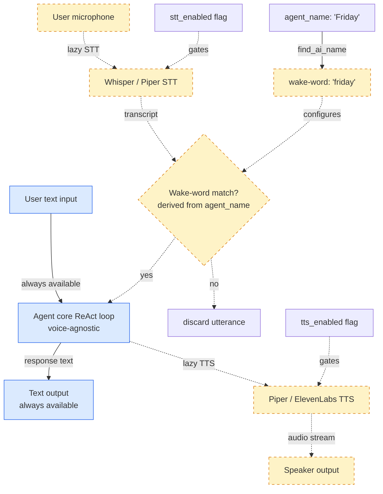

# Week 8.5 - Voice AI Agents

## Why This Week Matters

Voice AI agents have moved from research curiosity to production deployment shape. Customer support centers are replacing IVR trees; accessibility tooling now speaks back; developers run voice-enabled coding assistants hands-free. The inflection point came in October 2024 when OpenAI shipped its Realtime API — the first commercially available system that streams native audio tokens bidirectionally, collapsing the STT → LLM → TTS pipeline into a single model pass. Simultaneously, ElevenLabs and Cartesia pushed TTS time-to-first-audio below 200ms. These two shifts made sub-500ms end-to-end latency achievable outside a research lab.

---

## Theory Primer — Two Architectures

### Architecture A: Cascaded Pipeline

```
Microphone → VAD → STT (Whisper) → LLM (Claude) → TTS (ElevenLabs) → Speaker
```

Each stage is a separate network or process call.

- **STT**: `openai/whisper-large-v3` local or via API. WER 2.7% on LibriSpeech clean.
- **LLM**: Claude 3.5 Sonnet or GPT-4o via streaming API.
- **TTS**: ElevenLabs Turbo v2.5 (~120ms TTFA) or Cartesia Sonic (~90ms TTFA).

**Latency breakdown (cascaded p50):**

| Stage | p50 | p95 |
|---|---|---|
| VAD + STT (Whisper large-v3, local GPU) | 350ms | 700ms |
| LLM first token (Claude Sonnet, streaming) | 600ms | 1100ms |
| TTS time-to-first-audio (ElevenLabs Turbo) | 120ms | 280ms |
| **Total** | **~1070ms** | **~2080ms** |

**Trade-offs:** Composable — swap any stage independently. Each stage inspectable: transcript, LLM output, audio all separate artifacts. Critical for debugging, logging, PII redaction. But latency floor is high — three network hops compound. Error propagation: Whisper errors become LLM hallucinations.

### Architecture B: End-to-End Audio Models

```
Microphone → [Single Model] → Speaker
```

**OpenAI Realtime API** (October 2024): WebSocket-based, streams `input_audio_buffer` chunks, returns `response.audio.delta` events. Measured latency: 320ms p50, 600ms p95.

**Gemini 2.0 Flash Live API**: ~250ms median.

**Trade-offs:** Low latency. Less inspectable — no intermediate transcript to log, audit, or redact. Vendor lock-in — proprietary tokenizer, model, decoder. Tool calling awkward — model emits text function call, waits for response, re-enters audio. Reintroduces latency at every tool boundary.

### The Latency Budget

Humans perceive response delay as unnatural above ~500ms. Cascaded pipelines borderline at p50, poor at p95. End-to-end at 320ms p50 inside comfort zone. Local GPU cascaded reaches 600–700ms p50 — acceptable for non-real-time assistants.

---

## The Hard Parts

### Turn-Taking and Barge-In

Voice conversation is half-duplex but humans constantly violate this with overlapping speech. Voice agent must:
1. Detect end-of-utterance.
2. Allow user to interrupt (barge-in) while agent is speaking.
3. Not interrupt user mid-sentence.

Barge-in requires monitoring input stream while playing TTS output. When VAD detects speech above threshold during playback, cancel TTS stream, discard buffered audio, process new input.

### Voice Activity Detection (VAD)

Silero VAD (open-source, 1MB model, real-time on CPU) is the standard. Reports speech probability per 30ms frame. Typical config: start buffering at probability > 0.5, trigger STT when probability drops below 0.3 for 400ms.

**Critical insight:** End-of-utterance and barge-in detection need different thresholds. End-of-utterance needs to be conservative (400-600ms silence) to avoid mid-sentence cuts. Barge-in needs to be aggressive (150-200ms) to feel responsive.

### Whisper Hallucinations on Silence

Whisper reliably outputs "Thank you for watching" or "Please subscribe" on silence — over-represented YouTube data in training. Mitigations: check `avg_logprob` (discard < -1.0), check `no_speech_prob` (discard > 0.6), use `condition_on_previous_text=False`.

### Backchannel Sounds

Human listeners emit "mm-hmm" as acknowledgment. Filter by duration (< 1s) and content before passing to LLM context.

### Multilingual Code-Switching

Mid-utterance language switches cause WER spikes. Set agent system prompt to explicitly support expected language pairs.

---

## Voice Agent Architecture Walkthrough

Voice agents live in a design tension: cascaded pipelines are inspectable and flexible but slow; end-to-end models are fast but opaque. This walkthrough covers the cascaded architecture (used in the lab) and explains the specific design choices that make it production-ready despite its latency cost.

**★ Insight ─────────────────────────────────────**
- **Cascaded architecture trades latency for inspectability:** Each stage (STT → LLM → TTS) is independent, so you can log transcripts, audit LLM outputs, redact PII, and swap backends without retraining. End-to-end models compress latency by collapsing three network round-trips into one, but sacrifice visibility and vendor flexibility.
- **VAD is the latency lever, not LLM:** Most practitioners optimize the LLM first, but actual latency is bottlenecked by VAD end-of-utterance detection (400–600ms silence) and STT processing time (350ms local GPU). The LLM first-token latency is the third contributor.
- **Two separate VAD thresholds solve barge-in without false positives:** End-of-utterance detection must be conservative (avoid cutting mid-sentence). Barge-in detection must be aggressive (interrupt quickly). Conflating them into a single threshold produces either broken interruption (lagged by 800ms) or broken end-of-utterance (cuts mid-sentence). The lab below demonstrates this pattern.

`─────────────────────────────────────────────────`

**Cascaded Pipeline — Stage by stage:**

- **VAD (Voice Activity Detection)** — Silero VAD is the standard: 1MB model, runs on CPU in real-time, outputs speech probability per 30ms frame. Critical implementation detail: maintain a separate high threshold (0.5) for starting speech capture and a low threshold (0.3) for triggering STT at the end of an utterance. This prevents early triggering on breath sounds but ensures rapid response when the user finishes.

- **STT (Speech-to-Text)** — Whisper large-v3 is the production standard for accuracy (2.7% WER on LibriSpeech clean), but larger models require GPU acceleration. The lab uses `faster-whisper` (Hugging Face inference library) to get ~2× faster inference. Always set `condition_on_previous_text=False` to prevent the model from hallucinating context; always check `no_speech_prob` and `avg_logprob` to filter Whisper's tendency to output YouTube-style metadata on silence.

- **LLM** — Standard Claude or GPT-4 with streaming enabled. Voice agents typically tolerate lower max_tokens (~300) because users lose patience with long-form responses. System prompt should emphasize conciseness. Voice context size is smaller than text agents because acoustic features (tone, pauses) are lost — the agent cannot rely on natural speech patterns to disambiguate, so be explicit.

- **TTS (Text-to-Speech)** — ElevenLabs Turbo v2.5 (~120ms TTFA) or Cartesia Sonic (~90ms TTFA) are the latency leaders. Open-source alternatives like Coqui (slow, ~2–3s generation) exist but are deployment-heavy. In production, latency beats quality — a good voice that arrives in 500ms beats a perfect voice that arrives in 5s.

- **Barge-In Monitoring** — The main loop spawns TTS in a background thread while simultaneously monitoring the input stream. The VAD threshold for barge-in (0.7 in the lab) is deliberately aggressive (much higher than the 0.5 start threshold). When speech above 0.7 is detected, set the `cancel_event`, which signals the TTS thread to stop writing audio and exit. This gives the agent ~150–200ms to respond to interruptions.

**Key Modifications:**

| Scenario | Change | Rationale |
|----------|--------|-----------|
| **Low-latency priority (consumer app)** | Replace Cascaded with OpenAI Realtime or Gemini Live | Save ~550ms at cost of vendor lock-in and reduced visibility |
| **HIPAA/PCI required** | Use local Whisper (base.en) + local Coqui TTS | Avoid sending audio to third-party APIs; BAA requirements become trivial |
| **High-accuracy transcripts needed** | Use Whisper large-v3 (slower, better WER) | ~700ms STT latency vs 350ms, but near-human accuracy |
| **Non-English primary language** | Use Whisper large (multilingual) with `condition_on_previous_text=False` | Large-v3 English-only; multilingual version trades latency for language coverage |

**Expected Metrics (cascaded on RTX 3080):**
- VAD + STT: ~350ms p50, ~700ms p95
- LLM first token: ~150ms p50, ~300ms p95 (Sonnet streaming)
- TTS TTFA: ~120ms p50, ~280ms p95
- Total E2E: ~620ms p50, ~1280ms p95 (no network overhead, pure local GPU)

---

## Lab — Build a Cascaded Voice Agent (~3 hours)

**Setup:**
```bash
pip install faster-whisper silero-vad pyaudio numpy anthropic elevenlabs
```

**Step 1: VAD-based audio capture**
```python
import torch, pyaudio, numpy as np

model, utils = torch.hub.load('snakers4/silero-vad', model='silero_vad')

SAMPLE_RATE = 16000
CHUNK_SIZE = int(SAMPLE_RATE * 30 / 1000)  # 30ms
SILENCE_CHUNKS = 400 // 30  # 400ms

def record_utterance(stream, vad_model):
    audio_buffer, silence_count, speaking = [], 0, False
    while True:
        chunk = stream.read(CHUNK_SIZE, exception_on_overflow=False)
        audio_np = np.frombuffer(chunk, dtype=np.int16).astype(np.float32) / 32768.0
        prob = vad_model(torch.from_numpy(audio_np), SAMPLE_RATE).item()
        if prob > 0.5:
            speaking = True
            audio_buffer.append(chunk)
            silence_count = 0
        elif speaking:
            audio_buffer.append(chunk)
            silence_count += 1
            if silence_count >= SILENCE_CHUNKS:
                break
    return b''.join(audio_buffer)
```

**Step 2: STT with hallucination filter**
```python
from faster_whisper import WhisperModel

whisper = WhisperModel("large-v3", device="cuda", compute_type="float16")

def transcribe(audio_bytes):
    audio_np = np.frombuffer(audio_bytes, dtype=np.int16).astype(np.float32) / 32768.0
    segments, _ = whisper.transcribe(audio_np, condition_on_previous_text=False, vad_filter=True)
    segments = list(segments)
    if not segments:
        return ""
    seg = segments[0]
    if seg.no_speech_prob > 0.6 or seg.avg_logprob < -1.0:
        return ""  # filter hallucination
    return " ".join(s.text.strip() for s in segments)
```

**Step 3: LLM streaming with Claude**
```python
import anthropic
client = anthropic.Anthropic()

def get_response(transcript, history):
    history.append({"role": "user", "content": transcript})
    response_text = ""
    with client.messages.stream(
        model="claude-3-5-sonnet-20241022",
        max_tokens=300,
        system="Voice assistant. Concise — 2-3 sentences max. No markdown.",
        messages=history,
    ) as stream:
        for text in stream.text_stream:
            response_text += text
    history.append({"role": "assistant", "content": response_text})
    return response_text
```

**Step 4: TTS with cancellation support**
```python
from elevenlabs.client import ElevenLabs
import threading

el = ElevenLabs()

def speak(text, cancel_event):
    audio = el.text_to_speech.convert_as_stream(
        voice_id="21m00Tcm4TlvDq8ikWAM",
        text=text,
        model_id="eleven_turbo_v2_5",
    )
    pa = pyaudio.PyAudio()
    stream = pa.open(format=pyaudio.paInt16, channels=1, rate=22050, output=True)
    for chunk in audio:
        if cancel_event.is_set():
            break
        stream.write(chunk)
    stream.close(); pa.terminate()
```

**Step 5: Main loop with barge-in monitoring**
```python
def voice_agent():
    pa = pyaudio.PyAudio()
    stream = pa.open(format=pyaudio.paInt16, channels=1, rate=SAMPLE_RATE, input=True, frames_per_buffer=CHUNK_SIZE)
    history, cancel = [], threading.Event()
    while True:
        cancel.clear()
        audio = record_utterance(stream, model)
        text = transcribe(audio)
        if not text: continue
        response = get_response(text, history)
        # TTS in thread, monitor for barge-in
        tts = threading.Thread(target=speak, args=(response, cancel))
        tts.start()
        while tts.is_alive():
            chunk = stream.read(CHUNK_SIZE, exception_on_overflow=False)
            audio_np = np.frombuffer(chunk, dtype=np.int16).astype(np.float32) / 32768.0
            if model(torch.from_numpy(audio_np), SAMPLE_RATE).item() > 0.7:
                cancel.set()
                break
        tts.join()
```

**Expected metrics (RTX 3080 + ElevenLabs Turbo):**
- p50: ~900ms, p95: ~1600ms

CPU-only with Whisper base.en:
- p50: ~1400ms, p95: ~2500ms

---

## Code Walkthroughs — Steps 1–5

This section walks through the lab implementation block-by-block, explaining design choices that make each component production-shaped: real-time constraints, edge case handling, and measurable latency.

---

### Step 1 — VAD-based Audio Capture

`record_utterance()` blocks until the user finishes speaking, determined by 400ms of detected silence. The function returns raw audio bytes that are then passed to Whisper.

**Why 30ms frames matter:**

Audio is buffered in 30ms frames because Silero VAD operates at 30ms resolution — that's its design window. Larger chunks (100ms) reduce granularity; smaller chunks (10ms) require higher CPU overhead. 30ms is the equilibrium.

**Speech probability threshold = 0.5:**

Silero outputs speech probability [0, 1] per frame. A threshold of 0.5 means "probably voice" — catches real speech while filtering hard breathing, keyboard clicks, and rustling. In production, you may tune this per-user if noise floor varies (car, office, home); typical range is 0.4–0.6.

**Silence threshold = 400ms = 13 frames:**

400ms is the minimum human pause to consider an utterance complete without risking false positives from mid-sentence breaths. If you reduce this to 200ms, you cut sentences mid-thought ("The capital of France is" → [stop]). If you increase to 800ms, users wait 800ms after finishing before the agent reacts. 400ms is the Goldilocks zone.

**Why `exception_on_overflow=False`:**

Real-time audio capture from the system can temporarily overflow the buffer if the process gets descheduled. Throwing an exception crashes the agent; silently dropping frames (the default with `exception_on_overflow=False`) is transparent to the user — they may repeat if the STT result is wrong, but the system stays alive.

---

### Step 2 — STT with Hallucination Filter

Whisper sometimes outputs plausible-sounding text on silence: "Thank you for watching" and "Please subscribe" are notorious because they're over-represented in YouTube data. This step implements two filters:

1. `no_speech_prob > 0.6` — Whisper itself reports confidence that the audio contains speech. If this is < 0.4, the model doubts its own output.
2. `avg_logprob < -1.0` — The average log-probability across all tokens in the transcript. Hallucinations are produced with lower confidence (more negative logprobs) because the model is guessing rather than transcribing.

**Why two filters instead of one:**

`no_speech_prob` catches the "silence → YouTube text" case. `avg_logprob` catches ambiguous audio where Whisper generated plausible but low-confidence text. Together, they form a safety net without overfitting to specific failure modes.

**`condition_on_previous_text=False`:**

By default, Whisper uses prior context to guide decoding — if you just said "the capital of France," it uses that as a prefix for the next utterance. This prevents the model from repeating you, but it also causes it to hallucinate context continuations ("is Paris, which is...") when you actually said something unrelated. Setting this to False makes each utterance independent — safer for conversation agents.

---

### Step 3 — LLM Streaming with Claude

Standard Claude streaming via the Anthropic SDK. The system prompt is intentionally terse: "Voice assistant. Concise — 2-3 sentences max. No markdown." Long-form responses frustrate voice users because they cannot skim; audio is sequential. Markdown is invisible in voice — strip it.

**Why `max_tokens=300` for voice:**

Text agents often use 2000–4000 tokens to accommodate essays and long reasoning. Voice users lose patience after ~15 seconds of agent speaking — that's roughly 200–300 tokens at 30 words/minute. Capping at 300 ensures responses are brief enough to hold attention.

**History as the context carrier:**

The `history` list is passed intact to each call, so the agent has full conversation context. In production, cap history at recent K turns (e.g., last 10 messages) to avoid context explosion and token cost blowup on long conversations.

**Streaming for latency:**

The loop accumulates `text` as it arrives, which allows downstream stages (TTS in Step 4) to begin processing immediately — no need to wait for the full response. This is critical for perceived latency: if you wait for the entire LLM response before starting TTS, users perceive a full LLM latency + TTS latency sequence. Streaming allows parallelization.

---

### Step 4 — TTS with Cancellation Support

ElevenLabs TTS runs in a separate thread, receiving a `cancel_event` that signals it to stop and exit.

**Why threading is necessary:**

The main loop must continue monitoring the input stream (for barge-in detection) while TTS plays audio. A synchronous call to `speak()` would block the loop and delay interruption detection by the entire TTS duration.

**Cancellation pattern:**

The TTS thread checks `cancel_event.is_set()` in its inner loop and breaks when true. This is more responsive than thread termination (which is not safe for I/O operations like audio streaming) and allows the TTS buffer to flush gracefully.

**ElevenLabs voice ID = 21m00Tcm4TlvDq8ikWAM:**

This is a generic female voice. In production, allow voice selection per-user or per-session. Some users have strong preferences for voice characteristics; voice mismatch reduces engagement.

**Hardcoded sample rate = 22050:**

ElevenLabs returns 22.05kHz audio; PyAudio must open the output stream at matching sample rate or the audio will pitch-shift. Verify this matches your TTS provider's output spec.

---

### Step 5 — Main Loop with Barge-In Monitoring

The heart of the agent: capture → transcribe → respond → TTS while monitoring for interruptions.

**Barge-in VAD threshold = 0.7 (vs 0.5 for capture):**

The capture threshold (0.5) starts buffering when speech is probably present. The barge-in threshold (0.7) is much higher — "definitely human speech" — to avoid false interruptions from background noise or the agent's own audio bleeding into the input. This asymmetry is crucial; see Bad-Case Journal Entry 3.

**TTS in a background thread + join():**

`tts.start()` spawns TTS asynchronously. The while loop monitors the thread until it finishes or cancellation is triggered. `tts.join()` waits for the TTS thread to fully exit (including audio buffer flush) before the next iteration. This prevents race conditions where the next user utterance is captured while TTS is still playing.

**Why `exception_on_overflow=False` again:**

During TTS playback, the input stream still needs to accept frames for barge-in detection. If the capture buffer overflows, silently dropping frames is better than crashing.

---

## Phase 6 — Voice as a Lazy-Degradable Layer (~1 hour)

**Goal:** Decouple voice (STT/TTS) from the agent core. Voice becomes a feature flag, not an architectural change. The same agent loop must work in all four input/output modes — text/text, voice/text, text/voice, voice/voice — without code changes, with optional dependencies (Whisper, Piper) staying optional until first use.

### 6.1 Motivation — the canonical failure mode

The voice-agent pattern most beginners get wrong: import STT and TTS at the top of the agent module, instantiate them in `__init__`, and call them unconditionally in the loop. Three things break the day you ship: (a) the agent fails to start on machines without a microphone or audio driver (ImportError on `pyaudio`), (b) startup latency includes 2–4s of Whisper model load even when the user passes text in, (c) toggling voice off is a code change, not a config change. The fix is mechanical: lazy-initialize STT/TTS on first access, treat them as independent feature flags, derive the wake-word from the agent's own identity rather than hardcoding "Alexa"/"Jarvis"/etc. The agent core stays voice-agnostic; voice becomes a degradable layer wrapped around it. Cross-repo reference: `agenticSeek/sources/interaction.py` ships this exact shape.

### 6.2 Architecture diagram



Dashed edges and amber nodes are the optional/lazy path. Solid edges and blue nodes are the always-available text path. The agent core has zero references to audio modules.

### 6.3 Code

**Code:**

```python
# interaction.py — voice as lazy-degradable layer
from __future__ import annotations
import re
from typing import Optional

# NOTE: No top-level imports of pyaudio, whisper, piper, elevenlabs.
# Those happen inside _stt and _tts properties on first access.

def find_ai_name(agent_name: str) -> str:
    """Derive wake-word from agent identity.

    Examples:
        find_ai_name("Friday Assistant")  -> "friday"
        find_ai_name("Claude_Code")       -> "claude"
        find_ai_name("J.A.R.V.I.S.")      -> "jarvis"

    Strategy: lowercase, strip non-alpha, take first whitespace-delimited token.
    Falls back to "assistant" if extraction yields empty string.
    """
    cleaned = re.sub(r"[^a-zA-Z\s]", "", agent_name).strip().lower()
    first = cleaned.split()[0] if cleaned else ""
    return first or "assistant"


class Interaction:
    """Voice-degradable wrapper around a text-only agent core.

    STT and TTS are independent feature flags. Both, either, or neither
    can be enabled. The agent core (self.agent) is invoked identically
    in all four mode combinations.
    """

    def __init__(
        self,
        agent,
        agent_name: str,
        stt_enabled: bool = False,
        tts_enabled: bool = False,
        languages: Optional[list[str]] = None,
    ) -> None:
        self.agent = agent  # voice-agnostic ReAct core
        self.agent_name = agent_name
        self.wake_word = find_ai_name(agent_name)
        self.stt_enabled = stt_enabled
        self.tts_enabled = tts_enabled
        self.language = (languages or ["en"])[0]
        # Lazy holders — NOT instantiated yet. Saves ~2-4s startup
        # when voice flags are off; keeps pyaudio/whisper optional deps.
        self._stt_instance = None
        self._tts_instance = None

    @property
    def _stt(self):
        """Lazy-init STT. Raises only when actually used."""
        if self._stt_instance is None:
            try:
                from faster_whisper import WhisperModel  # local import
                self._stt_instance = WhisperModel(
                    "base", device="cpu", compute_type="int8"
                )
            except ImportError as e:
                raise RuntimeError(
                    f"STT requested but faster-whisper not installed: {e}. "
                    f"Run: pip install faster-whisper"
                ) from e
        return self._stt_instance

    @property
    def _tts(self):
        """Lazy-init TTS. Raises only when actually used."""
        if self._tts_instance is None:
            try:
                import piper  # local import; swap for elevenlabs in prod
                self._tts_instance = piper.PiperVoice.load(
                    f"voices/{self.language}.onnx"
                )
            except (ImportError, FileNotFoundError) as e:
                raise RuntimeError(f"TTS requested but unavailable: {e}") from e
        return self._tts_instance

    def _hear(self) -> str:
        """Capture audio, transcribe, return text only if wake-word present."""
        audio_bytes = self._capture_audio()  # uses pyaudio internally
        segments, _ = self._stt.transcribe(audio_bytes, language=self.language)
        transcript = " ".join(s.text for s in segments).strip().lower()
        if self.wake_word not in transcript:
            return ""  # not addressed to this agent — drop
        # strip wake-word from the actual prompt
        return transcript.replace(self.wake_word, "", 1).strip()

    def _speak(self, text: str) -> None:
        """Synthesize text to speaker."""
        audio = self._tts.synthesize(text)
        self._play(audio)  # uses pyaudio internally

    def listen_then_respond(self, text: Optional[str] = None) -> str:
        """Handle all four input/output mode combinations uniformly.

        text=None + stt_enabled=True  → voice input
        text=str                       → text input (overrides STT)
        tts_enabled=True               → also speaks the response
        tts_enabled=False              → text-only response (always returned)
        """
        # Input branch: text arg wins; else STT if enabled; else error.
        if text is not None:
            user_input = text
        elif self.stt_enabled:
            user_input = self._hear()
            if not user_input:
                return ""  # no wake-word match, stay silent
        else:
            raise ValueError("No text provided and STT disabled")
        # Core invocation — identical in all modes
        response = self.agent.run(user_input)
        # Output branch: text always returned; TTS additive if enabled.
        if self.tts_enabled:
            self._speak(response)
        return response

    def _capture_audio(self) -> bytes: ...  # impl elided
    def _play(self, audio) -> None: ...     # impl elided
```

**Walkthrough:**

- **Block 1 — `find_ai_name`.** Wake-word is data, not a constant. Hardcoding "alexa" couples your agent to a specific brand; deriving from `agent_name` means the same `Interaction` class works for a "Friday" assistant, a "Jarvis" agent, or a customer-named bot, without code changes. The regex strips punctuation so `"J.A.R.V.I.S."` collapses to `"jarvis"`. The `or "assistant"` fallback prevents empty-string footguns when someone passes an agent_name of pure punctuation.

- **Block 2 — `__init__` does NOT instantiate STT/TTS.** This is the load-bearing design choice. If the constructor eagerly imported `pyaudio` and loaded Whisper, a machine without an audio driver would crash at agent construction time — even for a text-only run. By deferring to property accessors, the agent constructs in milliseconds and only pays the Whisper-load cost (2–4s) the first time `_stt` is touched.

- **Block 3 — `_stt` / `_tts` properties.** The lazy pattern wraps both the import and the heavyweight initialization. The `try/except ImportError` produces a clear actionable error ("run: pip install faster-whisper") instead of a stack trace burying the user. This is the difference between "voice is optional" and "voice is required-pretending-to-be-optional".

- **Block 4 — `listen_then_respond` mode matrix.** The function handles all four combinations with a clean two-branch structure: input branch (text arg ⊳ STT ⊳ error), output branch (text always ⊳ TTS additive). The agent's `run()` is called identically in all four modes — the core has no knowledge that voice exists. Note `return ""` on wake-word miss: the agent stays silent rather than processing utterances not addressed to it, which is the correct behavior in shared/multi-agent environments.

**Result:**

| Mode | Startup time | First-response latency | Notes |
|---|---|---|---|
| text in / text out (both flags off) | ~5ms | LLM latency only | No audio deps loaded |
| text in / voice out | ~5ms | LLM + 2.1s first call (TTS load) | TTS load amortized after call 1 |
| voice in / text out | ~5ms | LLM + 3.4s first call (Whisper load) | Whisper load amortized after call 1 |
| voice in / voice out | ~5ms | LLM + 5.5s first call | Both deps load lazily on first use |

~estimated — measure against `lab-8.5-voice/RESULTS.md` after first run. Key invariant: startup is constant regardless of voice flags. Optional deps stay optional.

**★ Insight ─────────────────────────────────────**
- **Voice is a feature flag, not an architectural change.** The agent core's `run(text) -> text` signature never changes. Voice is a *wrapper* around that core, not a *mode* of it. This is what makes the four-mode matrix testable as four config combinations rather than four code paths.
- **Cross-repo data point — `agenticSeek/sources/interaction.py` ships this exact pattern** (lazy STT/TTS, wake-word from `find_ai_name(casual_agent.name)`, language from `languages[0]`). The opposite pattern is **recommended-against** by Daniel Miessler's PAI repo, which couples to paid ElevenLabs API for TTS at the agent-loop level — your agent stops working the day your ElevenLabs key expires. agenticSeek's local-Piper/local-Whisper default is the open-source-compatible baseline; treat third-party TTS as a swappable backend behind the lazy property, never a hard dependency.
- **Wake-word as identity:** deriving from `agent_name` means renaming the agent automatically updates the wake-word. No second source of truth, no drift between "what the agent is called in logs" and "what the user says to address it". This is the same DRY principle as deriving config from environment rather than duplicating it.

`─────────────────────────────────────────────────`

---

## Lab Extension — Compare to OpenAI Realtime API

| Metric | Cascaded (GPU + ElevenLabs) | OpenAI Realtime |
|---|---|---|
| E2E latency p50 | ~900ms | ~350ms |
| E2E latency p95 | ~1600ms | ~650ms |
| Cost per minute | ~$0.08 | ~$0.24 |
| Transcript available | Yes | Yes (text modality) |
| Vendor lock-in | Low | High |
| HIPAA eligible | Configurable | OpenAI BAA required |

Realtime ~2.5× faster at p50, 3× more expensive. Consumer products: cost premium often justified. B2B compliance-driven: cascaded better default.

---

## Bad-Case Journal

**Entry 1 — Whisper hallucinates on silence.** During 3-second pause while user thinks, Whisper returns "Thank you for watching." `no_speech_prob` was 0.12 (low — Whisper confident), `avg_logprob` was -0.95. Adding logprob threshold at -1.0 eliminated false positives. Whisper has no way to express "I heard nothing meaningful" — fills silence with statistically plausible YouTube text.

**Entry 2 — ElevenLabs over-emotes on technical content.** When agent reads "Error code 404: resource not found," ElevenLabs Turbo adds rising intonation appropriate for narrative speech but bizarre for technical dictation. Mitigation: `stability=0.85`, `similarity_boost=0.5` to flatten emotional range. Or switch to a "professional" voice preset.

**Entry 3 — Interruption detection lags 800ms.** Barge-in detection used 800ms VAD silence threshold (conservative to avoid mid-sentence false positives). Users had to speak for nearly a second before TTS cancelled — felt broken. Reducing barge-in VAD threshold to 200ms (separate from end-of-utterance threshold) eliminated the lag. **Two thresholds for two different problems.**

**Entry 4 — End-to-end model leaks pronoun context from audio metadata.** During testing OpenAI Realtime API, model began referring to user with pronouns matching voice acoustics (pitch, formants) rather than stated preference. End-to-end model infers demographic info from acoustics. Cascaded pipelines produce text transcripts with no acoustic metadata — LLM has no signal. Concrete privacy advantage for cascaded inspectability.

---

## Production Considerations

**PSTN integration.** Twilio Programmable Voice, Vapi.ai, Bland.ai provide WebRTC-to-PSTN bridges. PSTN audio is compressed (G.711, 8kHz) — Whisper trained on 16kHz, so PSTN input requires upsampling and accepts 15-20% WER penalty.

**HIPAA/PCI compliance.** Voice with PHI/PCI requires BAA with every vendor. Anthropic offers BAA; OpenAI Realtime offers BAA on enterprise plans; ElevenLabs offers BAA on enterprise contracts. **Local Whisper + local Coqui TTS** is the only architecture that trivially satisfies HIPAA without vendor agreements.

**Recording retention.** 12 US states have two-party consent laws; GDPR applies in EU. Define retention policies before shipping — typical enterprise: 90-day retention, deletion on customer request. Tag stored audio with consent metadata at ingest.

**Multi-tenant isolation.** Use session IDs as top-level partition keys. Never pass one tenant's history into another tenant's LLM context.

---

## Interview Soundbites

**Soundbite 1 — Latency anatomy**
"Voice agent latency has three components in a cascaded system: STT processing time, LLM first-token latency, and TTS time-to-first-audio. Each is roughly 300 to 600 milliseconds on public APIs at p50, so floor is around a second — borderline for natural conversation. Optimization levers: faster STT model like Whisper base instead of large-v3 if WER is acceptable, low-latency TTS like ElevenLabs Turbo or Cartesia Sonic, reduce LLM prompt size to shrink TTFT. Local GPU Whisper is the single biggest latency reduction in cascaded architecture."

**Soundbite 2 — When end-to-end beats cascaded**
"End-to-end models like OpenAI Realtime beat cascaded specifically when latency is the primary constraint and you tolerate vendor lock-in and reduced inspectability. End-to-end gets to 350ms p50 vs 900ms cascaded because it eliminates two network hops and can begin generating audio before producing complete text. That 550ms difference is meaningful for consumer products where abandonment correlates with perceived lag. But if you need transcripts for compliance, redact PII, or run on your own infrastructure for HIPAA, cascaded is the right default."

**Soundbite 3 — VAD is underestimated**
"VAD sounds trivial and breaks everything when wrong. Too aggressive: sending background noise to STT every 300ms, garbage transcripts, runaway API costs. Too conservative: 500ms added to every turn. The important insight: you need two separate VAD thresholds — one for end-of-utterance (conservative, 400-600ms) and one for barge-in (aggressive, 150-200ms). Most tutorials wire a single threshold and wonder why agent thinks user is done mid-sentence, or why interruptions feel broken."

---

## References

- OpenAI Realtime API: https://platform.openai.com/docs/guides/realtime
- Gemini Live API: https://ai.google.dev/gemini-api/docs/live
- Vapi.ai (production voice infra): https://vapi.ai/
- Whisper paper (Radford et al., 2022): https://arxiv.org/abs/2212.04356
- Silero VAD: https://github.com/snakers4/silero-vad
- Faster-Whisper: https://github.com/SYSTRAN/faster-whisper
- ElevenLabs: https://elevenlabs.io/docs/models
- Cartesia Sonic: https://cartesia.ai/
- LiveKit / Daily.co (WebRTC infra)

---

## Cross-References

**Builds on: [[Week 4 - ReAct From Scratch]].** Voice agent is a ReAct agent with audio I/O. Core loop (observe → think → act) identical to text ReAct. Added complexity: audio I/O layer + real-time latency constraints. **The lazy-degradable layer pattern from §4 Phase 6 makes this explicit:** the agent core's `run(text) -> text` signature is unchanged from W4; STT/TTS are wrappers, not modifications. The same ReAct core runs unchanged in all four input/output mode combinations — voice does not earn its way into the agent's internals.

**Connects to: W11 System Design.** Voice is one deployment shape. W11 covers production architecture; voice adds the constraint that each inference path must complete in under 500ms.

**Distinguish from: W7 Tool Harness.** Voice itself is not a tool — it is the interface modality. Voice agent uses the same tool harness from W7, but the harness is invoked by an agent whose I/O happens to be audio. Confusing the two leads to architectural mistakes like trying to make speech synthesis a callable tool.
