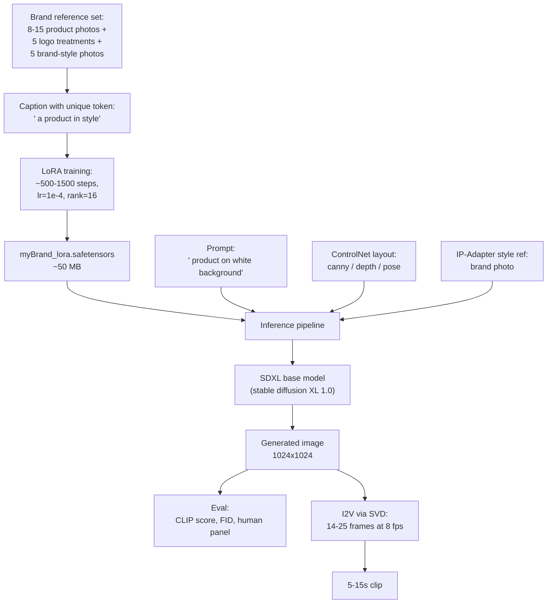

# Week 8.7 — Generative Media (Image / Video / Audio) and Fine-tuning

## Exit Criteria

- [ ] Articulate the diffusion forward + reverse process: $x_t = \sqrt{\bar{\alpha}_t} x_0 + \sqrt{1 - \bar{\alpha}_t} \epsilon$ ; reverse via learned $\epsilon_\theta(x_t, t)$
- [ ] Distinguish DDPM / DDIM / latent diffusion / classifier-free guidance — what each adds
- [ ] Train a LoRA adapter on 10 brand-consistent reference images of one subject; load + apply at inference time
- [ ] Use ControlNet + IP-Adapter to enforce structural + style constraints
- [ ] Compute CLIP score + FID for generated outputs; explain why both are necessary + insufficient
- [ ] Extend to video: I2V via AnimateDiff or SVD; explain temporal-consistency challenges
- [ ] Write 3 interview soundbites for JD#4 "generative media + brand-consistent fine-tuning"

## Why This Week Matters

JDs targeting brand-consistent generative content (e-commerce hero images, product video, marketing audio) need engineers who can fine-tune diffusion models — not just call a paid API. LoRA + DreamBooth + ControlNet are the production stack. Image generation extends to video via temporal-coherence mechanisms (AnimateDiff, SVD). Without this chapter the curriculum is unable to answer "have you fine-tuned a generative model?" with anything beyond text. This is a SPEC-level chapter — full lab implementation is heavy GPU work (LoRA training takes ~30 min on M5 Pro for 50 steps; full DreamBooth is hours), but the pedagogy + interview soundbites are achievable in 4-6 hours of read + 2-hour LoRA demo.

## Theory Primer — Diffusion, LoRA, ControlNet, Eval

### Concept 1 — Diffusion Forward + Reverse

**Forward process.** Take an image $x_0$, gradually add Gaussian noise over $T$ timesteps:

$$
q(x_t \mid x_{t-1}) = \mathcal{N}\!\left(x_t;\ \sqrt{1 - \beta_t}\,x_{t-1},\ \beta_t I\right)
$$

After $T$ steps with appropriate $\beta_t$ schedule, $x_T \approx \mathcal{N}(0, I)$ — pure noise.

The forward process has a closed-form jump:

$$
x_t = \sqrt{\bar{\alpha}_t}\,x_0 + \sqrt{1 - \bar{\alpha}_t}\,\epsilon, \quad \epsilon \sim \mathcal{N}(0, I)
$$

where $\bar{\alpha}_t = \prod_{s=1}^{t} (1 - \beta_s)$.

**Reverse process.** Train a neural network $\epsilon_\theta(x_t, t)$ to PREDICT the noise. Loss:

$$
\mathcal{L} = \mathbb{E}_{x_0, t, \epsilon}\!\left[ \|\epsilon - \epsilon_\theta(x_t, t)\|^2 \right]
$$

At inference: start from $x_T \sim \mathcal{N}(0, I)$, iteratively denoise via the learned $\epsilon_\theta$ until $x_0$.

### Concept 2 — DDPM vs DDIM vs Latent Diffusion vs Classifier-Free Guidance

| Variant | What it adds | Practical impact |
|---|---|---|
| **DDPM** (Ho et al. 2020) | Original; ~1000-step Markov-chain denoising | Slow inference; quality baseline |
| **DDIM** (Song et al. 2020) | Deterministic non-Markov sampler; 20-50 steps | 20-50x faster inference at similar quality |
| **Latent diffusion** (Rombach et al. 2022 — Stable Diffusion) | Denoise in VAE latent space, not pixel space | ~10x faster + smaller memory; the production format |
| **Classifier-free guidance (CFG)** (Ho & Salimans 2022) | Combine conditional + unconditional predictions: $\hat{\epsilon} = \epsilon_\theta(x_t, c) + s(\epsilon_\theta(x_t, c) - \epsilon_\theta(x_t, \emptyset))$ | Controls how strongly text prompt steers generation; CFG scale 7-9 is typical |

Stable Diffusion = latent diffusion + DDIM sampling + CFG. The 3 levers together are why SD generates a 1024×1024 image in 4-15 seconds rather than 5 minutes.

### Concept 3 — LoRA for Brand-Consistent Fine-Tuning

Full fine-tuning of SDXL touches ~3.5B parameters. Brand-consistent training of one subject does NOT need that capacity — adding a small low-rank delta is enough.

**LoRA formulation.** Replace original weight matrix $W$ with $W + B A$ where $B \in \mathbb{R}^{d \times r}$, $A \in \mathbb{R}^{r \times k}$, and $r \ll \min(d, k)$. Typical $r = 4$ to $r = 32$.

Trainable parameters: $r(d + k)$ vs original $d \times k$. For a layer with $d = k = 1024$ and $r = 16$: trainable = $32{,}768$ vs original $1{,}048{,}576$ — **32x smaller**.

LoRA training: freeze $W$, train $B$ and $A$ only. Initial $B = 0$ so $W + BA = W$ at start; the model behaves identically before any LoRA update. After training, $BA$ encodes the delta.

**Brand-consistency pattern:**
1. Collect 8-15 reference images of the brand subject (logo, product, mascot)
2. Caption with a UNIQUE token like `<myBrand>` (avoid common dictionary words)
3. Train LoRA for ~500-1500 steps with low learning rate
4. At inference: include `<myBrand>` in prompts to invoke the trained concept

### Concept 4 — ControlNet + IP-Adapter (Structural + Style Constraints)

LoRA controls IDENTITY ("this brand's logo"). ControlNet + IP-Adapter control STRUCTURE and STYLE.

**ControlNet** (Zhang et al. 2023): trains a parallel network that conditions diffusion on a structural input — Canny edges, depth map, pose skeleton, segmentation mask. Generates an image that obeys the structural condition.

**IP-Adapter** (Ye et al. 2023): conditions diffusion on an IMAGE prompt rather than text. Use a reference image to drive style; the model generates new content in that style.

**Stack for brand-consistent ad creative:**

$$
\text{output} = \text{SDXL} + \text{LoRA}_{\text{brand-subject}} + \text{ControlNet}_{\text{layout}} + \text{IP-Adapter}_{\text{brand-style}}
$$

LoRA puts the brand's product in the image. ControlNet ensures it fits a specified layout. IP-Adapter ensures the lighting + color palette match the brand's reference photos. Three orthogonal levers; combine for production-grade output.

### Concept 5 — Eval: CLIP Score + FID

**CLIP Score.** Measures text-image alignment. For a generated image $I$ and prompt $T$:

$$
\text{CLIPScore}(I, T) = \max\!\left(0,\ \cos(\text{CLIP}_{\text{img}}(I),\ \text{CLIP}_{\text{txt}}(T))\right)
$$

Higher = better text-image match. Saturated around 0.32 for strong models.

**Fréchet Inception Distance (FID).** Compares the distribution of generated images to a reference set:

$$
\text{FID}(P, Q) = \|\mu_P - \mu_Q\|^2 + \operatorname{tr}\!\left(\Sigma_P + \Sigma_Q - 2 (\Sigma_P \Sigma_Q)^{1/2}\right)
$$

where $\mu, \Sigma$ are mean + covariance of Inception-v3 features on the two image sets. Lower = better. SDXL on COCO-2017 hits FID ~7-10.

**Why both are necessary + insufficient.** CLIP measures relevance but not realism; a blurry image of a cat is highly CLIP-scoring. FID measures distribution match but is INSENSITIVE to caption alignment; a high-FID model can hallucinate caption-irrelevant content. Production rule: track CLIP + FID + **human preference scores** from a panel of 10-50 annotators per release.

### Concept 6 — Video Extension: Temporal Coherence

Image diffusion → video diffusion requires preserving subject identity across frames. Three approaches:

1. **AnimateDiff** — train a separate motion module on top of existing T2I; ~2s clips at 16 fps.
2. **Stable Video Diffusion (SVD)** — image-to-video; takes a static image + generates 14-25 frames of motion.
3. **CogVideoX / OpenAI Sora** — native text-to-video; longer clips, higher quality, much more expensive.

Brand consistency over video: LoRA + ControlNet (per-frame pose) + frame-blending interpolation. Production output: 5-15 second clips for ad creative.

## Architecture Diagram



## Phase 1 — LoRA Training on Brand Subject (~3 hours, SPEC-level)

```bash
mkdir -p lab-08-7-genmedia/dataset
# Drop 10-15 photos of the brand subject into dataset/
# Each photo needs a .txt with the SAME prompt, e.g. "<myBrand> a product photo"
uv init --no-readme --no-workspace --python 3.12
uv add diffusers transformers accelerate peft mlx-diffusion datasets
```

```python
# src/train_lora.py — LoRA fine-tuning of SDXL on brand subject
"""SPEC-level outline. Production LoRA training scripts exist in the diffusers
repo at examples/dreambooth/train_dreambooth_lora_sdxl.py; this is the
chapter's pedagogical sketch of what those scripts do."""
from diffusers import StableDiffusionXLPipeline, DDPMScheduler
from peft import LoraConfig, get_peft_model
import torch


# LoRA configuration
LORA_CONFIG = LoraConfig(
    r=16,                           # rank — typical 4-32; 16 is balanced
    lora_alpha=32,                  # scaling — usually 2x rank
    target_modules=[                # which attention layers get LoRA
        "to_q", "to_k", "to_v", "to_out.0",
    ],
    lora_dropout=0.05,
    bias="none",
)

# Outline (not runnable; see diffusers examples for the full implementation):
# 1. Load SDXL: pipe = StableDiffusionXLPipeline.from_pretrained(...)
# 2. Wrap UNet with LoRA: pipe.unet = get_peft_model(pipe.unet, LORA_CONFIG)
# 3. Build dataset from brand images + captions
# 4. Training loop:
#    for step in range(num_steps):
#        x_0 = batch_image  # (B, 3, H, W)
#        t = sample_uniform(0, T)  # random timestep
#        eps = randn_like(x_0)
#        x_t = sqrt_alpha_bar[t] * x_0 + sqrt_one_minus_alpha_bar[t] * eps
#        eps_pred = pipe.unet(x_t, t, text_embeds=...)
#        loss = mse(eps, eps_pred)
#        loss.backward(); optimizer.step()
# 5. Save LoRA weights: pipe.unet.save_pretrained("myBrand_lora")
```

**Walkthrough:**

- **Rank=16 is the sweet spot.** r=4 too restrictive for visual concepts; r=32 overfits with only 10 images. The diffusers default and the production default.
- **`target_modules` selects ATTENTION layers only.** Cross-attention is where text-conditioning meets image features; that's where brand-identity learning concentrates. LoRA on FFN layers helps slightly but adds 2x parameter count for marginal gain.
- **`bias="none"` means biases are not trained.** Bias updates in LoRA are usually destructive — they shift the baseline behavior of the model on unrelated prompts. Keep biases frozen.
- **The forward-process closed form `x_t = sqrt_alpha_bar[t] * x_0 + ...`** is the load-bearing math. It lets you JUMP to any timestep in one operation instead of iterating; massive training-time speedup.

## Phase 2 — Inference with Stacked LoRA + ControlNet + IP-Adapter (~1 hour)

```python
# src/generate.py — combined inference pipeline
"""Pseudo-code outline; the diffusers library has the canonical implementations."""
from diffusers import StableDiffusionXLControlNetPipeline, ControlNetModel
from diffusers.utils import load_image


# Load SDXL + ControlNet (Canny for structure) + IP-Adapter (style)
controlnet = ControlNetModel.from_pretrained("diffusers/controlnet-canny-sdxl-1.0")
pipe = StableDiffusionXLControlNetPipeline.from_pretrained(
    "stabilityai/stable-diffusion-xl-base-1.0",
    controlnet=controlnet,
)

# Load trained brand LoRA
pipe.load_lora_weights("myBrand_lora")

# Load IP-Adapter for style
pipe.load_ip_adapter("h94/IP-Adapter", subfolder="sdxl_models",
                     weight_name="ip-adapter_sdxl.bin")

# Inputs
prompt = "<myBrand> a sleek product photo on a white background"
canny_image = load_image("layout_canny.png")
style_ref_image = load_image("brand_style_photo.jpg")

# Generate
result = pipe(
    prompt=prompt,
    image=canny_image,                    # ControlNet input
    ip_adapter_image=style_ref_image,     # IP-Adapter input
    controlnet_conditioning_scale=0.7,
    ip_adapter_scale=0.6,
    num_inference_steps=30,
    guidance_scale=7.5,
)
result.images[0].save("output.png")
```

## Phase 3 — Eval (~1 hour)

```python
# src/evaluate.py — CLIP + FID for generated outputs
from transformers import CLIPProcessor, CLIPModel
from cleanfid import fid


def clip_score(images: list, prompts: list[str]) -> float:
    """Mean CLIP score across image-prompt pairs."""
    model = CLIPModel.from_pretrained("openai/clip-vit-large-patch14")
    processor = CLIPProcessor.from_pretrained("openai/clip-vit-large-patch14")
    # ...process pairs, compute cosine similarities, return mean
    pass


def fid_score(generated_dir: str, reference_dir: str) -> float:
    return fid.compute_fid(generated_dir, reference_dir)
```

## Phase 4 — Video Extension via SVD (~30 min, SPEC)

```python
# src/generate_video.py — Stable Video Diffusion outline
from diffusers import StableVideoDiffusionPipeline
from diffusers.utils import load_image, export_to_video


pipe = StableVideoDiffusionPipeline.from_pretrained(
    "stabilityai/stable-video-diffusion-img2vid-xt"
)
input_image = load_image("brand_hero.png")
frames = pipe(input_image, num_frames=25, num_inference_steps=25).frames[0]
export_to_video(frames, "brand_clip.mp4", fps=8)
```

## Bad-Case Journal

*Provenance.* All pre-scoped.

**Entry 1 — LoRA-trained model loses general capability.** *(pre-scoped)*
*Symptom:* After LoRA training on a brand subject, the model can only generate that subject; prompts for unrelated content produce brand-looking outputs.
*Root cause:* "Catastrophic forgetting" — too high LoRA rank or too many training steps over-specializes the model.
*Fix:* Reduce rank to 8; reduce steps to 500; use higher learning rate (1e-4) with shorter training.

**Entry 2 — Generated images don't show the brand subject.** *(pre-scoped)*
*Symptom:* Prompt `<myBrand> product` generates a generic product without brand identity.
*Root cause:* The unique token `<myBrand>` is too close to dictionary words; SDXL's tokenizer might split it into common subwords.
*Fix:* Pick a token that's clearly OOD: e.g., "sks" or "qweqweqwe" or a random UUID-like string. The token must be UNIQUE in the tokenizer's vocab.

**Entry 3 — Video frames are inconsistent (subject morphs).** *(pre-scoped)*
*Symptom:* SVD output shows the brand product warping or changing color frame-to-frame.
*Root cause:* SVD's temporal-coherence module wasn't trained on the brand subject; per-frame LoRA doesn't enforce frame-to-frame consistency.
*Fix:* Use AnimateDiff with ControlNet per frame (pose-tracking) OR train a video-specific LoRA on short brand clips.

**Entry 4 — CLIP score high but human panel rates low.** *(pre-scoped)*
*Symptom:* CLIP score = 0.31 (saturated); human-panel average rating 3.2/10.
*Root cause:* CLIP measures text-image alignment, not aesthetic quality or brand fit. A blurry, technically-correct image scores high on CLIP.
*Fix:* Always include human evaluation in the gate. CLIP + FID are necessary but not sufficient.

## Interview Soundbites

**Soundbite 1 — "Walk me through fine-tuning a diffusion model for brand-consistent generation."**

"LoRA on SDXL. Pick 8-15 reference images of the brand subject; caption with a UNIQUE token that's out-of-distribution in the tokenizer — sks or a random string, never a real word. Configure LoRA with rank 16, target the cross-attention modules to_q to_k to_v to_out, skip the FFN layers. Train for 500-1500 steps at lr 1e-4. Save the 50 MB adapter. At inference, load SDXL plus the LoRA plus ControlNet for layout plus IP-Adapter for style — three orthogonal levers: LoRA controls identity, ControlNet controls structure, IP-Adapter controls style. The combined stack gives production-grade brand consistency without retraining the 3.5B-parameter base model. Total compute: about 30 minutes on M5 Pro for LoRA training."

**Soundbite 2 — "How do you evaluate generative output quality?"**

"Three signals minimum. CLIP score for text-image alignment — cosine of CLIP-image and CLIP-text embeddings, saturates around 0.32 for strong models. FID for distribution match against a reference set — lower is better, SDXL hits 7-10 on COCO. Plus human-panel preference from 10-50 annotators per release. CLIP catches caption-violating output. FID catches mode collapse + visual artifacts. Human panels catch aesthetic quality + brand fit that neither metric measures. Production rule: a model that wins on CLIP but loses on human-panel is still failing — CLIP and FID are necessary but not sufficient."

**Soundbite 3 — "What's the difference between LoRA, DreamBooth, and ControlNet?"**

"Different layers of the control stack. LoRA is parameter-efficient fine-tuning — adds a low-rank delta to attention layers, trainable params drop 30-100x. Good for teaching the model new IDENTITIES (a specific brand subject). DreamBooth is a TRAINING METHOD for personalization that uses class-preservation loss; can be combined with LoRA — DreamBooth-LoRA is a common production pattern. ControlNet is an INFERENCE-TIME conditioning network — takes a structural input like Canny edges or pose skeleton and steers generation toward layouts that match. They compose: LoRA defines who's in the image, DreamBooth-style loss makes the LoRA training stick, ControlNet defines how the image is laid out. Plus IP-Adapter for style transfer. Four orthogonal mechanisms for full brand-consistent generative control."

## References

- **Ho et al. (2020).** *Denoising Diffusion Probabilistic Models.* arXiv:2006.11239. The DDPM paper. Sections 2-3 give you the forward + reverse formulation.
- **Song et al. (2020).** *Denoising Diffusion Implicit Models.* arXiv:2010.02502. DDIM sampler — production-grade fast inference.
- **Rombach et al. (2022).** *High-Resolution Image Synthesis with Latent Diffusion Models.* arXiv:2112.10752. The Stable Diffusion paper.
- **Hu et al. (2021).** *LoRA: Low-Rank Adaptation of Large Language Models.* arXiv:2106.09685. LoRA originally for LLMs; the same math powers diffusion-LoRA.
- **Ruiz et al. (2022).** *DreamBooth: Fine Tuning Text-to-Image Diffusion Models for Subject-Driven Generation.* arXiv:2208.12242.
- **Zhang et al. (2023).** *Adding Conditional Control to Text-to-Image Diffusion Models.* arXiv:2302.05543. The ControlNet paper.
- **Ye et al. (2023).** *IP-Adapter.* arXiv:2308.06721. Image-prompt conditioning.
- **Blattmann et al. (2023).** *Stable Video Diffusion.* arXiv:2311.15127. SVD for image-to-video.
- **diffusers docs** — `examples/dreambooth/train_dreambooth_lora_sdxl.py` is the canonical training script.

## Cross-References

- **Builds on:** W0.5 (transformer attention — diffusion models USE transformer blocks at scale), W7.7 (quantization applies to diffusion models too — SDXL Turbo + FP16 variants)
- **Distinguish from:**
  - *GANs* (older paradigm): adversarial training; harder to train; produces sharper but less diverse outputs.
  - *Autoregressive image models* (PixelRNN, image-GPT): generate pixel by pixel; impractical at high resolution.
  - *VAEs alone*: smoother but blurrier; diffusion uses the VAE as a latent compressor, not the generator.
- **Connects to:** W8.5 voice AI (same generative-model story applied to audio — diffusion audio is now production), W11 system design (multi-modal generation system patterns)
- **Foreshadows:** capstone where a multi-modal brand demo can be the centerpiece
