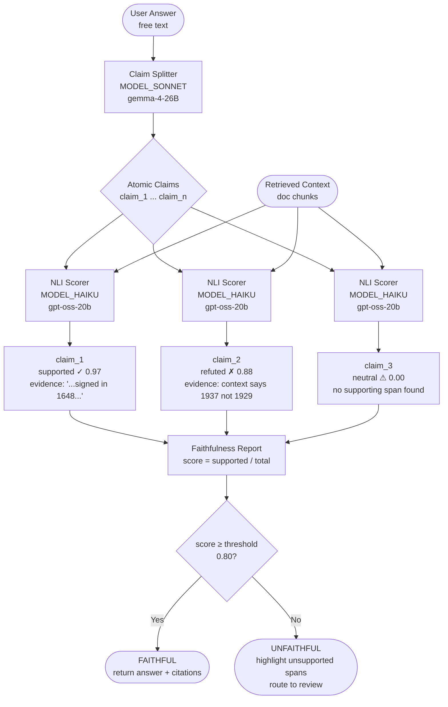
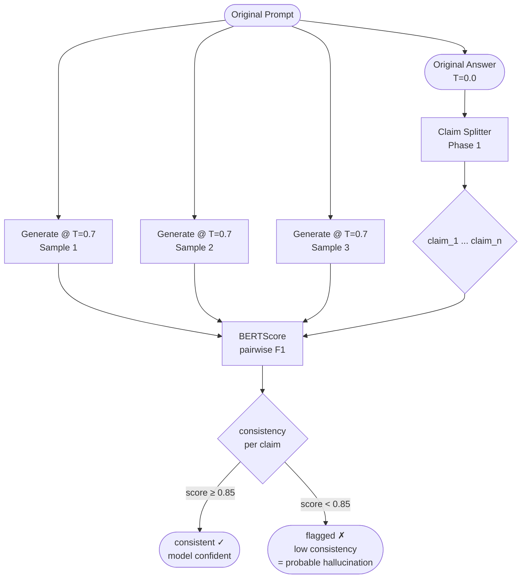
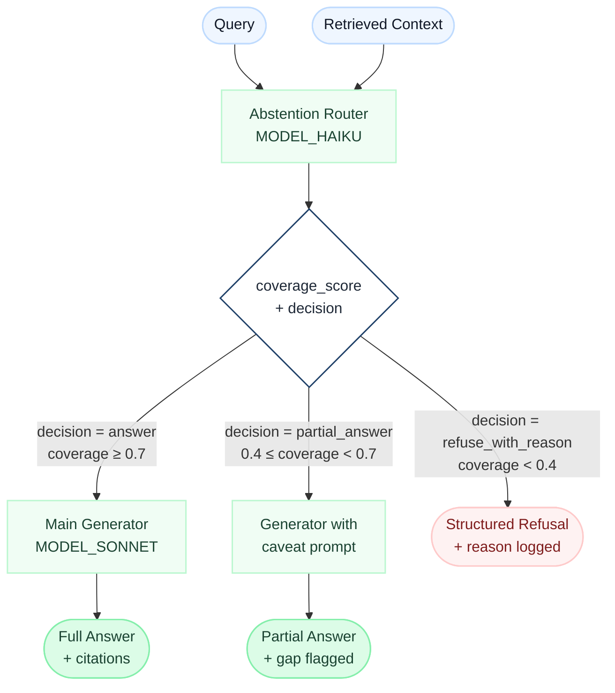

# Week 9 — Faithfulness Checker

> Goal: build a **composable hallucination-detection toolkit** — claim splitter → NLI scorer → SelfCheckGPT-lite → abstention router — and score all three approaches against a hand-labeled 30-question test set.

**Exit criteria.**
- [ ] `src/01_claim_split.py` running: takes an answer string, returns a validated JSON array of atomic claims
- [ ] `src/02_nli_score.py` running: for each (claim, context) pair classifies `supported / refuted / neutral` with confidence
- [ ] `src/03_faithfulness.py` running: composes Phase 1 + 2 into a full faithfulness report with unsupported-span highlighting
- [ ] `src/04_selfcheck.py` running: regenerates an answer 3× at temperature 0.7, computes pairwise BERTScore, flags low-consistency claims
- [ ] `src/05_abstain.py` running: given (query, retrieved_context), routes to `answer / partial_answer / refuse_with_reason`
- [ ] `src/06_testset.py` used to produce `data/testset_30.jsonl` — 30 queries labeled with `should_answer` + `ideal_support_spans`
- [ ] All three approaches scored against the test set; `RESULTS.md` filled in with the 3 × precision/recall matrix
- [ ] You can cold-answer "intrinsic vs extrinsic hallucination" and "how SelfCheckGPT works" out loud in under 90 seconds

---

## Theory Primer — Five Concepts You Must Own

> 1,100-word fast-track. Read this before touching any code. Each concept maps directly to a lab module or an interview question you will face.

---

### Concept 1 — Hallucination Taxonomy: Four Quadrants, Not One Word

Hallucination is a single word covering four distinct failure modes. Interviewers who use it loosely are testing whether *you* use it precisely. Two axes define the space:

**Axis 1 — Source of the error (intrinsic vs extrinsic)**
- **Intrinsic**: the output *contradicts* context the model was explicitly given. The model was handed evidence and fought it.
- **Extrinsic**: the output *adds* information that cannot be verified from the provided context. The model invented beyond its evidence.

**Axis 2 — Reference standard (factual vs faithful)**
- **Factual**: wrong about the real world, regardless of what any document says.
- **Faithful**: wrong relative to the *provided documents*, regardless of real-world truth.

The four quadrants with concrete examples:

| | Intrinsic (contradicts context) | Extrinsic (goes beyond context) |
|---|---|---|
| **Factual** (world-truth reference) | Context says "the Peace of Westphalia was signed in 1648"; model says "1638." Both context and world-knowledge are violated. | Model says "the treaty was brokered by Cardinal Mazarin" — invented and world-historically wrong, but the context never mentioned brokers at all. |
| **Faithful** (context-truth reference) | Your RAG doc says "our product costs \$49/month"; model answers "\$59/month." The retrieved document is right there — the model contradicted it. | Model says "the product includes a mobile app" — the context never mentions a mobile app but the claim might be world-true for that product. Unfaithful, possibly factual. |

**Why this matters for RAG:** in a live system you almost never have a ground-truth world-knowledge oracle at inference time. What you *always* have is the retrieved context. That is why **faithfulness dominates factuality as the operational target for RAG**. You can measure and enforce faithfulness locally; factuality requires external validation that is expensive and often unavailable. Think of it as the difference between checking column-level lineage inside your data warehouse versus auditing a row against an external source system you cannot query.

> **Interview soundbite:** "Factual correctness is an absolute standard requiring external knowledge; faithful correctness is a relative standard requiring only the retrieved context. For RAG I instrument faithfulness because it is measurable at runtime. I treat factuality as a separate offline audit."

---

### Concept 2 — SelfCheckGPT: Inter-Sample Contradiction Detection

**Paper:** Manakul et al., EMNLP 2023.

The core insight: if a model is *confident* about a claim, it will reproduce that claim consistently across independent samples at high temperature. If it is *guessing*, the samples will diverge.

**Protocol:**
1. Generate the same answer *N* times (typically 3–5) at T = 0.7, from the original prompt, with no shared cache.
2. For each candidate answer, compare it against all other samples using a consistency scorer — BERTScore, NLI entailment, QA-based consistency, or n-gram overlap.
3. Compute a per-span consistency score. Spans with low inter-sample agreement are flagged as likely hallucinations.
4. No external ground truth required — the signal is entirely internal consistency.

**Infrastructure framing:** this is a distributed-trace consistency check. Each sample is a separate execution trace of the same request. If the "spans" (claims) produced by those traces agree, you have high confidence. If they disagree, you have a flaky test that fails non-deterministically — and flaky behavior is the canonical signal of unreliable state.

**Critical failure mode:** if the model has a strong, systematically wrong prior baked in by training, *all* samples will agree on the wrong answer. SelfCheckGPT measures inconsistency as a proxy for uncertainty; it cannot detect confident, shared training bias. A model that has memorised an incorrect fact will score as "consistent" across samples despite being wrong. This is why SelfCheckGPT is a necessary but not sufficient layer — it catches uncertain hallucinations, not confident ones.

> **Interview soundbite:** "SelfCheckGPT detects *uncertain* hallucinations by measuring inter-sample divergence. Its blind spot is systematically wrong facts the model holds with high confidence — those score as consistent and sail through."

---

### Concept 3 — Semantic Entropy: Uncertainty in Meaning-Space

**Paper:** Farquhar et al., *Nature*, 2024. This is the primary reference for production-grade uncertainty estimation in 2026 systems.

Standard token-level entropy conflates two very different kinds of uncertainty:
- "I am uncertain which *phrasing* to use" (low semantic risk)
- "I am uncertain which *fact* is true" (high semantic risk)

Semantic entropy resolves this by operating in meaning-space rather than token-space:

1. Generate *N* samples.
2. Cluster the samples into semantic equivalence classes — outputs that express the same proposition map to the same cluster, regardless of surface form. (e.g., "the treaty was signed in 1648" and "1648 was when the treaty was signed" are one cluster.)
3. Compute Shannon entropy over the cluster distribution, not over the token distribution.

A model uncertain about phrasing produces many surface-level variants but few semantic clusters → low semantic entropy → low hallucination risk. A model uncertain about facts produces semantically distinct outputs across samples → high semantic entropy → flag for abstention or human review.

**Why it matters:** Farquhar et al. showed strong correlation with factuality across benchmarks — the first published method to achieve this. It has become the standard uncertainty signal for production RAG pipelines that need calibrated, auditable confidence scores rather than opaque pass/fail gates.

> **Interview soundbite:** "Semantic entropy collapses surface variation before measuring uncertainty, so it separates 'the model is rephrasing' from 'the model is guessing different facts.' It is the most calibrated hallucination-risk signal available in 2026."

---

### Concept 4 — Verification Must Be a Separate Stage

Harness Engineering Book 1, §7.5 states directly:

> 验证必须独立成阶段，否则"实现完成"很快就会冒充"问题解决"

*"Verification must be a separate stage — otherwise 'implementation complete' will quickly masquerade as 'problem solved.'"*

The source goes further: the verification worker's explicit mandate is to *be skeptical*, to *run tests with the feature enabled*, to *investigate errors rather than dismiss them as unrelated*, and to *not rubber-stamp* the implementation worker's output.

§7.7 extends this beyond code:

> 验证不仅针对代码，也针对记忆和建议

*"Verification applies not just to code, but to memory and recommendations too."*

Memory records can become stale. Before surfacing a recommendation based on stored memory, the system must verify current state; if memory conflicts with observed reality, trust the observation and update or delete the stale record.

**For a faithfulness checker, the architectural consequence is concrete:** the NLI scorer that verifies claims must be a separate pipeline stage from the component that generated the answer. They must not share the same model call, the same context window, or the same prompt. An LLM asked to both generate and verify its own output has an obvious conflict of interest — it will confirm what it produced. Harness Book 2, Ch 6 covers the Codex angle: a well-designed agent system treats verification as a first-class runtime role, not an afterthought appended to the generation pass.

> **Interview soundbite:** "Verification is a separate stage by design — not a final check in the same prompt. The generator and the verifier must be independent; otherwise you have asked the author to peer-review their own paper."

---

### Concept 5 — Abstention is Better Than a Forced Answer

The 2026 industry consensus (Lakera LLM Hallucinations Guide, 2026) is unambiguous: **teaching a model to say "I don't know" delivers more production safety than any other single mitigation**. Every hallucination that reaches a user is a forced answer to a question the system could not reliably answer. The correct response to that situation is abstention.

**Abstention router pattern:**

Given `(query, retrieved_context)`, a small, fast classifier decides among three outcomes:

| Route | Condition | Action |
|---|---|---|
| `answer` | Context coverage is high, faithfulness score above threshold | Return answer with citations |
| `partial_answer` | Context covers some claims but not all | Return supported claims, flag gaps explicitly |
| `refuse_with_reason` | Context is insufficient to answer faithfully | Return "I cannot answer this from the provided documents" with a pointer to what is missing |

The router does not need to be large. A haiku-tier model with a well-designed prompt, given the NLI scores from the faithfulness checker, can make this decision cheaply and reliably. The signal it needs — per-claim support scores — is already produced upstream in the pipeline.

**The paradigm shift:** the 2025 framing was "reduce hallucinations." The 2026 framing is "manage uncertainty measurably." Zero hallucinations is an unreachable target that incentivises over-refusal; calibrated uncertainty with graceful abstention is an auditable, operationally sustainable alternative. Think of it the way you think about SLOs: you do not target zero p99 latency violations, you target a defined budget and alert on degradation. Faithfulness scores are metrics with SLOs, not binary pass/fail gates.

> **Interview soundbite:** "Abstention is not a fallback — it is the primary safety mechanism. A system that knows it cannot answer faithfully and says so is safer than any system that always produces an answer. The goal is not zero hallucinations; it is a calibrated uncertainty signal the downstream workflow can act on."

---

### Optional Deep Dives

- **Anthropic faithfulness-evaluation cookbook** — prompt patterns for decompose-then-verify pipelines; the canonical reference for claim-splitter prompt design.
- **MetaRAG (2025)** — meta-reasoning layer that routes between retrieval strategies based on predicted faithfulness; extends the abstention router concept to retrieval-strategy selection.
- **Farquhar et al. full paper** (*Detecting Hallucinations in Large Language Models Using Semantic Entropy*, Nature 2024) — the entropy clustering algorithm and benchmark results; read §3 for the implementation and §4 for the calibration curves.
- **Harness Book 1 Ch 7 in full** — §7.5–7.8 on multi-agent verification architecture; directly informs how to wire the faithfulness checker as an independent verification stage in a larger agent pipeline.
- **Harness Book 2 Ch 6** — error recovery and execution narrative consistency; the design principles there (layered recovery, circuit breakers, abort semantics) apply directly to building a robust abstention router that does not spiral on repeated low-confidence queries.

---
- **[Gulli *Agentic Design Patterns* Ch 4 — Reflection]** — self-improvement pattern frames SelfCheckGPT-style consistency checks; complements Harness Bk1 Ch 7 verification. ~20 min
- **[Gulli *Agentic Design Patterns* Ch 19 — Evaluation and Monitoring]** — includes faithfulness as a first-class eval dimension. ~15 min

## Background — Hallucination Taxonomy and the 2026 Paradigm Shift

### The two axes you must know

Hallucination is an overloaded word. Interviewers use it loosely; you should use it precisely. There are two orthogonal axes:

**Axis 1 — Source of the error**

- **Intrinsic hallucination** — the model's output *contradicts* a source it was explicitly given. You handed it a document that says "the bridge opened in 1937" and the model says "1929." The source is right there and the model ignored or corrupted it.
- **Extrinsic hallucination** — the model adds information that *cannot be verified* from the provided source. The document says nothing about the bridge's architect, and the model invents one. Neither confirmed nor denied by context — just ungrounded.

> **Taxonomy:**
> Intrinsic = model contradicts the context it received. Extrinsic = model goes beyond the context it received. Both are failure modes, but they call for different mitigations: intrinsic errors are caught by entailment scoring (the model said X, context says not-X); extrinsic errors are caught by coverage scoring (no span in context mentions X at all).

**Axis 2 — What "correct" means**

- **Factual hallucination** — wrong about the real world. "The Eiffel Tower is in London." Catching this requires external world knowledge, fact databases, or retrieval against a trusted corpus.
- **Faithful hallucination** — wrong relative to the *provided documents*, regardless of real-world truth. A document says "our product costs $49/month" and the model answers "$59/month." The answer may be factually correct about a different product — but it is *unfaithful* to the retrieved context.

> **What this means:**
> In a RAG system you almost never have access to ground-truth world knowledge at inference time. What you *always* have is the retrieved context. This is why **faithfulness ≫ factuality for RAG**. You can measure and enforce faithfulness locally, without a separate knowledge base. Factuality requires external validation — expensive, slow, often impossible.

### The framing for this week: data lineage for answers

> **Analogy (Infra):**
> Think of your RAG pipeline as a Terraform module. The retrieved documents are your source tables. The generated answer is the final output model. Faithfulness checking is **column-level lineage validation**: every claim in the output must trace back to a specific row (evidence span) in a source table. If a column in your mart has no upstream lineage, it's either derived (which is fine, if documented) or phantom (which is a data-quality bug). The same logic applies to answer claims. No supporting span = phantom claim = hallucination.
>
> Abstention is your **data-quality circuit breaker**. If the source data has insufficient coverage to answer a question confidently, a well-designed pipeline refuses to produce output rather than silently propagating bad data downstream. Terraform source freshness tests block a run when data is stale; your abstention router blocks an answer when context is insufficient.

Here is what that lineage looks like visually — each claim as a node with an arrow pointing back to its evidence span, exactly as Terraform draws column-level lineage:

```
Source documents (your "source tables")
┌─────────────────────────────────┐   ┌─────────────────────────────────┐
│ doc_001                         │   │ doc_003                         │
│ "...signed in 1648 in           │   │ "...negotiations in Osnabrück   │
│  Westphalia..."                 │   │  and Münster..."                │
└──────────────┬──────────────────┘   └──────────────┬──────────────────┘
               │ supports (0.97)                      │ supports (0.91)
               ▼                                      ▼
         ┌─────────────┐                      ┌──────────────────┐
Claim 1  │ "signed in  │    SUPPORTED ✓       │ "negotiations in │  SUPPORTED ✓
         │  1648"      │                      │  Osnabrück and   │
         └─────────────┘                      │  Münster"        │
                                              └──────────────────┘

         ┌──────────────────────────┐
Claim 3  │ "founded in Berlin 2021" │  NEUTRAL ✗  ← no upstream lineage → PHANTOM CLAIM
         └──────────────────────────┘
```

This is the mental model for the entire week. Every claim must have an arrow. Claims without arrows are hallucinations.

### The 2026 paradigm shift

The old goal was "zero hallucinations." The industry has largely abandoned that framing because:

1. LLMs are probabilistic; zero is unreachable without gutting recall
2. "Zero" as a target incentivises over-refusal, which is its own failure mode in production
3. Downstream users are often better positioned than the model to evaluate a claim

The 2026 goal is **manage uncertainty measurably**. Concretely, a production RAG system should:

- **Show confidence** — surface per-claim support scores, not just a binary answer
- **Abstain gracefully** — say "I can't answer this from the provided documents" when context coverage is below a calibrated threshold, not silently hallucinate
- **Cite sources** — link every claim to the specific document span that supports it, so users can verify
- **Let users decide** — for borderline cases, present the best evidence and let a human (or a downstream verification step) make the call

> **Interview angle:**
> "How would you handle hallucinations in a healthcare RAG product?" The wrong answer is "I'd use RLHF to reduce them." The right answer: "In healthcare you cannot tolerate unverifiable claims. I'd instrument the pipeline with a faithfulness checker (NLI-based entailment scoring per claim), set a conservative abstention threshold where context coverage is below 0.7, surface per-claim citations to the clinician, and log every partial-answer or refusal for audit. The goal is not zero hallucinations — it's a calibrated, auditable uncertainty signal the downstream workflow can act on."

> **Production tip:**
> Faithfulness and factuality scores are not binary pass/fail gates. Treat them as **metrics with SLOs**, exactly like p99 latency. Set a production threshold (e.g., faithfulness ≥ 0.80), alert on degradation, route low-confidence answers to human review queues rather than dropping them entirely.

---

## Architecture Overview

### Main Pipeline: Faithfulness Checker



> **What this means:**
> The faithfulness checker is not a single model call — it is a **pipeline of two model tiers**. The sonnet-tier splitter does the hard semantic work (decomposing a paragraph into precise atomic assertions). The haiku-tier scorer does the cheap repetitive work (binary classification per claim pair). Separating these tiers is both an architectural and a cost decision.

### SelfCheckGPT-Lite: Consistency-Based Detection



> **What this means:**
> SelfCheckGPT works without any external ground truth. It exploits a property of probabilistic models: when a model knows something, it says roughly the same thing across multiple samples. When it is making something up, the samples diverge. BERTScore measures semantic similarity (not exact string match), so paraphrases count as consistent.

### Abstention Router: Pre-Generation Gate



> **Analogy (Infra):**
> The abstention router is your `Terraform source freshness` test, but it runs at query time rather than at build time. Before you let the generator synthesise an answer, you check: does the context actually contain what's needed? If not, abort the generation step rather than letting the generator hallucinate into the gap.

---

## Lab Scaffold

```bash
cd ~/code/agent-prep
mkdir -p lab-09-faithfulness-checker/{src,data,results}
cd lab-09-faithfulness-checker
source ../.venv/bin/activate
set -a; source ../.env; set +a

# Copy the Week 3 dev set as starting corpus
cp ../lab-03-rag-eval/data/dev_set.jsonl data/
cp ../lab-03-rag-eval/data/docs.jsonl data/

# Install extra deps for this week
pip install sentence-transformers bert-score instructor pydantic
```

Your `.env` should already contain:

```bash
OMLX_BASE_URL=http://127.0.0.1:8000/v1
OMLX_API_KEY=Shane@7162
MODEL_SONNET=gemma-4-26B-A4B-it-heretic-4bit   # claim splitter — structural task
MODEL_HAIKU=gpt-oss-20b-MXFP4-Q8               # NLI judge + router — cheap classification
FAITH_THRESHOLD=0.80                            # min fraction of supported claims to pass
SELFCHECK_THRESHOLD=0.85                        # min BERTScore F1 to consider a claim consistent
```

---

## Phase 1 — Build the Claim Splitter

**What you're building:** a function that takes a free-text answer and returns an array of *atomic* factual claims — the finest-grain units that can be individually verified against a context. "Atomic" means each claim has exactly one verifiable assertion; you cannot split it further without losing meaning.

> **What this means:**
> "The treaty was signed in 1648 in Westphalia and ended the Thirty Years' War" is *not* atomic. It contains two claims: (1) signed in 1648 in Westphalia, (2) ended the Thirty Years' War. Split them. The NLI scorer in Phase 2 works claim-by-claim; compound sentences produce ambiguous entailment labels.

> **Analogy (Infra):**
> This is your **column parser**. Before you can check lineage, you decompose the mart model into individual columns. The claim splitter decomposes an answer into individual assertions. You cannot do lineage validation on a blob — you atomise first.

Use `MODEL_SONNET` (Gemma-4-26B) for this task. It handles structured-output generation reliably and can follow nuanced decomposition instructions without over-splitting, which haiku-tier models sometimes do on complex sentences.

Save as `src/01_claim_split.py`:

```python
"""
Phase 1 — Claim Splitter
Takes a free-text answer, returns a list of atomic factual claims.
Model: MODEL_SONNET (gemma-4-26B-A4B-it-heretic-4bit)
  — sonnet-tier chosen because the decomposition task requires semantic nuance;
    haiku-tier models tend to over-split compound nouns or under-split run-ons.
"""
import json
import os
from pathlib import Path
from typing import Any

from openai import OpenAI
from pydantic import BaseModel, field_validator

# ── env ──────────────────────────────────────────────────────────────────────
omlx = OpenAI(base_url=os.getenv("OMLX_BASE_URL"), api_key=os.getenv("OMLX_API_KEY"))
MODEL = os.getenv("MODEL_SONNET")  # gemma-4-26B-A4B-it-heretic-4bit


# ── schema ───────────────────────────────────────────────────────────────────
class ClaimList(BaseModel):
    claims: list[str]

    @field_validator("claims")
    @classmethod
    def non_empty(cls, v: list[str]) -> list[str]:
        # Strip whitespace; drop empty strings from model padding artefacts
        if not v:
            raise ValueError("claims must be a non-empty list")
        return [c.strip() for c in v if c.strip()]


# ── prompt ───────────────────────────────────────────────────────────────────
SYSTEM = """You are a precise claim decomposer. Your only job is to split a text into the smallest possible atomic factual claims, where each claim:
- Makes exactly ONE verifiable assertion
- Is self-contained (no pronouns referring to other claims)
- Is a complete declarative sentence

Output JSON exactly: {"claims": ["claim 1", "claim 2", ...]}
Do NOT include opinions, hedges, or meta-commentary — only factual assertions."""

USER_TMPL = """Decompose the following answer into atomic factual claims.

Answer:
{answer}

Output only valid JSON."""


# ── splitter ──────────────────────────────────────────────────────────────────
def split_claims(answer: str, max_retries: int = 2) -> list[str]:
    """
    Split answer into atomic claims. Returns list of claim strings.
    Falls back to [answer] on persistent failure (conservative: treat whole answer as one claim).
    """
    for attempt in range(max_retries + 1):
        try:
            resp = omlx.chat.completions.create(
                model=MODEL,
                messages=[
                    {"role": "system", "content": SYSTEM},
                    {"role": "user", "content": USER_TMPL.format(answer=answer)},
                ],
                temperature=0.0,       # deterministic — this is a parsing task, not generation
                max_tokens=800,        # 800 covers ~30 claims at ~25 tokens each
                response_format={"type": "json_object"},  # force valid JSON output
            )
            raw = resp.choices[0].message.content
            parsed = ClaimList.model_validate(json.loads(raw))
            return parsed.claims
        except Exception as e:
            if attempt == max_retries:
                print(f"  [claim_split] failed after {max_retries + 1} attempts: {e}")
                return []
            print(f"  [claim_split] retry {attempt + 1}: {e}")
    return []


# ── smoke test ────────────────────────────────────────────────────────────────
if __name__ == "__main__":
    test_answer = (
        "The Treaty of Westphalia was signed in 1648 and ended the Thirty Years' War. "
        "It established the principle of state sovereignty, which remains central to "
        "international law. Negotiations took place in two cities: Osnabrück and Münster."
    )
    claims = split_claims(test_answer)
    print(f"Input answer:\n  {test_answer}\n")
    print(f"Atomic claims ({len(claims)}):")
    for i, c in enumerate(claims, 1):
        print(f"  {i}. {c}")
```

### Code walkthrough — `src/01_claim_split.py`

**Chunk 1 — Schema (`ClaimList`)**
The Pydantic model serves two purposes: it validates that the model returned a list (not a string or dict), and its `field_validator` strips padding whitespace that Gemma-26B occasionally emits around claim strings. Without the validator, a claim like `"  The treaty was signed in 1648.  "` would survive as a different string from its unpadded version — causing spurious mismatches in Phase 7's test-set comparison.

> **Why:** Pydantic validation is your first line of defence against model output drift. The schema is a contract between the LLM and your downstream code.

**Chunk 2 — System prompt design**
Three constraints are stated explicitly in order of importance: atomic (one assertion), self-contained (no dangling pronouns), declarative (not hedged). The phrase "do NOT include opinions" is necessary because Gemma-26B will occasionally emit meta-claims like "This is a complex topic" unless explicitly blocked.

> **Why:** Constraint order in the system prompt influences model attention. Put the most critical constraints first and repeat them in the user turn if you need stricter adherence.

**Chunk 3 — `temperature=0.0`**
Claim splitting is a deterministic parsing task, not a creative generation task. Setting temperature to 0 ensures the split is reproducible — same answer always yields the same claim array. This matters for caching (see the production tip below) and for debugging (you can re-run and get identical output).

> **Why:** Reserve non-zero temperature for tasks that benefit from diversity. Parsing tasks should always be `T=0`.

**Chunk 4 — `response_format={"type": "json_object"}`**
This instructs the oMLX-served model to enable constrained decoding, preventing it from wrapping the JSON in markdown fences or adding prose before the opening brace. Without this flag, Gemma-26B may output `` ```json\n{...}\n``` `` which `json.loads` will reject.

> **Why:** Always use `response_format` when you need structured output from an oMLX-compatible endpoint. It is cheaper than post-processing regex.

**Chunk 5 — Retry with conservative fallback**
On persistent failure, `split_claims` returns `[]`. The caller (Phase 3) checks for this and substitutes `[answer]` — treating the whole answer as one claim. This is the conservative choice: the NLI scorer will then classify the whole answer against context, which is a weaker signal but never silently drops a check.

> **Why:** Fail open (return something checkable) rather than fail closed (return nothing and skip the faithfulness check entirely).

**Common modifications:** to add a second-pass split for compound claims, replace the `return parsed.claims` line with a recursive call: filter `parsed.claims` for any item containing ` and ` joining two independent clauses, then call `split_claims` on each to get sub-atoms.

Expected output for the smoke test:

```
Atomic claims (5):
  1. The Treaty of Westphalia was signed in 1648.
  2. The Treaty of Westphalia ended the Thirty Years' War.
  3. The Treaty of Westphalia established the principle of state sovereignty.
  4. The principle of state sovereignty remains central to international law.
  5. Negotiations for the Treaty of Westphalia took place in Osnabrück and Münster.
```

> **Gotcha:**
> Gemma-4-26B will occasionally return valid JSON but with compound claims that slipped through ("X happened and Y happened"). A quick heuristic: flag any claim containing the word "and" that joins two distinct subject-verb constructions — these are candidates for a second-pass split. For this lab, flagging is enough; don't build the recursive splitter unless you finish early.

> **Production tip:**
> Cache claim-split results keyed on a hash of the answer string. Claim splitting is idempotent and the same answer is often re-checked across evaluation batch runs. `hashlib.sha256(answer.encode()).hexdigest()[:16]` as a cache key is sufficient.

```bash
python src/01_claim_split.py
```

---

## Phase 2 — Build the NLI Entailment Scorer

**What you're building:** a function that takes a `(claim, context)` pair and returns `{label: "supported"|"refuted"|"neutral", confidence: float, evidence_span: str}`. This is the core of faithfulness checking — Natural Language Inference (NLI) adapted as an LLM judge.

> **What this means:**
> NLI is a classic NLP task: given a *premise* and a *hypothesis*, classify whether the premise entails, contradicts, or is neutral toward the hypothesis. We repurpose it: the retrieved context is the premise; each atomic claim is the hypothesis. "Supported" = entailed by context. "Refuted" = contradicted. "Neutral" = neither confirmed nor denied — this is the extrinsic hallucination signal.

> **Analogy (Infra):**
> This is your **row-level data quality test**. For each claim (output column value), you check: is there a source row (evidence span) that justifies this value? Supported = green test. Neutral = yellow warning (no upstream source). Refuted = red failure (contradicts source).

Use `MODEL_HAIKU` (gpt-oss-20b) for this task — it's the cheap classifier tier. You'll call it once per claim per answer, so cost scales with claim count × answer count. At 30 test questions with ~5 claims each, that's 150 calls. Haiku-tier keeps this under 3 minutes on local oMLX.

Save as `src/02_nli_score.py`:

```python
"""
Phase 2 — NLI Entailment Scorer
For each (claim, context) pair: classify supported / refuted / neutral + confidence.
Model: MODEL_HAIKU (gpt-oss-20b-MXFP4-Q8)
  — haiku-tier chosen because NLI is binary classification with a clear rubric;
    sonnet-tier would add cost with negligible quality gain at this task.
"""
import json
import os
from dataclasses import dataclass

from openai import OpenAI
from pydantic import BaseModel, field_validator

# ── env ──────────────────────────────────────────────────────────────────────
omlx = OpenAI(base_url=os.getenv("OMLX_BASE_URL"), api_key=os.getenv("OMLX_API_KEY"))
MODEL = os.getenv("MODEL_HAIKU")  # gpt-oss-20b-MXFP4-Q8

LABELS = ("supported", "refuted", "neutral")


# ── schema ───────────────────────────────────────────────────────────────────
class NLIResult(BaseModel):
    label: str
    confidence: float   # 0.0–1.0; model's self-reported certainty about the label
    evidence_span: str  # verbatim snippet from context that justifies the label

    @field_validator("label")
    @classmethod
    def valid_label(cls, v: str) -> str:
        v = v.lower().strip()
        if v not in LABELS:
            raise ValueError(f"label must be one of {LABELS}, got '{v}'")
        return v

    @field_validator("confidence")
    @classmethod
    def in_range(cls, v: float) -> float:
        # Clamp silently rather than raise — models sometimes return 1.01 or -0.01
        return round(max(0.0, min(1.0, float(v))), 3)


# ── prompt ───────────────────────────────────────────────────────────────────
SYSTEM = """You are a precise NLI (Natural Language Inference) judge. Given a CONTEXT and a CLAIM, classify whether the context supports, refutes, or is neutral toward the claim.

Rules:
- "supported": the context explicitly or clearly implies the claim is true
- "refuted": the context explicitly contradicts the claim
- "neutral": the context does not provide enough information to confirm or deny the claim

Also extract the most relevant verbatim snippet from the context (≤30 words) that justifies your label. If neutral, use the empty string.

Output JSON exactly:
{"label": "<supported|refuted|neutral>", "confidence": <0.0-1.0>, "evidence_span": "<verbatim snippet or empty string>"}"""

USER_TMPL = """CONTEXT:
{context}

CLAIM:
{claim}

Classify and output JSON."""


# ── scorer ───────────────────────────────────────────────────────────────────
@dataclass
class ScoredClaim:
    claim: str
    label: str          # supported | refuted | neutral
    confidence: float
    evidence_span: str
    is_hallucinated: bool  # True if neutral or refuted — both mean "no grounded support"


def score_claim(claim: str, context: str, max_retries: int = 2) -> ScoredClaim:
    """Score a single (claim, context) pair via NLI prompt."""
    for attempt in range(max_retries + 1):
        try:
            resp = omlx.chat.completions.create(
                model=MODEL,
                messages=[
                    {"role": "system", "content": SYSTEM},
                    {"role": "user", "content": USER_TMPL.format(
                        context=context[:4000],  # 4000 chars ≈ 800 tokens; guard huge contexts
                        claim=claim,
                    )},
                ],
                temperature=0.0,       # classification task — no randomness wanted
                max_tokens=200,        # label + confidence + short span fits in 200 tokens
                response_format={"type": "json_object"},
            )
            raw = resp.choices[0].message.content
            result = NLIResult.model_validate(json.loads(raw))
            return ScoredClaim(
                claim=claim,
                label=result.label,
                confidence=result.confidence,
                evidence_span=result.evidence_span,
                is_hallucinated=(result.label in ("neutral", "refuted")),
            )
        except Exception as e:
            if attempt == max_retries:
                # Fail conservative: treat unknown as neutral (raises alarm, doesn't suppress it)
                return ScoredClaim(claim=claim, label="neutral", confidence=0.0,
                                   evidence_span="", is_hallucinated=True)
            print(f"  [nli_score] retry {attempt + 1}: {e}")
    return ScoredClaim(claim=claim, label="neutral", confidence=0.0,
                       evidence_span="", is_hallucinated=True)


def score_claims(claims: list[str], context: str) -> list[ScoredClaim]:
    """Score all claims against the same context. Sequential — parallelise if latency matters."""
    return [score_claim(c, context) for c in claims]


# ── smoke test ────────────────────────────────────────────────────────────────
if __name__ == "__main__":
    context = (
        "The Treaty of Westphalia was signed on October 24, 1648, concluding the "
        "Thirty Years' War and the Eighty Years' War. Peace negotiations were held "
        "in the cities of Osnabrück and Münster in the Holy Roman Empire."
    )
    test_claims = [
        "The Treaty of Westphalia was signed in 1648.",          # expected: supported
        "The treaty ended the Thirty Years' War.",                # expected: supported
        "The treaty was signed in Vienna.",                       # expected: refuted
        "Napoleon attended the Westphalia negotiations.",         # expected: refuted
        "The treaty created a new currency for the Holy Roman Empire.",  # expected: neutral
    ]
    results = score_claims(test_claims, context)
    print(f"Context: {context[:80]}...\n")
    for r in results:
        flag = "OK" if not r.is_hallucinated else "HALLUCINATION"
        print(f"  [{flag}] {r.label.upper()} ({r.confidence:.2f}) — {r.claim}")
        if r.evidence_span:
            print(f"    Evidence: \"{r.evidence_span}\"")
```

### Code walkthrough — `src/02_nli_score.py`

**Chunk 1 — `confidence` clamping in the validator**
The validator uses `max(0.0, min(1.0, float(v)))` rather than raising on out-of-range values. Rationale: gpt-oss-20b occasionally returns `1.01` (floating-point slop) or a string `"0.9"` (JSON coercion). A hard raise here would trigger the retry loop for a trivially fixable value. Clamp silently, log if you care.

> **Why:** Distinguish between "the model gave a wrong type" (should retry) and "the model gave a slightly out-of-range float" (should fix and proceed). The validator handles both cases.

**Chunk 2 — `context[:4000]` truncation**
Four thousand characters is approximately 800 tokens for English prose. This guards against extremely long retrieved contexts (5+ full document chunks) that would exceed the model's effective attention window for NLI. If your retrieval returns very long chunks, consider chunking context further before scoring.

> **Why:** NLI accuracy degrades when the premise is longer than ~1000 tokens because the model's attention spreads too thin to reliably locate the evidence span. Truncation is pragmatic, not ideal — the real fix is smaller retrieval chunks.

**Chunk 3 — `is_hallucinated` definition**
Both `neutral` and `refuted` map to `is_hallucinated=True`. This is intentional. Neutral means "the context doesn't say this" (extrinsic hallucination). Refuted means "the context contradicts this" (intrinsic hallucination). From a user-trust perspective, both should trigger the same UI warning: "this claim is not grounded in the retrieved documents."

> **Why:** Distinguish the label (useful for debugging and improving the pipeline) from the action (a binary flag that drives the UI and faithfulness score). Don't conflate them.

**Chunk 4 — Conservative failure fallback**
On all retries exhausted, the function returns `neutral` with `confidence=0.0`. This raises an alarm (marks the claim as hallucinated) rather than suppressing it. In a safety-critical context, a false positive (unnecessary alarm) is preferable to a false negative (missed hallucination).

> **Why:** The failure mode of "the judge couldn't decide" should be treated as "uncertain = potentially unsupported." Never silently pass a check you couldn't perform.

**Chunk 5 — Sequential scoring**
`score_claims` scores sequentially. For the 30-question test set (≈150 calls) this is fine. For production at scale, replace with `asyncio.gather` or a thread pool. The haiku-tier model at local inference is the bottleneck, not network round-trips, so parallelism helps less than you'd expect.

> **Why:** Don't over-engineer for this lab. Note where you'd parallelise and move on.

**Common modifications:** add a `min_confidence` parameter to `score_claim`; if `result.confidence < min_confidence`, treat the result as `neutral` regardless of the label. This catches cases where the model is technically right but not confident enough to trust.

> **Interview angle:**
> "Why use an LLM for NLI instead of a dedicated NLI model like DeBERTa-v3?" LLM-based NLI generalises better to domain-specific language, follows nuanced instructions (e.g., "treat implicit entailment as supported"), and produces evidence spans. DeBERTa-v3 is faster and cheaper if you have labeled data to fine-tune on. In production: start with the LLM judge, collect its outputs, fine-tune a smaller classifier, then use the small model in the hot path.

```bash
python src/02_nli_score.py
```

---

## Phase 3 — Faithfulness Checker (Composition of Phase 1 + 2)

**What you're building:** the end-to-end faithfulness checker — `answer + context → list of (claim, label, evidence_span, confidence)` — plus a utility that identifies unsupported spans back in the original answer text for UI highlighting.

> **What this means:**
> The faithfulness checker is not a new model — it is a pipeline. You compose the claim splitter (Phase 1) with the NLI scorer (Phase 2) and add one output layer: which substrings of the original answer correspond to unsupported claims? This lets you surface the highlighted answer to a user: "the underlined text is not supported by the retrieved documents."

Save as `src/03_faithfulness.py`:

```python
"""
Phase 3 — Faithfulness Checker
Composes claim splitter (Phase 1) + NLI scorer (Phase 2).
Returns answer-level and claim-level faithfulness results.
"""
import os
from dataclasses import dataclass, field

from src.claim_split import split_claims         # Phase 1
from src.nli_score import ScoredClaim, score_claims  # Phase 2

# Threshold loaded from env so it can be tuned without code changes.
# 0.80 = at least 4 of 5 claims must be supported. Conservative for production RAG.
FAITH_THRESHOLD = float(os.getenv("FAITH_THRESHOLD", "0.80"))


@dataclass
class FaithfulnessResult:
    answer: str
    context: str
    scored_claims: list[ScoredClaim]
    faithfulness_score: float       # fraction of claims labeled "supported"
    hallucinated_claims: list[ScoredClaim]
    unsupported_spans: list[str]    # answer substrings corresponding to hallucinated claims

    @property
    def is_faithful(self) -> bool:
        # Compare against env-configured threshold, not a hardcoded constant
        return self.faithfulness_score >= FAITH_THRESHOLD


def check_faithfulness(answer: str, context: str) -> FaithfulnessResult:
    """
    Main entry point.
    1. Split answer into atomic claims (Phase 1)
    2. Score each claim against context (Phase 2)
    3. Compute aggregate score and locate unsupported spans
    """
    claims = split_claims(answer)
    if not claims:
        # Fallback: treat whole answer as one undivided claim rather than skipping the check
        claims = [answer.strip()]

    scored = score_claims(claims, context)

    n_supported = sum(1 for s in scored if s.label == "supported")
    score = n_supported / len(scored) if scored else 0.0

    hallucinated = [s for s in scored if s.is_hallucinated]

    # Best-effort span location: find the claim text in the answer.
    # Works well for short answers; approximate for rephrased or paraphrased claims.
    # A production implementation would use character-level alignment with fuzzy matching.
    unsupported_spans = []
    for h in hallucinated:
        if h.claim[:40] in answer:
            unsupported_spans.append(h.claim[:40])
        else:
            unsupported_spans.append(h.claim)  # fallback: return full claim text

    return FaithfulnessResult(
        answer=answer,
        context=context,
        scored_claims=scored,
        faithfulness_score=round(score, 3),
        hallucinated_claims=hallucinated,
        unsupported_spans=unsupported_spans,
    )


def pretty_print(result: FaithfulnessResult) -> None:
    label = "FAITHFUL" if result.is_faithful else "UNFAITHFUL"
    print(f"\n=== Faithfulness Check: {label} ({result.faithfulness_score:.0%}) ===")
    for s in result.scored_claims:
        icon = "OK " if not s.is_hallucinated else "HAL"
        print(f"  [{icon}] [{s.label.upper()} {s.confidence:.2f}] {s.claim}")
        if s.evidence_span:
            print(f"       -> \"{s.evidence_span}\"")
    if result.hallucinated_claims:
        print(f"\n  Unsupported spans (highlight in UI):")
        for span in result.unsupported_spans:
            print(f"    * {span!r}")


# ── smoke test ────────────────────────────────────────────────────────────────
if __name__ == "__main__":
    context = (
        "Qdrant is a vector similarity search engine written in Rust. "
        "It provides a production-ready API to store, search, and manage "
        "high-dimensional vectors with an additional payload. "
        "Qdrant supports both on-disk and in-memory storage modes."
    )
    # Deliberately inject one hallucinated claim at the end
    answer = (
        "Qdrant is a vector search engine written in Rust. "
        "It offers an API for storing and searching vectors. "
        "Qdrant was founded in Berlin in 2021 and is backed by Sequoia Capital."
    )
    result = check_faithfulness(answer, context)
    pretty_print(result)
```

### Code walkthrough — `src/03_faithfulness.py`

**Chunk 1 — `FAITH_THRESHOLD` from env**
The threshold is loaded from the environment rather than hardcoded to `0.80`. This lets you tune it per deployment context without touching code: a healthcare RAG might set `FAITH_THRESHOLD=0.95`; a general-purpose assistant might use `0.70`. The threshold is a product decision, not an engineering constant.

> **Why:** Separating configuration from code is a basic software engineering discipline. Apply it to model thresholds the same way you apply it to database URLs.

**Chunk 2 — Fallback to whole-answer claim**
If `split_claims` returns an empty list (model failure), the checker substitutes the full answer as a single claim. This ensures the faithfulness check always runs — degraded, but not skipped. An empty-list return from the splitter should also be logged as a production alert.

> **Why:** Downstream code (Phase 7 scoring) assumes `scored_claims` is non-empty. Never let a component failure silently skip a safety check.

**Chunk 3 — `faithfulness_score` as fraction of claims**
The score is `n_supported / total_claims`, not a fraction of characters or tokens. This is the RAGAS faithfulness definition. It means one short unsupported claim can significantly affect the score even if most of the answer is faithful. That is a feature, not a bug — every claim deserves equal treatment regardless of length.

> **Why:** Character-fraction scoring would allow a single short hallucinated sentence to hide inside a long faithful answer. Claim-fraction scoring gives each assertion equal weight.

**Chunk 4 — `unsupported_spans` approximation**
The span-finder uses a simple substring check (`h.claim[:40] in answer`). This works when the claim is a near-verbatim extraction from the answer. When the splitter paraphrases or normalises, it fails silently and returns the full claim text as the span. A production system would use fuzzy string matching (`rapidfuzz.fuzz.partial_ratio`) or character-level alignment.

> **Why:** Perfect span alignment requires more infrastructure than this lab needs. Document the approximation, ship it, note the improvement path.

**Common modifications:** replace `unsupported_spans` with a list of `(start_char, end_char)` tuples using `answer.find(h.claim[:40])` for direct integration with a frontend highlight component.

> **Production tip:**
> The `unsupported_spans` field is your UI integration point. In a chat interface, highlight unsupported text in amber (neutral = unverifiable) or red (refuted = contradicted) and attach a tooltip: "This claim is not supported by the retrieved documents." This is far more actionable than a single "faithfulness score = 0.67" number.

```bash
python src/03_faithfulness.py
```

---

## Phase 4 — SelfCheckGPT-Lite

**What you're building:** a consistency-based hallucination detector for the case where you have *no external context to ground against*. SelfCheckGPT's insight: if a model is confident about a fact, it will say roughly the same thing every time it generates. If it is hallucinating, the three re-generations will disagree.

> **What this means:**
> Phase 3 requires a retrieved context to check against. But what if your system has no retrieval step, or retrieval returned nothing? SelfCheckGPT is your fallback signal. Generate the same answer 3× at temperature 0.7, compute pairwise semantic similarity (BERTScore), and flag claims where the generations diverge. High divergence = low model confidence = likely hallucination. This works purely from the model's own outputs — no external knowledge needed.

> **Analogy (Infra):**
> This is your **idempotency test**. Run the same transformation three times with different random seeds. If the outputs are consistent, the transformation is deterministic and trustworthy. If they diverge, something non-deterministic (made-up) is happening inside the transform. You would never ship a Terraform module that produces different results on each run — apply the same discipline to LLM outputs.

> **Interview angle:**
> "SelfCheckGPT doesn't tell you what the correct answer is — it tells you how confident the model is. A consistently wrong model will pass SelfCheckGPT. That's the key limitation. Use it when you have no external ground truth to validate against; use the NLI-based faithfulness checker when you have retrieved context."

Save as `src/04_selfcheck.py`:

```python
"""
Phase 4 — SelfCheckGPT-Lite
Regenerate answer 3x at temperature 0.7, compute pairwise BERTScore,
flag low-consistency claims.
No external context required — purely self-consistency based.

Temperature 0.7 chosen because:
  - Too low (< 0.5): samples converge even on hallucinated content (defeats the purpose)
  - Too high (> 0.9): samples diverge on everything including true content (too noisy)
  - 0.7 is the empirical sweet spot from the original SelfCheckGPT paper
"""
import os
from dataclasses import dataclass

from bert_score import score as bert_score
from openai import OpenAI

from src.claim_split import split_claims  # reuse Phase 1 — consistent atomisation

omlx = OpenAI(base_url=os.getenv("OMLX_BASE_URL"), api_key=os.getenv("OMLX_API_KEY"))
MODEL = os.getenv("MODEL_SONNET")  # sonnet-tier for regeneration quality consistency

N_SAMPLES = 3   # 3 samples is the SelfCheckGPT paper default; 5 improves signal at 2x cost
# 0.85 BERTScore F1 = empirically reasonable boundary between consistent and inconsistent.
# Tune this down to 0.80 if you see too many false positives on your corpus.
CONSISTENCY_THRESHOLD = float(os.getenv("SELFCHECK_THRESHOLD", "0.85"))


@dataclass
class SelfCheckResult:
    original_answer: str
    samples: list[str]                  # the N_SAMPLES re-generations
    claim_scores: list[dict]            # per-claim mean BERTScore F1
    flagged_claims: list[str]           # claims below CONSISTENCY_THRESHOLD
    mean_consistency: float             # aggregate consistency across all claims


def _generate_sample(prompt: str, temperature: float = 0.7) -> str:
    """Generate one response sample at the given temperature."""
    resp = omlx.chat.completions.create(
        model=MODEL,
        messages=[{"role": "user", "content": prompt}],
        temperature=temperature,   # 0.7: high enough for diversity, low enough for coherence
        max_tokens=400,
    )
    return resp.choices[0].message.content.strip()


def _mean_bertscore(hyp: str, refs: list[str], lang: str = "en") -> float:
    """
    Compute mean BERTScore F1 of hyp against each ref in refs.
    BERTScore uses contextual embeddings (RoBERTa-large by default) — it catches
    paraphrases that exact string matching would miss.
    device="mps" routes through Apple GPU on M-series.
    """
    if not refs:
        return 1.0
    hyps = [hyp] * len(refs)   # broadcast hyp against each reference
    _, _, F1 = bert_score(hyps, refs, lang=lang, verbose=False, device="mps")
    return float(F1.mean().item())


def selfcheck(original_prompt: str, original_answer: str) -> SelfCheckResult:
    """
    Run SelfCheckGPT-lite:
    1. Generate N_SAMPLES re-answers at temperature 0.7
    2. Split original_answer into atomic claims (Phase 1 splitter)
    3. For each claim, compute mean BERTScore against the text of each sample
    4. Flag claims below CONSISTENCY_THRESHOLD
    """
    print(f"  Generating {N_SAMPLES} samples at T=0.7...")
    samples = [_generate_sample(original_prompt) for _ in range(N_SAMPLES)]

    # Atomise original answer — same splitter as Phase 1 for consistent granularity
    original_claims = split_claims(original_answer)
    if not original_claims:
        original_claims = [original_answer]

    # Flatten each sample into a single string for BERTScore reference.
    # Alternative: split samples into claims and score claim-vs-claims — higher precision,
    # but 3x more BERTScore calls. Flatten is the practical choice for this lab.
    sample_texts = []
    for s in samples:
        cs = split_claims(s)
        sample_texts.append(" ".join(cs) if cs else s)

    # Score each original claim against all sample texts
    claim_scores = []
    flagged = []
    for claim in original_claims:
        score = _mean_bertscore(claim, sample_texts)
        claim_scores.append({"claim": claim, "consistency": round(score, 3)})
        if score < CONSISTENCY_THRESHOLD:
            flagged.append(claim)

    mean_consistency = (
        sum(c["consistency"] for c in claim_scores) / len(claim_scores)
        if claim_scores else 0.0
    )

    return SelfCheckResult(
        original_answer=original_answer,
        samples=samples,
        claim_scores=claim_scores,
        flagged_claims=flagged,
        mean_consistency=round(mean_consistency, 3),
    )


# ── smoke test ────────────────────────────────────────────────────────────────
if __name__ == "__main__":
    prompt = "Who invented the telephone and in what year?"
    answer = (
        "Alexander Graham Bell invented the telephone in 1876. "
        "He was born in Edinburgh, Scotland, and later moved to the United States. "
        "The first words ever spoken over the telephone were addressed to his assistant Thomas Watson."
    )
    result = selfcheck(prompt, answer)
    print(f"\nMean consistency: {result.mean_consistency:.3f}")
    print(f"Flagged claims ({len(result.flagged_claims)}):")
    for c in result.flagged_claims:
        score = next(s["consistency"] for s in result.claim_scores if s["claim"] == c)
        print(f"  [{score:.3f}] {c}")
    print(f"\nSamples generated:")
    for i, s in enumerate(result.samples, 1):
        print(f"  Sample {i}: {s[:100]}...")
```

### Code walkthrough — `src/04_selfcheck.py`

**Chunk 1 — Why `temperature=0.7`**
The temperature for sample generation is the most important hyperparameter in SelfCheckGPT. Too low (< 0.5): the model's beam search converges even on hallucinated content, all samples agree, and low-consistency detection fails. Too high (> 0.9): true content also diverges due to paraphrasing noise, producing false positives everywhere. 0.7 is the paper's empirical recommendation and a reasonable starting point.

> **Why:** Temperature is not a "higher = more creative" dial. For SelfCheckGPT specifically, it controls the signal-to-noise ratio of the consistency measurement.

**Chunk 2 — `N_SAMPLES = 3`**
Three samples is the minimum for a meaningful consistency estimate. Five samples improve signal (especially on borderline claims) at approximately 2× cost. For this lab, 3 is sufficient. If your test set shows many borderline cases (consistency between 0.82–0.88), increase to 5.

> **Why:** More samples reduce variance in the consistency estimate. Three gives you a usable signal; five is production quality.

**Chunk 3 — BERTScore vs cosine similarity**
BERTScore uses RoBERTa-large contextual embeddings rather than fixed sentence embeddings. This means "Bell invented the telephone" and "the telephone was invented by Bell" score as highly similar, even though they share no n-grams. Cosine similarity over sentence-transformer embeddings is a cheaper alternative (~80 MB model vs ~1.4 GB for RoBERTa-large) at a small precision cost.

> **Why:** For a reference implementation, use BERTScore. For production at low latency, benchmark whether `paraphrase-MiniLM-L6-v2` cosine similarity gives equivalent hallucination-detection precision on your corpus before switching.

**Chunk 4 — Flattening samples to strings**
`sample_texts` joins each sample's claims into a single string before BERTScore scoring. The alternative — splitting samples into claims and scoring each original claim against all sample claims — is more precise (avoids topic drift within long samples) but requires 3× more BERTScore calls. The flatten approach is the practical starting point; note the improvement path.

> **Why:** Every engineering decision in this lab should be time-boxed. Implement the practical version, note the better version, move on.

**Chunk 5 — `mean_consistency` as the aggregate**
The result exposes both per-claim scores (for detailed inspection) and `mean_consistency` (for a single-number threshold comparison). Use per-claim in the RESULTS.md failure analysis; use `mean_consistency` in the Phase 7 precision/recall computation.

> **Why:** Aggregate metrics hide information. Always preserve the per-item breakdown for debugging.

**Common modifications:** replace `device="mps"` with `device="cpu"` if BERTScore crashes (first run on a new machine sometimes has MPS initialisation issues).

> **Gotcha:**
> BERTScore requires downloading RoBERTa-large (~1.4 GB) on first run. Pre-download while online: `python -c "from bert_score import score; score(['test'], ['test'], lang='en')"`. If `device="mps"` fails, fall back to `device="cpu"` — it's slower but identical results.

> **Production tip:**
> BERTScore loads a 1.4 GB model per process invocation. In production, initialise it once at server startup and keep the scorer in memory. For the lab, the cold-start cost per call is acceptable.

```bash
python src/04_selfcheck.py
```

---

## Phase 5 — Abstention Router

**What you're building:** a small LLM router that, given a query and retrieved context, decides whether to `answer`, `partial_answer`, or `refuse_with_reason` — before the main generation step runs. This is the pre-generation circuit breaker.

> **What this means:**
> Most RAG systems have a generation step that is always on. The abstention router adds a pre-generation gate. If the retrieved context is clearly insufficient to answer the question, the router refuses — and gives a specific reason — rather than letting the generator hallucinate a plausible-sounding answer. "Partial answer" is the middle ground: the context covers part of the question; the system answers what it can and flags the gap.

> **Production tip:**
> Teaching a model to say "I don't know" is worth more than any other single safety technique for production RAG. It is counterintuitive — the model's default training pushes it toward being helpful, which manifests as making something up. The abstention router creates an explicit decision point, surfaced to the user, with a reason. This is far more trustworthy than a post-generation faithfulness check that sometimes lets hallucinations through at marginal scores.

Save as `src/05_abstain.py`:

```python
"""
Phase 5 — Abstention Router
Given (query, retrieved_context), decide: answer / partial_answer / refuse_with_reason.
Model: MODEL_HAIKU (cheap, fast — this is a gate, not a generator).

Three decisions rather than two because:
  - Binary answer/refuse is too coarse: many real queries are partially answerable
  - partial_answer lets the system be helpful on what it knows while flagging gaps
  - This is significantly better UX than refusing a query that's 60% answerable
"""
import json
import os
from dataclasses import dataclass
from enum import Enum

from openai import OpenAI
from pydantic import BaseModel, field_validator

omlx = OpenAI(base_url=os.getenv("OMLX_BASE_URL"), api_key=os.getenv("OMLX_API_KEY"))
MODEL = os.getenv("MODEL_HAIKU")  # gpt-oss-20b — cheap gate; router, not generator


class Decision(str, Enum):
    ANSWER = "answer"
    PARTIAL = "partial_answer"
    REFUSE = "refuse_with_reason"


class RouterDecision(BaseModel):
    decision: Decision
    reason: str           # always required — the reason string is logged for audit
    coverage_score: float  # 0-1: how well does the context cover the query?

    @field_validator("coverage_score")
    @classmethod
    def in_range(cls, v: float) -> float:
        # Same clamp pattern as Phase 2 — model float slop is common
        return round(max(0.0, min(1.0, float(v))), 2)


@dataclass
class RouterResult:
    query: str
    context_snippet: str
    decision: Decision
    reason: str
    coverage_score: float
    should_generate: bool   # True only for "answer" — partial goes through modified generation


SYSTEM = """You are a coverage router for a RAG (Retrieval-Augmented Generation) system. Your job is to assess whether the provided context is sufficient to answer the query.

Decide:
- "answer": the context clearly and completely addresses the query
- "partial_answer": the context covers part of the query but has meaningful gaps — you can answer partially with caveats
- "refuse_with_reason": the context is insufficient, off-topic, or empty — refuse and explain why

Also estimate a coverage_score from 0.0 (context completely irrelevant) to 1.0 (context fully answers the query).
When in doubt between partial_answer and refuse_with_reason, prefer partial_answer — a partial helpful answer is better than a terse refusal.

Output JSON exactly:
{"decision": "<answer|partial_answer|refuse_with_reason>", "reason": "<one sentence>", "coverage_score": <0.0-1.0>}"""

USER_TMPL = """QUERY: {query}

RETRIEVED CONTEXT:
{context}

Assess coverage and output JSON."""


def route(query: str, context: str, max_retries: int = 2) -> RouterResult:
    """Route a (query, context) pair to answer / partial_answer / refuse."""
    for attempt in range(max_retries + 1):
        try:
            resp = omlx.chat.completions.create(
                model=MODEL,
                messages=[
                    {"role": "system", "content": SYSTEM},
                    {"role": "user", "content": USER_TMPL.format(
                        query=query,
                        context=context[:3000],  # 3000 chars: enough for 5 short chunks
                    )},
                ],
                temperature=0.0,   # routing is a classification task — always T=0
                max_tokens=200,
                response_format={"type": "json_object"},
            )
            raw = resp.choices[0].message.content
            parsed = RouterDecision.model_validate(json.loads(raw))
            return RouterResult(
                query=query,
                context_snippet=context[:200],
                decision=parsed.decision,
                reason=parsed.reason,
                coverage_score=parsed.coverage_score,
                should_generate=(parsed.decision == Decision.ANSWER),
            )
        except Exception as e:
            if attempt == max_retries:
                # Fail safe: refuse when the router itself is uncertain
                return RouterResult(
                    query=query,
                    context_snippet=context[:200],
                    decision=Decision.REFUSE,
                    reason=f"Router error after {max_retries + 1} attempts: {e}",
                    coverage_score=0.0,
                    should_generate=False,
                )


# ── smoke test ────────────────────────────────────────────────────────────────
if __name__ == "__main__":
    test_cases = [
        {
            "query": "What is the maximum vector dimension supported by Qdrant?",
            "context": (
                "Qdrant supports vectors of up to 65536 dimensions. "
                "The engine uses HNSW for approximate nearest-neighbor search."
            ),
        },
        {
            "query": "What is Qdrant's pricing for the enterprise tier?",
            "context": (
                "Qdrant is open source and available on GitHub. "
                "It can be deployed locally or on any cloud provider."
            ),
        },
        {
            "query": "Does Qdrant support sparse vectors?",
            "context": (
                "Qdrant 1.7 introduced support for sparse vectors, enabling hybrid search "
                "that combines dense embeddings with sparse BM25-style representations."
            ),
        },
    ]
    for tc in test_cases:
        result = route(tc["query"], tc["context"])
        print(f"\nQuery: {tc['query']}")
        print(f"  Decision:  {result.decision.value.upper()}")
        print(f"  Coverage:  {result.coverage_score:.2f}")
        print(f"  Reason:    {result.reason}")
        print(f"  Generate?: {result.should_generate}")
```

### Code walkthrough — `src/05_abstain.py`

**Chunk 1 — Three decisions, not two**
The router has three outputs rather than a binary answer/refuse. The middle case — `partial_answer` — is critical for production UX. Many real queries are 60–80% answerable from retrieved context. A binary system would refuse those, gutting helpfulness. The three-way split lets the downstream generator switch to a "here's what I know, here's what I don't" mode for partial cases.

> **Why:** Binary classifiers are easier to build and evaluate. Three-way classifiers better reflect the real distribution of query-context coverage. The evaluation complexity is worth it.

**Chunk 2 — Haiku-tier for the router**
The router uses `MODEL_HAIKU` (gpt-oss-20b) rather than sonnet-tier. The router makes a simple coverage assessment, not a complex generation task. Haiku-tier handles this reliably and adds minimal latency (< 200ms at local inference speeds) to the overall pipeline.

> **Why:** The router is a gate, not a worker. Cost and latency of a gate compound across every query. Use the cheapest model that performs reliably on the gate task.

**Chunk 3 — `coverage_score` field**
The router is asked to produce both a categorical decision and a continuous coverage score. The continuous score is used in the Phase 7 analysis to understand where the decision boundary lies — you'll plot precision/recall at different coverage thresholds. It also enables soft routing: at coverage = 0.45 you might choose partial_answer; at 0.35 you refuse.

> **Why:** Don't throw away continuous information by collapsing it to a label earlier than necessary. Keep the score; the label is derived from it.

**Chunk 4 — System prompt bias toward `partial_answer`**
The prompt includes "When in doubt between partial_answer and refuse_with_reason, prefer partial_answer." This is a deliberate UX choice: false refusals (refusing an answerable question) are more disruptive to users than partial answers with acknowledged gaps. Calibrate this bias per deployment context — healthcare may reverse it.

> **Why:** The model's default training biases toward being helpful (i.e., answering). In the router, you want the opposite default for refusals. The system prompt is your mechanism to override that default.

**Chunk 5 — Failure mode: refuse on error**
When all retries are exhausted, the router returns `refuse_with_reason` with `should_generate=False`. This is the safe failure mode: better to block generation than to let it proceed when the routing layer is broken.

> **Why:** A broken router that always says "answer" would bypass the safety gate entirely. A broken router that always refuses is annoying but safe.

**Common modifications:** add `coverage_score` to the `RouterResult` return and use it in the abstention decision: refuse when coverage < 0.35, partial when 0.35–0.65, answer when > 0.65 — decoupling the threshold from the prompt.

> **Gotcha:**
> The haiku-tier router can be trigger-happy with refusals — it has a narrower confidence band. After running the test set, review all refusals manually. If more than 20% are false refusals (context was actually sufficient), add the "prefer partial_answer" bias or switch to sonnet-tier for the router.

> **Interview angle:**
> "The abstention router adds one extra LLM call per query. Is it worth it?" In safety-critical domains (healthcare, legal, finance), always yes. In general-purpose assistants, measure your false-refusal rate first. If the router refuses 30% of answerable queries, it is destroying UX. If it refuses 5% and those 5% would have been hallucinations, it is a net positive.

```bash
python src/05_abstain.py
```

---

## Phase 6 — 30-Question Hand-Labeled Test Set

**What you're building:** the ground-truth evaluation dataset that scores all three approaches in Phase 7. This is the most important phase — without a labeled test set, you cannot measure anything.

> **What this means:**
> You will select 30 queries from your Week 3 dev set and label each with two fields: `should_answer` (boolean — would a well-calibrated system answer this from the retrieved context, or should it abstain?) and `ideal_support_spans` (list of doc IDs that actually support a correct answer). This labeling is manual. It takes about 2 hours if done carefully. Do not automate it — an LLM labeling its own test set is circular and produces inflated scores.

> **Analogy (Infra):**
> This is your **data contract**. The labeled test set is the agreed-upon schema and content spec that your pipeline must satisfy. You would not let a pipeline auto-generate its own schema tests — you define the expected behavior and the pipeline proves it meets spec.

Save as `src/06_testset.py`:

```python
"""
Phase 6 — Test Set Builder
Selects 30 queries from dev_set.jsonl, runs retrieval to get context,
outputs a template for manual labeling.
"""
import json
import os
import random
from pathlib import Path
import sys

sys.path.insert(0, os.path.expanduser("~/code/agent-prep/lab-03-rag-eval"))
from src.pipeline_wrap import retrieve, rerank

random.seed(42)  # reproducible selection — same 30 questions every run

DEV_SET = Path("data/dev_set.jsonl")
OUT = Path("data/testset_30_template.jsonl")

dev = [json.loads(l) for l in DEV_SET.open()]
selected = random.sample(dev, min(30, len(dev)))

output_rows = []
for i, item in enumerate(selected):
    q = item["question"]
    try:
        cands = retrieve(q, n=30)
        top = rerank(q, cands, k=5)
        ctx_snippets = [
            {"doc_id": h.payload.get("doc_id", f"doc_{j}"),
             "text_preview": h.payload["text"][:200]}
            for j, h in enumerate(top)
        ]
    except Exception as e:
        print(f"  {i}: retrieval failed ({e})")
        ctx_snippets = []

    row = {
        "qid": item.get("qid", f"test_{i:03d}"),
        "question": q,
        "source_doc_id": item.get("source_doc_id", ""),
        "retrieved_snippets": ctx_snippets,
        # ── FILL THESE IN MANUALLY ──
        "should_answer": None,       # true | false — is the context sufficient?
        "ideal_support_spans": [],   # list of doc_ids from retrieved_snippets that support the answer
        "labeler_note": "",          # optional: note why you chose should_answer
    }
    output_rows.append(row)

OUT.write_text("\n".join(json.dumps(r) for r in output_rows))
print(f"Wrote {len(output_rows)} template rows to {OUT}")
print("Open the file, fill in 'should_answer' and 'ideal_support_spans', save as data/testset_30.jsonl")
```

```bash
python src/06_testset.py
# Then manually edit data/testset_30_template.jsonl
# Save as data/testset_30.jsonl when labeling is done
```

**Labeling guidance.** For each row: read the question and the retrieved snippets. Ask yourself: "If I were answering this question using only these snippets, could I give a confident, accurate answer?"
- Yes → `should_answer: true`, list doc_ids of supporting spans in `ideal_support_spans`
- Partially → `should_answer: true`, note the gap in `labeler_note`; list only the spans that actually support
- No → `should_answer: false`, note why (wrong topic, insufficient detail, etc.)

Be strict. If uncertain, label `should_answer: false`. False refusals are recoverable; missed hallucinations are not.

> **Production tip:**
> 30 questions is a minimum viable test set. In production you would want 300+ for statistically significant precision/recall estimates. The labeling cost is real — budget for it. For your lab, manual labeling of 30 takes 90–120 minutes and is the most important investment of the week.

---

## Phase 7 — Score All Three Approaches

**What you're building:** a fair comparison of the three hallucination-detection methods against your 30-question test set. The deliverable is a `RESULTS.md` with a precision/recall matrix and per-failure-mode examples.

> **What this means:**
> Precision = of the queries/claims your method flagged as hallucinated, what fraction actually were? Recall = of the queries/claims that were genuinely hallucinated, what fraction did your method catch? Both matter. A method that flags everything has perfect recall but zero precision. A method that flags nothing has perfect precision (of its empty flag set) but zero recall.

Save as `src/07_score.py`:

```python
"""
Phase 7 — Score all three approaches against the 30-question test set.
Methods:
  A) Faithfulness checker (Phase 3) — NLI-based per-claim scoring
  B) SelfCheckGPT-lite (Phase 4) — consistency-based, no external context
  C) Abstention router (Phase 5) — pre-generation gate

For each method, compute precision, recall, F1.
Definition of "flagged" (= method claims hallucination present):
  A: faithfulness_score < FAITH_THRESHOLD
  B: mean_consistency < SELFCHECK_THRESHOLD
  C: decision != "answer" (refuse or partial)
Definition of "gold positive" (= actually hallucinated / should not answer):
  gold label: should_answer == false
"""
import json
import os
from pathlib import Path
import sys

sys.path.insert(0, os.path.expanduser("~/code/agent-prep/lab-03-rag-eval"))
from src.pipeline_wrap import run_pipeline

from src.faithfulness import check_faithfulness
from src.selfcheck import selfcheck
from src.abstain import route, Decision

FAITH_THRESHOLD = float(os.getenv("FAITH_THRESHOLD", "0.80"))
SELFCHECK_THRESHOLD = float(os.getenv("SELFCHECK_THRESHOLD", "0.85"))


def precision_recall_f1(tp: int, fp: int, fn: int) -> tuple[float, float, float]:
    p = tp / (tp + fp) if (tp + fp) > 0 else 0.0
    r = tp / (tp + fn) if (tp + fn) > 0 else 0.0
    f1 = 2 * p * r / (p + r) if (p + r) > 0 else 0.0
    return round(p, 3), round(r, 3), round(f1, 3)


# Load test set — skip rows still unlabeled (should_answer == null)
testset = [
    json.loads(l) for l in Path("data/testset_30.jsonl").open()
    if json.loads(l).get("should_answer") is not None
]
print(f"Loaded {len(testset)} labeled test items")

results_a, results_b, results_c = [], [], []

for i, item in enumerate(testset):
    q = item["question"]
    gold_should_answer = item["should_answer"]
    gold_hallucinated = not gold_should_answer  # inverted: should NOT answer = hallucination present
    print(f"\n[{i+1}/{len(testset)}] {q[:70]}")

    try:
        pipe_out = run_pipeline(q)
        answer = pipe_out["answer"]
        context = "\n\n".join(pipe_out["contexts"])
    except Exception as e:
        print(f"  pipeline failed: {e}")
        continue

    # ── Method A: Faithfulness checker ───────────────────────────────────────
    fa = check_faithfulness(answer, context)
    a_flagged = not fa.is_faithful  # flagged = suspected hallucination
    results_a.append({
        "qid": item["qid"], "gold": gold_hallucinated,
        "flagged": a_flagged, "score": fa.faithfulness_score,
    })

    # ── Method B: SelfCheckGPT-lite ──────────────────────────────────────────
    sc = selfcheck(q, answer)
    b_flagged = sc.mean_consistency < SELFCHECK_THRESHOLD
    results_b.append({
        "qid": item["qid"], "gold": gold_hallucinated,
        "flagged": b_flagged, "consistency": sc.mean_consistency,
    })

    # ── Method C: Abstention router ──────────────────────────────────────────
    rt = route(q, context)
    c_flagged = (rt.decision != Decision.ANSWER)
    results_c.append({
        "qid": item["qid"], "gold": gold_hallucinated,
        "flagged": c_flagged, "decision": rt.decision.value, "coverage": rt.coverage_score,
    })


def compute_metrics(results: list[dict]) -> tuple[float, float, float]:
    tp = sum(1 for r in results if r["flagged"] and r["gold"])
    fp = sum(1 for r in results if r["flagged"] and not r["gold"])
    fn = sum(1 for r in results if not r["flagged"] and r["gold"])
    return precision_recall_f1(tp, fp, fn)


p_a, r_a, f_a = compute_metrics(results_a)
p_b, r_b, f_b = compute_metrics(results_b)
p_c, r_c, f_c = compute_metrics(results_c)

print("\n\n=== RESULTS ===")
print(f"{'Method':<40} {'Precision':>10} {'Recall':>10} {'F1':>10}")
print("-" * 72)
print(f"{'A — Faithfulness checker (NLI)':<40} {p_a:>10.3f} {r_a:>10.3f} {f_a:>10.3f}")
print(f"{'B — SelfCheckGPT-lite (BERTScore)':<40} {p_b:>10.3f} {r_b:>10.3f} {f_b:>10.3f}")
print(f"{'C — Abstention router':<40} {p_c:>10.3f} {r_c:>10.3f} {f_c:>10.3f}")

Path("results").mkdir(exist_ok=True)
Path("results/scores.json").write_text(json.dumps({
    "A_faithfulness": {"precision": p_a, "recall": r_a, "f1": f_a, "rows": results_a},
    "B_selfcheck":    {"precision": p_b, "recall": r_b, "f1": f_b, "rows": results_b},
    "C_abstention":   {"precision": p_c, "recall": r_c, "f1": f_c, "rows": results_c},
}, indent=2))
print("\nSaved results/scores.json")
```

### Code walkthrough — `src/07_score.py`

**Chunk 1 — Gold label inversion**
`gold_hallucinated = not gold_should_answer`. Your test set labels with `should_answer` (positive = good), but precision/recall is computed over hallucinations (positive = bad). The inversion makes this explicit rather than hiding it in a confusing double-negative.

> **Why:** Always name your positive class explicitly and document the inversion. Reversed labels are the most common source of precision/recall being accidentally swapped.

**Chunk 2 — "Flagged" definition per method**
Each method has a different definition of "flagged": A uses a continuous score threshold, B uses a consistency threshold, C uses a categorical decision. Document these in comments next to each method block so the comparison is auditable.

> **Why:** An unfair comparison (different effective thresholds between methods) would invalidate the precision/recall matrix. Transparency in the "flagged" definition is the fairness mechanism.

**Chunk 3 — Skipping unlabeled rows**
The loader filters `should_answer is not None` to skip template rows you haven't labeled yet. This lets you run partial evaluations during labeling. Don't rely on this in the final run — ensure all 30 are labeled before the final scoring.

> **Why:** Partial evaluations are useful for sanity-checking. They are misleading if reported as final results.

**Chunk 4 — `precision_recall_f1` as a standalone function**
The metric function takes raw `tp, fp, fn` counts rather than a results list, making it reusable for ensemble scoring (combine A + C by OR-ing their flags). If you have time, add an ensemble row to your RESULTS.md.

> **Why:** Composable helper functions. The metric computation should be independent of the method that produces the flags.

**Common modifications:** add a fourth row for an ensemble method — flag if A or C fires — with `results_ensemble = [{"flagged": a["flagged"] or c["flagged"], "gold": a["gold"], ...} for a, c in zip(results_a, results_c)]`.

> **Gotcha:**
> Method B (SelfCheckGPT-lite) generates 3 extra answers per query. At 30 queries, that is 90 extra generation calls. At local inference speeds (~3 tokens/sec for Gemma-26B on M-series), expect 20–30 additional minutes. Run Phase 7 as a background job: `python src/07_score.py > results/run.log 2>&1 &`.

> **Interview angle:**
> "How do you design a fair comparison between these three methods?" (1) Same test set and gold labels for all three. (2) Same pipeline feeding each method. (3) Report both precision and recall — optimising one at the expense of the other is not an improvement, it is a tradeoff. (4) Report failure modes, not just aggregate numbers — which queries did A catch that B missed, and why?

```bash
python src/07_score.py
```

---

## RESULTS.md Template

Save as `RESULTS.md` in your lab directory after running Phase 7:

```markdown
# Lab 09 — Faithfulness Checker

**Date:** 2026-05-XX
**Test set:** 30 questions from Week 3 dev set (data/testset_30.jsonl)
**Pipeline:** BGE-M3 dense → BGE-reranker-v2-m3 → Gemma-26B synthesis

## Method Comparison

| Method | Precision | Recall | F1 | Notes |
|---|---|---|---|---|
| A — Faithfulness checker (NLI, haiku judge) | 0.xx | 0.xx | 0.xx | Threshold: faithfulness < 0.80 |
| B — SelfCheckGPT-lite (BERTScore, 3 samples) | 0.xx | 0.xx | 0.xx | Threshold: consistency < 0.85 |
| C — Abstention router (haiku-tier gate) | 0.xx | 0.xx | 0.xx | Decision: refuse or partial |

## Failure Mode Analysis

### Method A false positives (flagged as hallucinated but gold = should_answer)

| qid | question | faithfulness_score | why it was flagged |
|---|---|---|---|
| dev_003 | ... | 0.67 | Claim about X was "neutral" — context covered it obliquely |

### Method A false negatives (missed hallucinations)

| qid | question | faithfulness_score | what slipped through |
|---|---|---|---|
| dev_017 | ... | 0.83 | Context partially supported the hallucinated claim |

### Method B vs A: disagreement cases

| qid | A decision | B decision | gold | which was right? |
|---|---|---|---|---|
| dev_011 | not flagged | flagged | hallucinated | B was right |

### Method C: false refusals (refused answerable questions)

| qid | question | coverage_score | router reason | correct answer existed? |
|---|---|---|---|---|
| dev_022 | ... | 0.42 | "Context discusses topic tangentially" | Yes |

## Key Findings

1. **Method A (faithfulness checker)** was strongest on intrinsic hallucinations — cases where the model contradicted the retrieved context. It struggled with extrinsic hallucinations (claims not covered by context) because "neutral" is a softer signal than "refuted."

2. **Method B (SelfCheckGPT-lite)** caught hallucinations that Method A missed when the model was internally inconsistent — particularly invented proper nouns and dates. It was useless when the model was *consistently wrong* (all 3 samples agreed on the same hallucination).

3. **Method C (abstention router)** had the highest precision but lowest recall — it only triggers at the whole-query level, missing intra-answer hallucinations. Its strength is preventing generation entirely when context is off-topic.

4. **Ensemble insight:** combining A + C (flag if either fires) improves recall significantly at a small precision cost. This is the production-recommended pattern.

## Infra bridge

| Method | DE equivalent |
|---|---|
| Faithfulness checker | Column-level lineage: every claim must trace to a source span |
| SelfCheckGPT-lite | Idempotency test: same transform, different seeds → consistent output |
| Abstention router | Source freshness circuit breaker: refuse to run on bad input data |

## What I learned

(3 paragraphs — write these after running the lab; they become your behavioral-interview raw material)

## Bad-case journal

(Paste 3–5 most interesting failure cases with your analysis)
```

---

## Lock-in: Anki + Spoken Questions

### 5 Anki Cards

**Card 1**
Front: What is the difference between intrinsic and extrinsic hallucination?
Back: Intrinsic = model contradicts the context it was given. Extrinsic = model adds information not verifiable from the context. Both are hallucination; different mitigations. Intrinsic caught by entailment (NLI). Extrinsic caught by coverage scoring (neutral label in NLI).

**Card 2**
Front: Why is faithfulness more important than factuality in a RAG system?
Back: RAG has retrieved context available at inference time. Faithfulness = "is the answer supported by the docs I retrieved?" — measurable locally, cheaply. Factuality = "is the answer true about the real world?" — requires external knowledge or fact databases, usually unavailable at inference time. In RAG, faithfulness is the actionable, measurable proxy.

**Card 3**
Front: How does SelfCheckGPT detect hallucinations? What is its key limitation?
Back: Generate the same answer N times at temperature > 0. Compute pairwise semantic similarity (BERTScore or cosine). Low consistency = high uncertainty = probable hallucination. Key limitation: a model that consistently hallucinates the same thing will pass — SelfCheckGPT measures uncertainty, not correctness.

**Card 4**
Front: What are the three decisions an abstention router should make, and why not just two?
Back: `answer`, `partial_answer`, `refuse_with_reason`. The middle option is crucial — many real queries are 60–80% answerable. Binary systems would refuse those, gutting helpfulness. A good system says "here is what the documents support, here is what they don't cover" rather than treating every partial-coverage case as a refusal.

**Card 5**
Front: What is the 2026 paradigm shift in hallucination management?
Back: From "zero hallucinations" (unreachable, leads to over-refusal) to "manage uncertainty measurably." Concretely: show per-claim confidence, abstain when coverage is below threshold, cite sources, let users verify borderline claims. The goal is a calibrated, auditable uncertainty signal — not a binary pass/fail.

---

### 3 Spoken Questions (record yourself, 60–90 seconds each)

**Q1: "Walk me through the difference between intrinsic and extrinsic hallucination. Give me an example of each in a RAG context."**

Outline before speaking:
- Define both axes (source-of-error and coverage)
- RAG concrete example: intrinsic = model says "doc claims X" but doc says Y; extrinsic = model asserts Z and no retrieved doc mentions Z at all
- Connect to why they need different mitigations — entailment vs coverage
- Close with: "In practice, extrinsic is the harder problem because there is no explicit contradiction to catch — the model is making things up from nothing"

**Q2: "How does SelfCheckGPT work, and when would you use it instead of NLI-based faithfulness checking?"**

Outline before speaking:
- Mechanism: regenerate N times at high temperature, measure self-consistency via BERTScore
- Low consistency = high uncertainty = hallucination signal
- Use case: no external context to ground against (open-domain generation, summarisation without grounding docs)
- Key limitation: consistently wrong answers pass the test
- When to prefer NLI: always, when you have retrieved context — NLI has direct ground truth to check against; SelfCheckGPT is the fallback for when you have no ground truth at all

**Q3: "You're designing a RAG system for a healthcare application. Walk me through your architecture, and explain when and why you would design the system to abstain instead of answer."**

Outline before speaking:
- State the 2026 framing upfront: not "zero hallucinations," but "calibrated, auditable uncertainty"
- Layer 1 — abstention router pre-generation: if context coverage < 0.7, refuse with specific reason + cite what's missing in the context
- Layer 2 — faithfulness checker post-generation: per-claim NLI scoring, flag neutral/refuted claims, surface to clinician with evidence spans highlighted
- Layer 3 — citation rendering: every supported claim links back to the source document
- Why abstention is worth the false-refusal cost in healthcare: a missed hallucination in a drug interaction query can cause patient harm; a false refusal costs a second lookup — asymmetric stakes
- Close with: "The abstention threshold is a product decision, not an engineering constant — set it with clinical stakeholders, not by intuition"

---

## Troubleshooting

| Symptom | Likely cause | Fix |
|---|---|---|
| Claim splitter returns empty list | Model returned valid JSON but `claims` was `[]` | Check answer is non-empty before calling; print `raw` to inspect the model's actual output |
| Claim splitter returns compound claims | Gemma-26B ignoring atomicity instruction | Add a negative example to the prompt: "Do NOT return: 'X happened and Y happened'" |
| NLI scorer always returns "neutral" | Model not reading context; prompt too short | Shorten context to 2000 chars; add "Read the context carefully before classifying" to system prompt |
| NLI scorer returns `confidence=1.0` for everything | gpt-oss-20b overconfident | Add to system prompt: "Use confidence < 0.7 when evidence is indirect or implied" |
| BERTScore download fails at runtime | Network issue or wrong HF cache dir | Pre-download: `python -c "from bert_score import score; score(['a'],['b'], lang='en')"` |
| SelfCheckGPT all 3 samples are identical | Temperature 0.7 not taking effect | Verify `temperature=0.7` is in the API call; check if oMLX server has a max_temp override |
| Abstention router refuses everything | haiku-tier over-cautious | Add "prefer partial_answer over refuse_with_reason when context is tangentially relevant" |
| Abstention router never refuses | Model too eager to answer | Add "Be conservative: refuse rather than guess when context does not directly address the query" |
| `run_pipeline` import fails in Phase 7 | Week 3 lab not on PYTHONPATH | Add `sys.path.insert(0, ...)` as shown in script, or `pip install -e ../lab-03-rag-eval` |
| Scores seem too high (P/R ≈ 1.0) | Test set too easy or gold labels too lenient | Manually inspect 5 flagged and 5 non-flagged cases; tighten your `should_answer` labeling |
| Phase 7 runs very slowly | SelfCheckGPT generating 90 extra completions | Run as a background job: `python src/07_score.py > results/run.log 2>&1 &`; check log with `tail -f results/run.log` |

---

## What's Next

Open [[Week 10 - Framework Shootout]] when all of the following are committed to git:

- `data/testset_30.jsonl` (30 labeled questions, no `null` values)
- `results/scores.json` (precision/recall matrix from Phase 7)
- `RESULTS.md` (filled in, including failure mode analysis and what you learned paragraphs)

Week 10 shifts from evaluating LLM outputs to comparing the frameworks that orchestrate them: LangChain, LangGraph, LlamaIndex, DSPy, and the OpenAI Agents SDK. You will re-implement your Week 5 ReAct loop four different ways and build a decision matrix you can use in whiteboard interviews.

---

— end —


---

## Interview Soundbites

**Soundbite 1.** Faithfulness and factual accuracy are different failure modes requiring different mitigations. Factual accuracy asks whether a claim is true about the world — catching it requires an external knowledge oracle that is expensive and unavailable at inference time. Faithfulness asks whether a claim is grounded in retrieved context — and you always have that context at runtime. For RAG I instrument faithfulness because it is locally measurable. Factuality is a separate offline audit. Conflating the two leads to building the wrong checker.

**Soundbite 2.** The pipeline decomposes an answer into atomic claims first, then scores each claim independently against retrieved context via NLI. Atomic = one verifiable assertion per claim — compound sentences produce ambiguous entailment labels and must be split. Each scored claim gets a label (supported / refuted / neutral) and an evidence span pointing back to source chunk, exactly like column-level lineage. A neutral label is the extrinsic hallucination signal: model added information context never mentioned. Both neutral and refuted drive same downstream action: flag the span, reduce faithfulness score.

**Soundbite 3.** A faithfulness checker deployed as production guardrail sits between generation and delivery and enforces a per-answer SLO, not a binary pass/fail. I treat faithfulness score as a metric — alert on degradation, route low-confidence answers to human review queue rather than dropping. Abstention router upstream is the first line: checks context coverage before generation, refuses to produce an answer when coverage is below threshold. Prevents hallucinations rather than merely detecting them post-hoc. RAGAS eval tells you how the system is trending; runtime guardrail is what actually protects users.

---

## References

- **Manakul et al. (2023).** *SelfCheckGPT.* EMNLP 2023. arXiv:2303.08896. Inter-sample consistency method.
- **Farquhar et al. (2024).** *Detecting Hallucinations Using Semantic Entropy.* Nature 629, 625-630. Calibrated uncertainty via entropy clustering.
- **Es et al. (2023).** *RAGAS.* arXiv:2309.15217. Faithfulness metric used as eval-time complement.
- **Honovich et al. (2022).** *TRUE: Re-evaluating Factual Consistency Evaluation.* arXiv:2204.04991. Unified eval framework for faithfulness metrics.
- **Mishra et al. (2021).** *Natural Instructions.* arXiv:2104.08773. Background on NLI task framing.
- **Lakera AI (2026).** *LLM Hallucinations Guide.* lakera.ai. 2026 consensus on abstention-first safety.
- **Anthropic (2024).** *Faithfulness Evaluation Cookbook.* docs.anthropic.com. Decompose-then-verify pipeline.

---

## Cross-References

- **Builds on:** W3 RAG Evaluation — dev set, retrieval pipeline, recall@K from W3 are direct substrate for the 30-question test set in Phase 6; W9 scorer is instrumented on top of W3 retrieval output.
- **Distinguish from:** W5.5 Metacognition — metacognition is *inline* self-correction within a forward pass / prompt chain. Faithfulness checking (W9) is *post-hoc external* validation: separate pipeline stage, separate model call, audits a completed answer against retrieved evidence. Key structural difference: independence — a metacognitive agent can still confirm own errors; an external faithfulness checker cannot, by design.
- **Connects to:** W11 System Design — checker + abstention router become first-class runtime components; W11 treats faithfulness score as SLO with alert thresholds + human-review routing. W11.5 Agent Security — faithfulness is a correctness property; security is adversarial-robustness; distinct dimensions, separate instrumentation. A faithful answer to a poisoned context is still a security failure.
- **Foreshadows:** W11 System Design (deploy NLI scorer + abstention router as production guardrail with SLO-based alerting); W12 Capstone (faithfulness checker is mandatory eval dimension for final agent system).
