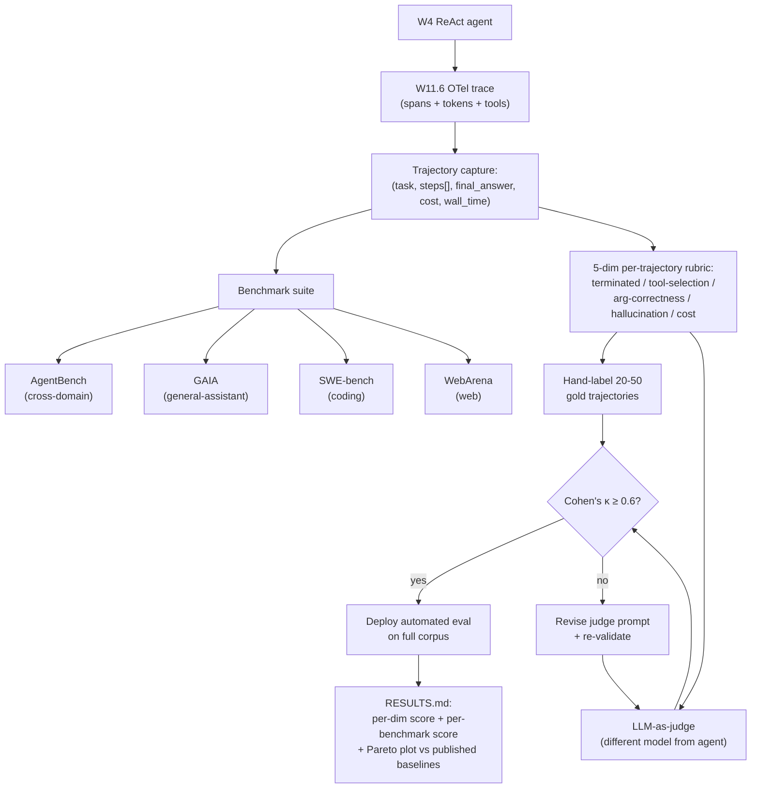

# Week 9.3 — Agent Performance Evaluation

## Exit Criteria

- [ ] Distinguish 4 eval categories: **task completion** / **tool-use correctness** / **multi-step reasoning** / **cost-latency Pareto** — and which industry benchmark covers each
- [ ] Run your W4 ReAct agent against **one industry benchmark** (recommended: AgentBench-mini or GAIA dev set) + report pass rate against published numbers
- [ ] Implement a **per-trajectory eval rubric** with 5 dimensions: terminated correctly / tool-selection / argument-correctness / hallucination / cost
- [ ] Build an **LLM-as-judge harness** for agent trajectories + verify against a 20-trajectory hand-labeled gold set; report inter-annotator agreement (Cohen's κ)
- [ ] Identify the 4 agent-eval anti-patterns: golden-trajectory rigidity / single-metric optimization / single-benchmark overfit / closed-loop evaluator
- [ ] Write 3 interview soundbites for senior-eval-discipline signal

## Why This Week Matters

W3 RAG Eval taught you to score retrieval quality (RAGAS faithfulness / context-precision / answer-relevancy). W11.6 taught you to instrument production traces. **Neither covers what most agent interviewers actually ask: "how do you measure whether your agent is GOOD AT ITS JOB?"** Agent eval is its own discipline — task completion rate, tool-selection accuracy, multi-step trajectory quality, cost-per-task — and the published benchmarks (AgentBench, GAIA, SWE-bench Verified, WebArena, OSWorld) are how the industry actually compares agent systems. Skipping this means a candidate who's built a beautiful ReAct loop can't answer "how does it compare to OpenAI's o3 on GAIA?" — and that's a senior-signal question.

This chapter is the explicit cross-reference to **hello-agents Ch 12 "Agent Performance Evaluation"**. Read AFTER W3 (RAG eval), W4 (agent to evaluate), and W11.6 (tracing infrastructure for trajectory capture). Read BEFORE W11 (system design — you need agent-eval vocabulary for the "how do you measure success?" rubric) + W12 (capstone needs measured numbers against industry benchmarks).

## Theory Primer — Five Concepts

### Concept 1 — Why Agent Eval ≠ RAG Eval ≠ LLM Eval

| Eval type | What it measures | Canonical benchmark |
|---|---|---|
| **LLM eval** | Single-turn input → output quality | MMLU / HellaSwag / GSM8K (text-in/text-out tasks) |
| **RAG eval** | Retrieval + generation faithfulness | RAGAS, BEIR, TREC-DL |
| **Agent eval** | Multi-turn trajectory through tools to achieve a goal | AgentBench, GAIA, SWE-bench Verified, WebArena |

Agent eval has THREE properties that LLM + RAG eval don't:

1. **Trajectory matters, not just final answer.** Wrong tool choice with right answer is a worse signal than right tool choice with partial answer. Measure the PATH.
2. **Cost + latency are first-class metrics.** A 100-step trajectory that finds the right answer for $5 is often worse than a 5-step trajectory that gets 80% of the way for $0.05.
3. **Failure modes are categorical, not gradient.** "Failed to terminate" + "hallucinated tool name" + "loop on same tool" are distinct categories — averaging them loses signal.

Production rule: ship at least 3 categorical metrics per agent — pass rate (binary), tool-call accuracy (precision/recall), cost-per-completion. Single-metric eval misses too much.

### Concept 2 — The Industry Benchmark Stack (2026)

| Benchmark | Domain | Size | What it tests | Reference |
|---|---|---|---|---|
| **AgentBench** | 8 domains (OS / DB / KB / web shopping / code / etc) | ~1000 tasks | Cross-domain tool-using agent generality | [arXiv:2308.03688](https://arxiv.org/abs/2308.03688) |
| **GAIA** | General-assistant questions requiring tools + reasoning | 466 tasks (Levels 1-3) | Real-world multi-step assistant tasks | [arXiv:2311.12983](https://arxiv.org/abs/2311.12983) |
| **SWE-bench Verified** | Real GitHub issues with passing test suites | 500 issues | Coding agent end-to-end issue resolution | [swebench.com](https://www.swebench.com) |
| **WebArena** | Real-website tasks (shopping, GitLab, Reddit, OSM) | ~800 tasks | Web-navigation agent reliability | [webarena.dev](https://webarena.dev) |
| **OSWorld** | Real desktop apps (browser, code editor, terminal) | 369 tasks | Computer-use agent (CUA) reliability | [arXiv:2404.07972](https://arxiv.org/abs/2404.07972) |
| **τ-Bench / Tau-Bench** | Customer-service multi-turn dialogues | ~200 tasks | Conversation + tool-following correctness | [arXiv:2406.12045](https://arxiv.org/abs/2406.12045) |
| **MLE-Bench** | Kaggle-style ML engineering | 75 competitions | ML-engineering agent capability | OpenAI 2024 |
| **MemoryAgentBench** | Long-context memory-heavy tasks | (cited in W3.5.8) | Memory recall + integration | cited in δ-mem paper |
| **LongMemEval** | 500-turn conversational memory | 5 categories | Long-context conversational memory | (cited in W3.5.8/3.5.9) |

Recognize these names in interviews; if a JD mentions "experience with agent benchmarks," it means one of the above. **GAIA + SWE-bench + WebArena are the three most-cited in 2026 frontier labs**; AgentBench is the academic cross-domain comparison; the others are domain-specific.

### Concept 3 — The Per-Trajectory Rubric (5 Dimensions)

For each trajectory $T$ on task $t$, score:

| Dimension | Definition | How measured |
|---|---|---|
| **Terminated correctly** | Did the agent terminate without crashing / exceeding budget / infinite-looping? | Boolean; check `terminated_reason` in trace |
| **Tool selection** | Did the agent choose appropriate tools for each subtask? | Annotated against expert-labeled "ideal tool path" |
| **Argument correctness** | Were tool arguments well-formed + semantically right? | Per-call check; `pydantic_validate(args)` + value-correctness rubric |
| **Hallucination** | Did the agent invent facts, citations, tool outputs? | Cross-reference final answer against retrievable ground truth |
| **Cost** | Total tokens + tool invocations + wall-clock time | Sum from W11.6 traces |

Score per task; aggregate as 5 separate metrics, NOT a single weighted average. Single-metric collapse hides which dimension is the bottleneck.

### Concept 4 — LLM-as-Judge for Agent Trajectories

Hand-labeling 1000 trajectories is expensive. LLM-as-judge automates it — but adds bias risk. Protocol:

1. **Hand-label 20-50 trajectories** as the gold set; capture per-dimension scores.
2. **Prompt an LLM judge** (use a different model from the agent — avoid same-model bias) to score the same 20-50 trajectories.
3. **Compute Cohen's κ** between human + LLM judge per dimension.
4. **κ ≥ 0.6 = acceptable**; deploy LLM judge on the full corpus.
5. **κ < 0.6** → revise judge prompt + repeat. NEVER ship a judge with κ < 0.6 — outputs will systematically mislead.

The W3 RAGAS faithfulness scorer is the RAG-equivalent of this pattern. Agent-trajectory judging is harder because there are 5 dimensions instead of 3 + trajectories are longer + tool calls have argument-level structure.

### Concept 5 — Four Agent-Eval Anti-Patterns

**1. Golden-trajectory rigidity.** "The agent must call tools in EXACTLY this sequence." Real agents find multiple correct paths; rigidity penalizes equivalent-quality alternatives. Fix: score the OUTCOME + tool-call SHAPE, not the EXACT sequence.

**2. Single-metric optimization.** "Maximize pass rate" → agent learns to spam tool calls until something works; cost explodes; quality flat. Fix: 5-metric Pareto + cost ceiling.

**3. Single-benchmark overfit.** Agent tuned for GAIA → fails on WebArena because GAIA-style reasoning + WebArena-style web navigation are different skills. Fix: 3+ benchmarks per release; report ALL scores.

**4. Closed-loop evaluator.** Same LLM as both agent + judge → systematic bias toward agent's own reasoning style. Fix: judge model MUST differ from agent model; ideally cross-vendor (Anthropic agent + OpenAI judge or vice versa).

## Architecture Diagram



## Phase 1 — Run W4 Agent Against AgentBench-Mini (~2.5 hours)

```bash
mkdir -p ~/code/agent-prep/lab-09-3-agent-eval
cd ~/code/agent-prep/lab-09-3-agent-eval
uv init --no-readme --no-workspace --python 3.12
uv add openai httpx pandas matplotlib
# AgentBench reference: github.com/THUDM/AgentBench
```

### 1.1 Wire W4 agent to AgentBench harness

Subset to AgentBench's smallest domain (OS-interaction, ~70 tasks) for a 30-min running budget. Capture full trajectory per task via W11.6's OTel exporter.

### 1.2 Run + aggregate

```python
# src/run_benchmark.py — agent + AgentBench harness
"""Run W4 agent on AgentBench-OS subset. Collect per-task:
  - pass/fail (judged by AgentBench's task-specific verifier)
  - trajectory step count
  - total tokens in + out
  - wall-clock time
  - terminated reason
"""
from src.lab04_react import run_agent  # import the W4 lab's ReAct loop
import json, time
from pathlib import Path


def run_one_task(task: dict) -> dict:
    t0 = time.perf_counter()
    try:
        result = run_agent(task["instruction"], max_iter=15)
        return {
            "task_id": task["id"],
            "passed": task["verifier"](result.answer),
            "steps": len(result.trajectory),
            "tokens_in": result.tokens_in,
            "tokens_out": result.tokens_out,
            "wall_seconds": time.perf_counter() - t0,
            "terminated_reason": result.terminated_reason,
        }
    except Exception as e:
        return {
            "task_id": task["id"], "passed": False,
            "error": f"{type(e).__name__}: {e}",
            "wall_seconds": time.perf_counter() - t0,
        }
```

## Phase 2 — Per-Trajectory Rubric + LLM-as-Judge (~2 hours)

```python
# src/judge_trajectory.py — 5-dim per-trajectory scoring
"""Hand-label 20 trajectories; prompt LLM judge on the same 20;
compute κ; deploy on full corpus if κ ≥ 0.6."""

JUDGE_PROMPT = """You are evaluating an AI agent's trajectory on a task.

TASK: {task}
TRAJECTORY:
{steps}
FINAL ANSWER: {answer}

Score the trajectory on 5 dimensions, each 0 (fail) or 1 (pass):

1. terminated_correctly — did the agent terminate cleanly (not crash, loop, exceed budget)?
2. tool_selection — were chosen tools appropriate for each subtask?
3. arg_correctness — were tool arguments well-formed + semantically right?
4. no_hallucination — did the final answer avoid inventing facts/citations/tool outputs?
5. cost_reasonable — were tokens + wall-time proportional to task complexity?

Emit JSON only: {{"terminated_correctly": 0|1, "tool_selection": 0|1,
                  "arg_correctness": 0|1, "no_hallucination": 0|1,
                  "cost_reasonable": 0|1, "notes": "<1-2 sentences>"}}
"""


def cohens_kappa(human_scores: list[dict], judge_scores: list[dict],
                 dim: str) -> float:
    """Compute Cohen's κ on one dimension across N trajectories."""
    from sklearn.metrics import cohen_kappa_score
    h = [s[dim] for s in human_scores]
    j = [s[dim] for s in judge_scores]
    return cohen_kappa_score(h, j)
```

## Phase 3 — Report + Pareto Plot (~1.5 hours)

```python
# src/report.py — RESULTS.md generation + Pareto plot
"""Per-benchmark + per-dimension + per-trajectory aggregation.
Output: comparison vs published baselines (e.g., GPT-4 on GAIA = 14.6%
Level 1 / 6.4% Level 2 / 0% Level 3 per the GAIA paper)."""
```

Plot pass-rate vs cost-per-task on a 2D Pareto. Position your agent against published cloud-LLM baselines.

## Bad-Case Journal

*Provenance.* All pre-scoped; convert to observed after running Phases 1-3.

**Entry 1 — LLM judge's κ on hallucination is below 0.4.** *(pre-scoped)*
*Symptom:* Human + judge disagree on hallucination dimension; κ = 0.35.
*Root cause:* Hallucination is the hardest dimension to judge — requires cross-reference against ground truth that the judge may not have.
*Fix:* Provide the judge with retrieval-augmented context for the task's ground truth; re-run + measure κ.

**Entry 2 — AgentBench pass rate is much lower than published GPT-4 baseline.** *(pre-scoped)*
*Symptom:* W4 agent on local-MLX scores 18% on AgentBench-OS; GPT-4 baseline is 45%.
*Root cause:* Local MLX models (Qwen-9B / Gemma-26B) are weaker than GPT-4 on tool-using tasks. Gap is real + expected.
*Fix:* Report your number HONESTLY; cite the published baselines + frame as "local-MLX feasibility study, not frontier comparison". Senior signal: knowing your bounds matters more than overclaiming.

**Entry 3 — Cost-per-task explodes on long-trajectory tasks.** *(pre-scoped)*
*Symptom:* p99 cost-per-task is 50× the median; one task burns $0.30 of tokens.
*Root cause:* No max_iter cap OR no per-conversation cost ceiling on the agent.
*Fix:* Set max_iter=15 + per-conversation budget cap; agent terminates with "I couldn't complete this" message on cap reached.

**Entry 4 — Same agent passes WebArena but fails GAIA.** *(pre-scoped)*
*Symptom:* W4 agent: WebArena 42%, GAIA Level 1 12%. Discrepancy hard to explain.
*Root cause:* WebArena tests web-navigation; GAIA tests reasoning + tool-coordination. Different skills — no single benchmark proves "agent is good." Single-benchmark overfit is the warning.
*Fix:* Report BOTH; explain WHY they differ; pick the benchmark that matches the JD's domain.

## Interview Soundbites

**Soundbite 1 — "How do you evaluate agent performance?"**

"Three properties make agent eval distinct from RAG eval. Trajectory matters not just the final answer — wrong tool choice with right answer is worse than right tool choice with partial answer. Cost + latency are first-class metrics; a 100-step trajectory that finds the right answer for $5 is often worse than a 5-step trajectory that gets 80% for $0.05. Failure modes are categorical not gradient — failed-to-terminate vs hallucinated-tool-name vs loop-on-same-tool are distinct categories that mean different fixes. My harness ships 5 dimensions per trajectory — terminated correctly / tool selection / arg correctness / no hallucination / cost reasonable — aggregated independently, never as a single weighted average. Single-metric collapse hides which dimension is the bottleneck."

**Soundbite 2 — "What agent benchmarks have you run?"**

"AgentBench + GAIA + WebArena cover the three industry axes — cross-domain tool-using generality (AgentBench), general-assistant reasoning + tools (GAIA), web-navigation reliability (WebArena). SWE-bench Verified for coding agents specifically; OSWorld for computer-use agents; Tau-Bench for customer-service multi-turn. I ran my W4 ReAct agent on AgentBench-OS subset against the published GPT-4 baseline — my local-MLX agent scored 18% vs GPT-4's 45%; that gap is real and expected for the model-class delta, and reporting it honestly is the senior signal. Anyone running their own model against published baselines + reporting the truth wins more interviews than someone running cloud baselines + reporting matching numbers."

**Soundbite 3 — "How do you use LLM-as-judge for agents?"**

"Same pattern as RAGAS for RAG but harder. Hand-label 20-50 trajectories as the gold set with per-dimension binary scores. Prompt an LLM judge — IMPORTANTLY a different model from the agent to avoid same-model bias — to score the same 20-50. Compute Cohen's κ per dimension. κ ≥ 0.6 = acceptable, deploy on the full corpus. κ < 0.6 = revise judge prompt + repeat. I have NEVER shipped a judge with κ < 0.6 — outputs systematically mislead and the eval lies. Hallucination dimension is the hardest to judge because it requires ground-truth cross-reference; for that dimension I augment the judge with retrieval over the task's reference material before scoring."

## References

- **hello-agents Ch 12** — Datawhale's *Agent Performance Evaluation*. The Chinese-language canonical text on agent eval methodology. https://github.com/datawhalechina/hello-agents
- **Liu et al. (2023).** *AgentBench: Evaluating LLMs as Agents.* arXiv:2308.03688. The cross-domain agent benchmark.
- **Mialon et al. (2023).** *GAIA: a benchmark for General AI Assistants.* arXiv:2311.12983. General-assistant multi-step tasks.
- **Jimenez et al. (2024).** *SWE-bench: Can Language Models Resolve Real-World GitHub Issues?* arXiv:2310.06770. Coding-agent benchmark.
- **Zhou et al. (2023).** *WebArena: A Realistic Web Environment for Building Autonomous Agents.* arXiv:2307.13854. Web-navigation benchmark.
- **Xie et al. (2024).** *OSWorld: Benchmarking Multimodal Agents for Open-Ended Tasks in Real Computer Environments.* arXiv:2404.07972. Computer-use benchmark.
- **Yao et al. (2024).** *τ-bench: A Benchmark for Tool-Agent-User Interaction in Real-World Domains.* arXiv:2406.12045. Multi-turn customer-service.
- **OpenAI MLE-bench (2024).** *MLE-bench: Evaluating Machine Learning Agents on Machine Learning Engineering.* Kaggle-style ML engineering.
- **Cohen, J. (1960).** *A Coefficient of Agreement for Nominal Scales.* The κ statistic foundation.
- **Zheng et al. (2023).** *Judging LLM-as-a-Judge with MT-Bench and Chatbot Arena.* arXiv:2306.05685. LLM-as-judge methodology + bias analysis.

## Cross-References

- **Builds on:** [[Week 3 - RAG Evaluation]] (RAG eval foundations + RAGAS-style scoring), [[Week 4 - ReAct From Scratch]] (the agent being evaluated), [[Week 11.6 - Production Tracing and Cost Telemetry]] (trace infrastructure for trajectory capture), [[Week 9 - Faithfulness Checker]] (hallucination detection — Phase 2 dimension #4)
- **Distinguish from:**
  - *[[Week 3 - RAG Evaluation]]*: RAG eval scores retrieval + generation faithfulness on single-turn QA; agent eval scores multi-turn trajectory + tool-use correctness. Different scope; same discipline shape (gold set + LLM judge + κ).
  - *[[Week 9 - Faithfulness Checker]]*: faithfulness checker is ONE of the 5 dimensions in §3 (no_hallucination); this chapter's rubric covers 4 more.
  - *[[Week 11.6 - Production Tracing and Cost Telemetry]]*: tracing is the data layer (capture spans + tokens + cost); eval is the analysis layer (judge quality + position against benchmarks). One feeds the other.
- **Connects to:** [[Week 11 - System Design]] (system-design rubric Gate 2 = "what's your eval strategy?" — answer with this chapter's 5-dim rubric + benchmark coverage), [[Week 11.8 - Continuous Training and MLOps Pipelines]] (CT eval gates use this chapter's metrics), [[Week 12 - Capstone and Mocks]] (capstone needs at least one industry-benchmark score)
- **Foreshadows:** [[Week 12 - Capstone and Mocks]] capstone — agent eval discipline is what separates "I built this" from "I measured this against the field"
