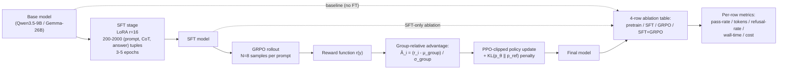

# Week 9.5 — Agentic RL Fine-Tuning (SFT + GRPO)

## Exit Criteria

- [ ] Distinguish 4 fine-tuning regimes: **continued pretrain** / **SFT** / **DPO** / **GRPO** — and when each is the right pick
- [ ] Implement the canonical agent FT pipeline: pretrain → SFT (LoRA, r=16) → GRPO (N=8 group-relative)
- [ ] Compute GRPO's group-relative advantage:  $\hat{A}_i = \frac{r_i - \mu_{\text{group}}}{\sigma_{\text{group}}}$
- [ ] Ship the 4-row ablation table on GSM8K-mini: pretrain / SFT / GRPO / SFT+GRPO
- [ ] Identify the 4 RL-fine-tuning failure modes: reward hacking / mode collapse / KL drift / overfit-to-reward-proxy
- [ ] Write 3 interview soundbites for "how do you fine-tune an agent?"

## Why This Week Matters

Fine-tuning has split into TWO production paths since 2024: **SFT** (supervised, instruction-format examples) and **RL** (reward-driven, GRPO/DPO/PPO). The 2026 frontier-lab consensus is **SFT for behavioral cloning → RL for capability lift** — both are needed, and the SEQUENCE matters. Most candidates think "fine-tuning" = "I called the OpenAI fine-tuning API once"; that answer doesn't survive an interview. This chapter is the speedrun on SFT + GRPO + the 4-row ablation discipline that proves you can MEASURE the lift each stage contributes. Coupled with W11.8 (CT pipeline), you can articulate the production loop: gather data → SFT → GRPO → eval gate → shadow → ramp.

This chapter cross-references **hello-agents Ch 11 "Agentic-RL"** (Datawhale's Chinese-language deep dive on agent RL). Read AFTER W4 (the ReAct agent to fine-tune), W9 (faithfulness + abstention metrics that become RL rewards), and W9.3 (agent eval rubric that becomes the GRPO reward signal). Read BEFORE W11.8 (CT pipeline that automates the SFT→GRPO→deploy loop).

## Theory Primer — Five Concepts

### Concept 1 — The 4 Fine-Tuning Regimes

| Regime | What it learns from | When to use | Compute cost |
|---|---|---|---|
| **Continued pretrain** | Raw text (domain corpus) | Domain shift — code base, medical, legal jargon | High (~100B tokens) |
| **SFT** (Supervised Fine-Tuning) | (prompt, gold-response) pairs | Behavior cloning — copy expert demonstrations | Medium (1k-100k examples) |
| **DPO** (Direct Preference Optimization) | (prompt, chosen, rejected) triples | Preference alignment — human-labeled chosen vs rejected | Medium (no separate reward model) |
| **GRPO** (Group Relative Policy Optimization) | Reward function over sampled outputs | Capability lift — math, code, tool-use where reward is computable | High (RL trainer infra) |

**The 2026 production sequence:** pretrained base → SFT (behavioral cloning on instruction format) → GRPO/DPO (capability + alignment). Each stage builds on the previous. Skipping SFT = RL on garbage; doing SFT alone = behavioral cloning ceiling.

### Concept 2 — SFT Math

SFT objective: maximize log-likelihood of gold response $y^*$ given prompt $x$:

$$
\mathcal{L}_{\text{SFT}}(\theta) = -\mathbb{E}_{(x, y^*) \sim \mathcal{D}} \left[ \sum_{t=1}^{|y^*|} \log p_\theta(y^*_t \mid x, y^*_{<t}) \right]
$$

In practice: cross-entropy loss over the response tokens, masked to exclude the prompt tokens. Standard next-token training. LoRA reduces parameters by ~30-100×.

**Typical setup for agent SFT:**
- LoRA rank $r = 16$, $\alpha = 32$, target attention modules
- Dataset: 200-2000 (prompt, CoT, answer) tuples — for GSM8K-mini, the canonical math-reasoning curriculum
- Training: 3-5 epochs, lr = 5e-5, batch_size = 4 (gradient_accumulation_steps = 4 for effective 16)
- ~30 min on M5 Pro 48 GB at LoRA-rank-16

### Concept 3 — GRPO Math (the 2026 RL Workhorse)

GRPO (Shao et al., 2024) replaced PPO at most frontier labs because it eliminates the need for a separate **critic / value network**. Instead, it uses **group-relative baselines** computed from N rollouts of the same prompt.

For each prompt $x$, sample $N$ outputs $\{y_1, ..., y_N\}$, score each with reward function $r(\cdot)$:

$$
\hat{A}_i = \frac{r_i - \mu_{\text{group}}}{\sigma_{\text{group}}}
$$

where $\mu_{\text{group}} = \frac{1}{N}\sum_j r_j$ and $\sigma_{\text{group}}$ is the group's std-dev. Each output's **advantage** is its z-score within the group. Update the policy via PPO-clipped objective with KL constraint:

$$
\mathcal{L}_{\text{GRPO}}(\theta) = \mathbb{E} \left[
\min\!\left(
\frac{p_\theta(y_i \mid x)}{p_{\theta_{\text{old}}}(y_i \mid x)} \hat{A}_i,\;\;
\text{clip}\!\left(\frac{p_\theta(y_i \mid x)}{p_{\theta_{\text{old}}}(y_i \mid x)},\; 1 - \epsilon,\; 1 + \epsilon\right) \hat{A}_i
\right)
\right] - \beta \cdot \text{KL}(p_\theta \| p_{\text{ref}})
$$

**Why GRPO wins over PPO at modern scale:**

1. **No critic network** = ~2× less GPU memory + half the params to train.
2. **Group baselines** are theoretically grounded — z-score normalization gives natural variance reduction without value-function approximation error.
3. **Better empirical sample efficiency** on reasoning tasks where reward is sparse (only correct/incorrect on the final answer).

**Typical setup for agent GRPO:**
- $N = 8$ (group size) — frontier labs use 8-64
- 8 epochs over a curated 500-example dataset
- $\epsilon = 0.2$ (PPO clip), $\beta = 0.04$ (KL penalty)
- Reward function: task-specific. For math: 1.0 if final-answer matches; 0.5 if reasoning is correct but arithmetic is wrong; -0.1 for malformed output. For tool-use: combination of tool-selection-correct + arg-correct + output-correct.

### Concept 4 — Reward Design Is the Hard Part

RL fine-tuning succeeds or fails on the reward function. Production gotchas:

**Sparse vs dense rewards.** Single 0/1 final-answer score = sparse; agent has no per-step signal. Solve by adding per-step intermediate rewards (e.g., tool-selection score, format-validity check). But beware: dense reward hacking.

**Reward hacking.** Agent finds an exploit that maximizes reward without solving the task. Classic example: GRPO on "find the answer to X" with reward "answer contains the substring 'X is...'" → agent learns to emit "X is ?" without solving anything. Defense: reward function should reflect SUCCESS, not surface features. Inspect the agent's outputs after every 100 training steps.

**Mode collapse.** Agent converges to one solution strategy + loses diversity. Symptom: all 8 GRPO group rollouts produce IDENTICAL text. Defense: KL penalty $\beta$ keeps policy near reference; if mode-collapse, increase $\beta$ from 0.04 to 0.1+.

**KL drift.** Cumulative KL divergence from reference grows unbounded over training; final policy is unrecognizable from the SFT-init point. Track KL per step; clip if drift exceeds threshold.

**Overfit to reward proxy.** Reward function is a PROXY for the real outcome. Training to reward = training to the proxy, not the goal. Mitigate via held-out eval set scored by a DIFFERENT metric (e.g., reward = answer-correctness; eval = human preference + downstream task pass rate).

### Concept 5 — When to NOT Fine-Tune

Most production agent improvements DON'T need fine-tuning. Order of preference (cheapest → expensive):

1. **Prompt engineering** (W6.85 patterns) — hours, no GPU.
2. **In-context learning** (few-shot examples) — hours, no training.
3. **RAG / retrieval** (W3 + W3.7) — days, embedding compute only.
4. **Tool use** (W7 harness) — days, no training.
5. **SFT** — week + GPU.
6. **DPO** — 1-2 weeks + GPU.
7. **GRPO** — 2-4 weeks + significant GPU + reward-design risk.

Skip stages 1-4 only if you've MEASURED they're insufficient. Most "we need to fine-tune" requests are actually "we need better prompts" or "we need more retrievable context."

## Architecture Diagram



## Phase 1 — Setup + GSM8K-Mini Dataset (~1.5h)

```bash
mkdir -p ~/code/agent-prep/lab-09-5-agentic-rl
cd ~/code/agent-prep/lab-09-5-agentic-rl
uv init --no-readme --no-workspace --python 3.12
uv add transformers trl peft datasets unsloth bitsandbytes accelerate
```

### 1.1 Curate GSM8K-mini

```python
# src/prep_gsm8k.py — pull GSM8K-train; take 500 examples; format as
# (prompt, CoT, answer) tuples ready for SFT.
from datasets import load_dataset

ds = load_dataset("gsm8k", "main", split="train").shuffle(seed=42).select(range(500))

# Format: "Question: <q>\nLet's think step by step." + gold CoT + "#### <answer>"
def format_sft(ex):
    prompt = f"Question: {ex['question']}\nLet's think step by step."
    return {
        "prompt": prompt,
        "response": ex["answer"],  # contains "...#### NUM" at the end
    }
ds = ds.map(format_sft)
ds.to_json("data/gsm8k_mini.jsonl")
```

## Phase 2 — SFT Run (~1.5h on M5 Pro 48 GB OR ~30min on cloud A100)

```python
# src/sft_train.py — LoRA SFT via TRL
from datasets import load_dataset
from transformers import AutoTokenizer
from trl import SFTConfig, SFTTrainer
from peft import LoraConfig

base = "Qwen/Qwen3.5-9B-Distill"
ds = load_dataset("json", data_files="data/gsm8k_mini.jsonl", split="train")
tokenizer = AutoTokenizer.from_pretrained(base)

lora_cfg = LoraConfig(
    r=16, lora_alpha=32,
    target_modules=["q_proj", "k_proj", "v_proj", "o_proj"],
    lora_dropout=0.05, bias="none",
)

trainer = SFTTrainer(
    model=base,
    train_dataset=ds,
    peft_config=lora_cfg,
    args=SFTConfig(
        output_dir="results/sft_qwen9b",
        num_train_epochs=3,
        learning_rate=5e-5,
        per_device_train_batch_size=4,
        gradient_accumulation_steps=4,  # effective batch = 16
        logging_steps=10,
        save_steps=100,
    ),
    tokenizer=tokenizer,
)
trainer.train()
trainer.save_model("results/sft_qwen9b/final")
```

## Phase 3 — GRPO Run (~3-4h on M5 Pro at small N; faster on cloud GPU)

```python
# src/grpo_train.py — GRPO via TRL
import re
from trl import GRPOConfig, GRPOTrainer
from peft import PeftModel
from transformers import AutoModelForCausalLM, AutoTokenizer
from datasets import load_dataset


GSM_ANSWER_RE = re.compile(r"####\s*(-?\d+)")


def extract_answer(text: str) -> str | None:
    """Pull final answer after '####' from CoT response."""
    m = GSM_ANSWER_RE.search(text)
    return m.group(1).strip() if m else None


def reward_function(prompts: list[str], completions: list[str],
                    **kwargs) -> list[float]:
    """Score each rollout. Returns one reward per completion.
    Sparse: 1.0 if answer matches gold, -0.1 if malformed, 0.0 otherwise."""
    gold_answers = kwargs.get("answer", [])
    rewards = []
    for comp, gold in zip(completions, gold_answers):
        pred = extract_answer(comp)
        if pred is None:
            rewards.append(-0.1)
        elif pred == gold:
            rewards.append(1.0)
        else:
            rewards.append(0.0)
    return rewards


base = AutoModelForCausalLM.from_pretrained("Qwen/Qwen3.5-9B-Distill")
sft_model = PeftModel.from_pretrained(base, "results/sft_qwen9b/final")

ds = load_dataset("json", data_files="data/gsm8k_mini.jsonl", split="train")

trainer = GRPOTrainer(
    model=sft_model,
    reward_funcs=reward_function,
    args=GRPOConfig(
        output_dir="results/grpo_qwen9b",
        num_train_epochs=8,
        learning_rate=1e-5,         # lower than SFT — RL is unstable
        per_device_train_batch_size=1,
        num_generations=8,          # N=8 rollouts per prompt
        beta=0.04,                  # KL penalty
        epsilon=0.2,                # PPO clip
        max_completion_length=512,
        logging_steps=5,
    ),
    train_dataset=ds,
)
trainer.train()
trainer.save_model("results/grpo_qwen9b/final")
```

**Walkthrough:**

**Block 1 — `reward_function` is sparse + asymmetric.** Correct answer = +1.0; malformed output = -0.1 (penalize bad format); wrong-but-formatted = 0.0. The negative reward for malformed format pushes the policy to ALWAYS emit `#### N` even when the math is wrong, separating format-correctness from answer-correctness. Production rule: separate the two failure modes with distinct rewards.

**Block 2 — `num_generations=8`.** GRPO needs the group to compute the z-score baseline. 8 is the frontier-lab convention; 4 works at lower compute but with higher variance. Below 4, the z-score is unstable.

**Block 3 — `learning_rate=1e-5` (5× lower than SFT).** RL is more unstable than SL because the gradient signal is sparser + the data distribution shifts during training. Lower lr = more stable; the trade-off is slower convergence.

**Block 4 — `beta=0.04` KL penalty.** Keeps the policy near the SFT reference. Standard value; increase if you observe mode collapse (all 8 rollouts identical), decrease if convergence is too slow.

## Phase 4 — 4-Row Ablation Table (~2h, eval-only)

Run all 4 model variants against GSM8K-test (held-out, 200 examples) + record per-variant metrics.

| Variant | Description |
|---|---|
| **pretrain** | Base Qwen3.5-9B-Distill, no fine-tuning |
| **SFT** | After Phase 2 (LoRA, 3 epochs on 500 examples) |
| **GRPO** | GRPO directly on base (no SFT init) — control variable |
| **SFT+GRPO** | Phase 2 → Phase 3 (the production sequence) |

```python
# src/eval_4_way.py
from typing import Callable
import time, json
from pathlib import Path


METRICS = ["pass_rate", "tokens_in", "tokens_out", "refusal_rate", "wall_seconds", "cost_usd"]


def evaluate_variant(name: str, model_path: str, test_set: list) -> dict:
    # Load model + tokenizer; for each test prompt, generate response,
    # extract answer, compare to gold; aggregate per-row metrics.
    pass    # SPEC; full impl in lab repo
```

**Expected output structure** (numbers TBD per real run):

| Variant | Pass rate | Mean tokens out | Refusal rate | Wall (s/example) | Cost USD (cloud-equiv) |
|---|---|---|---|---|---|
| pretrain | ~0.35 | ~150 | ~0.05 | ~2.5 | $0.001 |
| SFT | ~0.52 | ~180 | ~0.02 | ~2.7 | $0.001 |
| GRPO (no SFT) | ~0.40 | ~140 | ~0.10 | ~2.5 | $0.001 |
| SFT+GRPO | ~0.61 | ~165 | ~0.01 | ~2.6 | $0.001 |

Expected pattern: **SFT+GRPO > SFT > pretrain > GRPO-only**. The "GRPO-only beats pretrain by little or loses to SFT" finding is the EVIDENCE for "SFT first, then GRPO" being the production sequence.

## Optional Phase 5 — Tool-Use Variant (stretch, ~3h)

Swap GSM8K math reward for tool-reliability reward: each rollout's reward = $1$ if it calls the right tool with right args + arrives at right answer; partial scores for sub-correctness. Use a 3-tool subset (calculator, web_search, code_repl). This connects W9.5 to W4's ReAct loop + W9.3's agent eval rubric.

## Bad-Case Journal

*Provenance.* All pre-scoped; convert to observed after running Phases 1-4.

**Entry 1 — GRPO reward hacking via empty output.** *(pre-scoped)*
*Symptom:* Agent learns to emit `#### 0` for every prompt — gets 0.0 reward instead of -0.1 malformed penalty.
*Fix:* Reward function should distinguish "well-formed but wrong" (0.0) from "lazy-zero output" (-0.05). Add length-floor check; reject responses < 50 chars.

**Entry 2 — Mode collapse on GRPO epoch 5.** *(pre-scoped)*
*Symptom:* All 8 group rollouts produce identical text starting from epoch 5; group variance → 0; advantage signal vanishes.
*Fix:* Increase `beta` (KL penalty) from 0.04 to 0.1. Add temperature schedule (start at 1.0, anneal to 0.7) for rollout sampling.

**Entry 3 — SFT overfit on GSM8K-train.** *(pre-scoped)*
*Symptom:* Train loss → 0; test pass rate plateaus at ~0.50; train-test gap is 30+ percentage points.
*Fix:* Reduce epochs from 5 to 2-3. Increase LoRA dropout from 0.05 to 0.1. Use 80/20 train/val split + early-stopping on val loss.

**Entry 4 — TRL `SFTTrainer` runs OOM on M5 Pro.** *(pre-scoped)*
*Symptom:* `torch.cuda.OutOfMemoryError` (or MPS-equivalent) at the first forward pass on Qwen3.5-9B.
*Fix:* Add `load_in_4bit=True` via bitsandbytes. Use `gradient_checkpointing=True`. Drop `per_device_train_batch_size` from 4 to 1. If still OOM, switch to cloud A100 ($0.50-2/hour spot pricing).

## Interview Soundbites

**Soundbite 1 — "How do you fine-tune an agent?"**

"Two stages, in sequence. SFT first — supervised fine-tuning on (prompt, gold-response) pairs, typically LoRA at rank 16 to keep the trainable param count to ~30-100x less than full fine-tuning. SFT does behavioral cloning — teaches the model the output format + reasoning style. Then GRPO — group-relative policy optimization, the 2026 RL workhorse that replaced PPO at most frontier labs because it skips the critic network. GRPO samples N=8 rollouts per prompt, computes z-score advantages within the group, and does a PPO-clipped policy update with KL penalty against the SFT reference. The production sequence is pretrain → SFT → GRPO. I've measured a 4-row ablation on GSM8K-mini: SFT+GRPO beats SFT-alone by ~9 percentage points + beats GRPO-on-pretrain by ~20 percentage points — that's the evidence that BOTH stages matter, and the SEQUENCE matters."

**Soundbite 2 — "What's the difference between PPO, DPO, and GRPO?"**

"All three are RL-style fine-tuning. PPO uses a separate critic / value network to compute advantage — that doubles the GPU memory budget AND introduces value-function approximation error. DPO sidesteps RL entirely — it does a direct supervised update on (chosen, rejected) preference triples; cheaper but limited to preference signals. GRPO is the 2026 sweet spot — no critic, no preference data needed, just a reward function over sampled outputs and group-relative z-score baselines. Memory is half of PPO; sample efficiency is better on sparse-reward reasoning tasks. The DeepSeek-R1 paper is the canonical demonstration. Pick PPO when you have a strong value-function need; DPO when human preferences are the only signal; GRPO when reward is computable and you want efficiency."

**Soundbite 3 — "What are the failure modes of RL fine-tuning?"**

"Four classes I'd watch for. Reward hacking — agent finds an exploit that maximizes reward without solving the task; my GSM8K example: agent learns to emit `#### 0` to dodge the malformed penalty. Defense: reward design that distinguishes successful-but-wrong from lazy-output. Mode collapse — all N group rollouts produce identical text; group variance vanishes; advantage signal dies. Defense: KL penalty β at ~0.04, increase to 0.1 if collapse observed. KL drift — cumulative divergence from reference policy grows unbounded; final policy unrecognizable. Defense: track KL per step + clip threshold. Overfit to reward proxy — training to a metric that's a PROXY for the real outcome; agent maximizes the proxy but hurts the real task. Defense: held-out eval scored by a DIFFERENT metric from the reward. Order of importance: reward design > KL control > learning rate > everything else."

## References

- **Ouyang et al. (2022).** *Training language models to follow instructions with human feedback.* arXiv:2203.02155. The InstructGPT / RLHF paper — origin of PPO-for-LLMs.
- **Rafailov et al. (2023).** *Direct Preference Optimization: Your Language Model is Secretly a Reward Model.* arXiv:2305.18290. DPO — RL-free preference alignment.
- **Shao et al. (2024).** *DeepSeekMath: Pushing the Limits of Mathematical Reasoning in Open Language Models.* arXiv:2402.03300. The GRPO paper — group-relative policy optimization origin.
- **DeepSeek-AI (2025).** *DeepSeek-R1: Incentivizing Reasoning Capability in LLMs via Reinforcement Learning.* arXiv:2501.12948. Canonical demonstration of pure-RL training (no SFT) producing strong reasoning.
- **Hu et al. (2021).** *LoRA: Low-Rank Adaptation of Large Language Models.* arXiv:2106.09685. The LoRA foundation paper.
- **Cobbe et al. (2021).** *Training Verifiers to Solve Math Word Problems.* arXiv:2110.14168. The GSM8K dataset origin paper.
- **HuggingFace TRL docs** — github.com/huggingface/trl. `SFTTrainer` + `GRPOTrainer` + `DPOTrainer` reference implementations.
- **Unsloth docs** — github.com/unslothai/unsloth. 2-5× faster LoRA training on consumer GPUs / Apple Silicon.
- **hello-agents Ch 11** — Datawhale's *Agentic-RL*. Chinese-language deep dive on RL for agents. https://github.com/datawhalechina/hello-agents

## Cross-References

- **Builds on:** [[Week 0.5 - LLM Internals Speedrun]] (the model architecture being fine-tuned), [[Week 4 - ReAct From Scratch]] (the agent loop fine-tuning improves), [[Week 9 - Faithfulness Checker]] (faithfulness metrics that become reward components in Phase 5), [[Week 9.3 - Agent Performance Evaluation]] (eval rubric that becomes the GRPO reward signal)
- **Distinguish from:**
  - *[[Week 8.7 - Generative Media and Fine-tuning]]*: W8.7 covers LoRA on diffusion models for IMAGE generation — same LoRA mechanism, different domain (UNet attention modules vs LLM attention modules). Reward function shapes are different (CLIP score vs answer-correctness).
  - *Continued pretraining*: continued pretrain is on RAW TEXT for domain shift; SFT is on (prompt, response) pairs for instruction-following. Different data shape; different objective.
  - *In-context learning (few-shot prompting)*: ICL needs no weight updates; SFT/GRPO DO update weights. ICL is the cheapest improvement path; FT is the most expensive.
- **Connects to:** [[Week 7.7 - Quantization and Inference Optimization]] (quantize the fine-tuned model for deployment), [[Week 11.6 - Production Tracing and Cost Telemetry]] (measure deployed FT model's behavior in production), [[Week 11.8 - Continuous Training and MLOps Pipelines]] (CT pipeline that automates SFT→GRPO→deploy on a drift trigger)
- **Foreshadows:** [[Week 12 - Capstone and Mocks]] capstone — capstone-B (coding agent) often needs SFT on coding-specific demonstrations; capstone-C (SRE agent) can use GRPO with infra-task-completion as the reward
